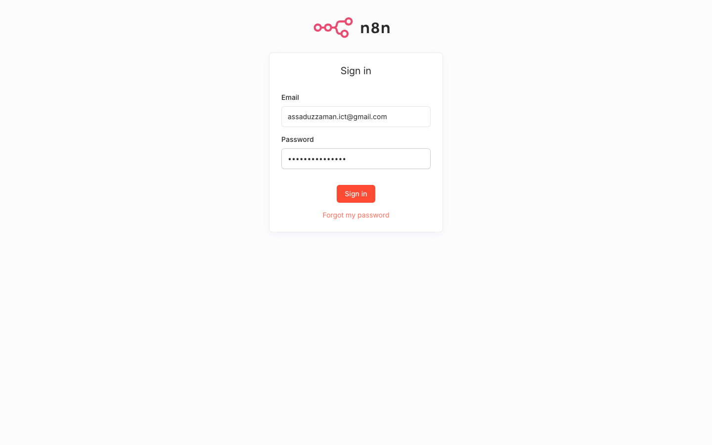

# Manual Test Guide — Kubernetes AI Knowledge System

**Version:** 1.7
**Date:** 2026-02-24
**Environment:** macOS · Docker Desktop · kind v0.24+ · n8n (latest) · All services in-cluster (k8s-ai namespace)

Complete step-by-step verification of the Kubernetes AI Knowledge System — from infrastructure health through to live CDC event observation and AI query validation in the n8n browser UI. Every command and browser step has been verified against the live running environment.

> **Generate screenshots first:** Set up your `.env` file (see §2.5 below), then run `npm run screenshots` from the project root. This auto-captures all UI screenshots referenced throughout.

---

## 0. Quick Start with Scripts

The fastest way to go from nothing to a fully working system is to run the setup script:

### 0.1 First-time setup (creates cluster, deploys everything, runs tests)

```bash
./scripts/setup.sh
```

This single command:
1. Verifies prerequisites (Docker, kind, kubectl, ollama, npm, python3)
2. Pulls any missing Ollama models (`nomic-embed-text`, `qwen3:8b`)
3. Creates the kind cluster with `infra/kind-config.yaml` (NodePort mappings + data mounts)
4. Applies all Kubernetes manifests (namespace, PVs, Kafka, Qdrant, k8s-watcher, n8n)
5. Builds and loads the `k8s-watcher-classic:latest` image into kind
6. Creates the Qdrant collection (`k8s`, 768-dim Cosine)
7. Sets up the n8n database: creates Kafka credential + imports and activates all 3 workflows
8. Triggers Qdrant resync and waits for ≥ 10 points
9. Runs `npm test` — all 5 E2E tests must pass

Expected output at the end:
```
━━━ Running E2E test suite ━━━
...
  5 passed (18.0s)

━━━━━━━━━━━━━━━━━━━━━━━━━━━━━━━━━━━━━━━━━━━━━━━━━━━━━━━━━━━━━━━━━━━━━
  Setup complete!
━━━━━━━━━━━━━━━━━━━━━━━━━━━━━━━━━━━━━━━━━━━━━━━━━━━━━━━━━━━━━━━━━━━━━

  n8n dashboard      : http://localhost:31000
  AI chat            : http://localhost:31000/webhook/k8s-ai-chat/chat
  Qdrant             : http://localhost:31001
  k8s-watcher health : http://localhost:31002/healthz

  Workflow IDs (static — embedded in JSON):
    CDC   = k8sCDCflow00001
    AI    = k8sAIflow000001
    Reset = k8sRSTflow00001
```

### 0.2 Re-setup without recreating the cluster (fastest path after editing workflows)

```bash
./scripts/setup.sh --keep-cluster
```

Reuses the existing `k8s-ai` kind cluster. Re-imports workflows, recreates the Kafka credential if needed, and runs the full E2E suite.

### 0.3 Skip tests during setup

```bash
./scripts/setup.sh --keep-cluster --no-test
```

### 0.4 Tear down everything

```bash
./scripts/cleanup.sh              # delete kind cluster + k8s-watcher image; keeps ./data/
./scripts/cleanup.sh --wipe-data  # also permanently delete ./data/ (Kafka, Qdrant, n8n state)
./scripts/cleanup.sh --yes        # skip confirmation prompt
```

> **After a fresh `./scripts/cleanup.sh --wipe-data`**, run `./scripts/setup.sh` (without `--keep-cluster`) for a truly clean slate — new cluster, fresh data directories, fresh n8n database.

### 0.5 Options reference

| Option | Effect |
|--------|--------|
| `--keep-cluster` | Reuse existing kind cluster; skip delete + create |
| `--no-test` | Skip the final `npm test` run |
| `--wipe-data` | *(cleanup only)* Delete `./data/` subdirs permanently |
| `--yes` | *(cleanup only)* Skip confirmation prompt |

---

## Table of Contents

0. [Quick Start with Scripts](#0-quick-start-with-scripts)
1. [Credentials & Endpoints](#1-credentials--endpoints)
2. [Prerequisites Checklist](#2-prerequisites-checklist) *(includes §2.5 — .env screenshot credentials)*
3. [Section A — Infrastructure Health](#section-a--infrastructure-health)
4. [Section B — Kafka & CDC Pipeline (Terminal)](#section-b--kafka--cdc-pipeline-terminal)
5. [Section C — n8n Sign-In (UI)](#section-c--n8n-sign-in-ui)
6. [Section D — Workflow Dashboard & Active Status (UI)](#section-d--workflow-dashboard--active-status-ui)
7. [Section E — CDC Workflow Canvas (UI)](#section-e--cdc-workflow-canvas-ui)
8. [Section F — Trigger CDC and Watch Execution (UI)](#section-f--trigger-cdc-and-watch-execution-ui)
9. [Section G — AI Workflow Canvas (UI)](#section-g--ai-workflow-canvas-ui)
10. [Section H — AI Chat Interface (UI, no login required)](#section-h--ai-chat-interface-ui-no-login-required)
11. [Section I — AI Pipeline Verification (Terminal)](#section-i--ai-pipeline-verification-terminal)
12. [Section J — Automated E2E Test Suite](#section-j--automated-e2e-test-suite)
13. [Section K — Persistence Verification](#section-k--persistence-verification)
14. [Section L — Reset REST Endpoint](#section-l--reset-rest-endpoint)
15. [Pass Criteria Summary](#pass-criteria-summary)
16. [Troubleshooting](#troubleshooting)

---

## 1. Credentials & Endpoints

| Service | URL | Auth |
|---------|-----|------|
| n8n Sign-In (localhost) | http://localhost:31000/signin | Email + Password (owner account) |
| n8n Sign-In (domain) | http://n8n.genai.prod:31000/signin | Requires `/etc/hosts`: `192.168.1.154 n8n.genai.prod` |
| n8n Public Chat (no login) | http://n8n.genai.prod:31000/webhook/k8s-ai-chat/chat | None — publicly accessible |
| n8n Reset Webhook | http://localhost:31000/webhook/k8s-reset | None — POST only |
| k8s-watcher Health | http://localhost:31002/healthz | None |
| Qdrant REST API | http://localhost:31001 | None |
| Ollama (host machine) | http://localhost:11434 | None |

---

## 2. Prerequisites Checklist

### 2.1 Docker Desktop Running

```bash
docker info --format '{{.ServerVersion}}'
```

Expected: a version string such as `27.x.x`. If blank, launch Docker Desktop and wait until it reaches the Running state.

### 2.2 kind Cluster Present with NodePort Config

```bash
kind get clusters
```

Expected output:
```
k8s-ai
```

If absent, create it with the config file (required for NodePort mappings and data mounts):
```bash
kind create cluster --config infra/kind-config.yaml
```

Verify the cluster has the correct port mappings:
```bash
docker inspect k8s-ai-classic-control-plane --format '{{json .HostConfig.PortBindings}}' | python3 -m json.tool
```

Expected: ports 31000, 31001, 31002 and 6443 all listed.

### 2.3 Ollama Models Available on Host

```bash
ollama list
```

Both of the following must be present:

| Model | Purpose |
|-------|---------|
| `nomic-embed-text:latest` | 768-dim text embeddings |
| `qwen3:8b` | Chat / reasoning LLM |

If either is missing: `ollama pull nomic-embed-text && ollama pull qwen3:8b`

### 2.4 All 4 Pods Running in k8s-ai Namespace

```bash
kubectl --context kind-k8s-ai-classic -n k8s-ai get pods
```

Expected — all 4 pods in `Running` state (1/1 Ready):

```
NAME                           READY   STATUS    RESTARTS
k8s-watcher-<hash>             1/1     Running   0
kafka-0                        1/1     Running   0
n8n-<hash>                     1/1     Running   0
qdrant-<hash>                  1/1     Running   0
```

If any pod is missing or not Ready, apply the manifests:
```bash
kubectl --context kind-k8s-ai-classic apply -f infra/k8s/00-namespace.yaml
kubectl --context kind-k8s-ai-classic apply -f infra/k8s/01-pvs.yaml
kubectl --context kind-k8s-ai-classic apply -f infra/k8s/kafka/
kubectl --context kind-k8s-ai-classic apply -f infra/k8s/qdrant/
kubectl --context kind-k8s-ai-classic apply -f infra/k8s/k8s-watcher/
kubectl --context kind-k8s-ai-classic apply -f infra/k8s/n8n/
# Wait 30 seconds for Kafka readiness probe, then check again
```

> **Note for k8s-watcher:** it uses `imagePullPolicy: Never` — the image must be loaded into kind:
> ```bash
> docker build -t k8s-watcher-classic:latest ./k8s-watcher/
> kind load docker-image k8s-watcher-classic:latest --name k8s-ai-classic
> ```

### 2.5 Screenshot Credentials (.env)

The screenshot capture script (`npm run screenshots`) logs into n8n using your owner credentials. These must be provided via a `.env` file — they are never stored in the repository.

**One-time setup:**

```bash
cp .env.example .env
```

Then open `.env` and fill in the two values:

```dotenv
N8N_EMAIL=your-owner-email@example.com
N8N_PASS=your-owner-password
```

> **`.env` is gitignored** — it will never be committed.

Once `.env` is in place, run:

```bash
npm run screenshots
```

To run screenshots without a `.env` file, pass the values inline:

```bash
N8N_EMAIL=you@example.com N8N_PASS=yourpassword npm run screenshots
```

---

## Section A — Infrastructure Health

### A1. Qdrant

```bash
curl -s http://localhost:31001/healthz
```

Expected: `healthz check passed`

```bash
curl -s http://localhost:31001/collections/k8s | python3 -m json.tool
```

Key fields to confirm:

| Field | Expected |
|-------|----------|
| `result.status` | `"green"` |
| `result.config.params.vectors.size` | `768` |
| `result.config.params.vectors.distance` | `"Cosine"` |
| `result.points_count` | `≥ 25` |

### A2. Ollama

```bash
curl -s http://localhost:11434/api/tags | python3 -c "
import sys, json
for m in json.load(sys.stdin).get('models', []):
    print(m['name'])
"
```

Expected: `nomic-embed-text:latest` and `qwen3:8b` both appear.

### A3. n8n

```bash
curl -s http://localhost:31000/healthz
```

Expected: `{"status":"ok"}`

### A4. Kafka Broker

```bash
KAFKA_POD=$(kubectl --context kind-k8s-ai-classic -n k8s-ai get pod -l app=kafka -o jsonpath='{.items[0].metadata.name}')
kubectl --context kind-k8s-ai-classic -n k8s-ai exec ${KAFKA_POD} -- \
  kafka-broker-api-versions --bootstrap-server localhost:9092 2>/dev/null | head -2
```

Expected: a broker version line (non-empty output).

### A5. k8s-watcher

```bash
curl -s http://localhost:31002/healthz
```

Expected: `{"status":"ok"}`

---

## Section B — Kafka & CDC Pipeline (Terminal)

### B1. Verify Kafka Topic

```bash
KAFKA_POD=$(kubectl --context kind-k8s-ai-classic -n k8s-ai get pod -l app=kafka -o jsonpath='{.items[0].metadata.name}')
kubectl --context kind-k8s-ai-classic -n k8s-ai exec ${KAFKA_POD} -- \
  kafka-topics --bootstrap-server localhost:9092 --list
```

Expected: `k8s-resources` appears in the list.

### B2. Check Message Count

```bash
KAFKA_POD=$(kubectl --context kind-k8s-ai-classic -n k8s-ai get pod -l app=kafka -o jsonpath='{.items[0].metadata.name}')
kubectl --context kind-k8s-ai-classic -n k8s-ai exec ${KAFKA_POD} -- \
  kafka-get-offsets --bootstrap-server localhost:9092 --topic k8s-resources
```

Expected: `k8s-resources:0:<N>` where N ≥ 35 (initial cluster snapshot published by k8s-watcher on startup).

### B3. Verify Kafka Consumer Group (n8n CDC listener)

```bash
KAFKA_POD=$(kubectl --context kind-k8s-ai-classic -n k8s-ai get pod -l app=kafka -o jsonpath='{.items[0].metadata.name}')
kubectl --context kind-k8s-ai-classic -n k8s-ai exec ${KAFKA_POD} -- \
  kafka-consumer-groups --bootstrap-server localhost:9092 --list
```

Expected: `n8n-cdc-consumer` is listed — confirming the CDC_K8s_Flow Kafka Trigger is actively listening.

### B4. Live CDC Event Test (Two Terminals)

**Terminal 1** — Watch for new Kafka messages:

```bash
KAFKA_POD=$(kubectl --context kind-k8s-ai-classic -n k8s-ai get pod -l app=kafka -o jsonpath='{.items[0].metadata.name}')
kubectl --context kind-k8s-ai-classic -n k8s-ai exec ${KAFKA_POD} -- \
  kafka-console-consumer \
  --bootstrap-server localhost:9092 \
  --topic k8s-resources \
  --from-beginning \
  --property print.timestamp=true 2>/dev/null | tail -f
```

**Terminal 2** — Create a test namespace:

```bash
kubectl --context kind-k8s-ai-classic create namespace b-live-test
```

**Expected in Terminal 1** within 2–3 seconds — a JSON event appears containing:
```json
{"event_type": "ADDED", "kind": "Namespace", "name": "b-live-test", ...}
```

**Cleanup:**
```bash
kubectl --context kind-k8s-ai-classic delete namespace b-live-test --ignore-not-found
```

---

## Section C — n8n Sign-In (UI)

Open your browser and navigate to:

```
http://localhost:31000/signin
```

Or using the domain name (requires `/etc/hosts` entry `192.168.1.154 n8n.genai.prod`):

```
http://n8n.genai.prod:31000/signin
```

The n8n sign-in page loads directly.


Enter the owner account credentials:

| Field | Value |
|-------|-------|
| Email | *(the email you registered during n8n first-run setup)* |
| Password | *(the password you set during n8n first-run setup)* |



Click **Sign in** or press `Enter` on the password field. You are redirected to the workflow dashboard.

---

## Section D — Workflow Dashboard & Active Status (UI)

After signing in, the workflow list is displayed.


**What to verify:**

Both workflows must show a green **Active** badge on the right side of their row.


| Workflow | Expected Status |
|----------|----------------|
| `CDC_K8s_Flow` | Active (green) |
| `AI_K8s_Flow` | Active (green) |
| `Reset_K8s_Flow` | Active (green) |

If any workflow shows as inactive, refer to the [Troubleshooting](#troubleshooting) section.

Verify active status from the terminal as well — look for webhook 200 responses:

```bash
curl -s -o /dev/null -w "AI chat: %{http_code}\n" http://localhost:31000/webhook/k8s-ai-chat/chat
curl -s -o /dev/null -w "Reset:   %{http_code}\n" -X POST http://localhost:31000/webhook/k8s-reset \
  -H 'Content-Type: application/json' -d '{}'
```

Both must return `200`.

---

## Section E — CDC Workflow Canvas (UI)

Click on **CDC_K8s_Flow** in the workflow list to open the editor.


**Expected nodes on the canvas (left to right):**

| # | Node | Type | Role |
|---|------|------|------|
| 1 | Kafka Trigger | Kafka Trigger | Listens on topic `k8s-resources`, group `n8n-cdc-consumer` |
| 2 | Parse Message | Code | Parses Kafka JSON, builds natural-language `embed_text` |
| 3 | Delete Existing Vector | HTTP Request | Removes old Qdrant point by `resource_uid` (idempotent) |
| 4 | Is Delete Event? | If | Routes `DELETED` events to stop; all others continue |
| 5 | Generate Embedding | HTTP Request | Calls Ollama `nomic-embed-text` → 768-dim vector |
| 6 | Build Qdrant Point | Code | Assembles point payload with `resource_uid` as ID |
| 7 | Insert Vector | HTTP Request | `PUT /collections/k8s/points` — stores in Qdrant |

> The **Is Delete Event?** `true` branch (DELETED events) terminates after deletion — no re-insert. The `false` branch (ADDED/MODIFIED) continues to embedding and upsert.

### E1. Inspect the Kafka Trigger Node

Double-click the **Kafka Trigger** node. Confirm:

| Setting | Value |
|---------|-------|
| Topic | `k8s-resources` |
| Group ID | `n8n-cdc-consumer` |
| Credential | Kafka Local (kafka:9092) |
| Auto Offset Reset | `latest` |

> Note: `kafka:9092` is the ClusterIP service name — both n8n and k8s-watcher pods resolve it via kube-dns. `autoOffsetReset: latest` ensures CDC only processes messages published **after** the workflow starts, not historical replays. Using `earliest` would cause CDC to replay the entire Kafka topic on every n8n restart, breaking test 5 (which expects Qdrant to be empty immediately after reset).

### E2. View CDC Execution History

Click **Executions** in the left sidebar, or navigate to:

```
http://localhost:31000/workflow/k8sCDCflow00001/executions
```


Each row represents one Kafka message processed end-to-end. Status should be green for all successful runs.

### E3. Inspect an Execution

Click any row to open the execution detail.


**What to verify in the detail panel:**

| Node | Expected Output |
|------|----------------|
| Kafka Trigger | Raw JSON with `event_type`, `kind`, `name`, `namespace`, `resource_uid` |
| Parse Message | `embed_text` = `"Kubernetes {kind} named {name} in namespace {ns}. Labels: ..."` |
| Delete Existing Vector | `{"status": "acknowledged"}` |
| Is Delete Event? | Routes to `false` branch (for ADDED/MODIFIED events) |
| Generate Embedding | `{"embeddings": [[...768 floats...]]}` |
| Build Qdrant Point | `{"points": [{"id": "<uid>", "vector": [...], "payload": {...}}]}` |
| Insert Vector | `{"status": "acknowledged"}` |

---

## Section F — Trigger CDC and Watch Execution (UI)

This section performs a live end-to-end CDC cycle observable in the n8n execution list.

### F1. Keep the CDC Execution List Open

Navigate to:

```
http://localhost:31000/workflow/k8sCDCflow00001/executions
```

### F2. Create a Kubernetes Namespace

In a terminal:

```bash
kubectl --context kind-k8s-ai-classic create namespace f-ui-cdc-test
```

### F3. Observe the New Execution (within 5 seconds)

Refresh the execution history page. A new row appears at the top for the `ADDED` event.

Click the new row. Verify the data flowing through each node:

1. **Kafka Trigger → Output:** `"event_type": "ADDED"`, `"kind": "Namespace"`, `"name": "f-ui-cdc-test"`
2. **Parse Message → Output:** `embed_text` contains `"Kubernetes Namespace named f-ui-cdc-test cluster-scoped"`
3. **Delete Existing Vector → Output:** acknowledged (removes any prior duplicate)
4. **Is Delete Event? → Output:** routes to `false` branch
5. **Generate Embedding → Output:** 768-element float array
6. **Insert Vector → Output:** `{"status": "acknowledged"}`

### F4. Confirm Point in Qdrant

```bash
# Get the namespace UID
UID=$(kubectl --context kind-k8s-ai-classic get namespace f-ui-cdc-test -o jsonpath='{.metadata.uid}')

# Query Qdrant via NodePort 31001
python3 - << EOF
import urllib.request, json
req = urllib.request.Request(
    f'http://localhost:31001/collections/k8s/points/${UID}',
    headers={'Content-Type': 'application/json'}
)
with urllib.request.urlopen(req) as r:
    d = json.load(r)
    p = d['result']['payload']
    print(f"kind={p['kind']}  name={p['name']}  uid={p['resource_uid']}")
EOF
```

Expected: `kind=Namespace  name=f-ui-cdc-test  uid=<uuid>`

### F5. Delete Event Test

```bash
kubectl --context kind-k8s-ai-classic delete namespace f-ui-cdc-test
```

Watch the execution list — a new row appears for the `DELETED` event. In the detail view, the **Is Delete Event?** node routes to the `true` branch and the pipeline ends without re-inserting. The point is now absent from Qdrant.

---

## Section G — AI Workflow Canvas (UI)

Navigate back to the workflow list and click **AI_K8s_Flow**, or go directly to:

```
http://localhost:31000/workflow/k8sAIflow000001
```


**Expected nodes on the canvas (left to right):**

| # | Node | Role |
|---|------|------|
| 1 | Chat Trigger | Receives user query via public webhook `/webhook/k8s-ai-chat/chat` |
| 2 | Generate Embedding | Embeds query via Ollama `nomic-embed-text` (768-dim) |
| 3 | Qdrant Search | Vector similarity search, cosine ≥ 0.3, top 30 results |
| 4 | Build Prompt | Formats retrieved docs + spec snippets into LLM messages |
| 5 | LLM Chat | Calls Ollama `qwen3:8b`, temperature 0.1 |
| 6 | Format Response | Extracts `message.content` and returns as `output` |

### G1. Verify AI Workflow Active Status

The workflow header shows an **Active** indicator (green). Confirm from terminal:

```bash
curl -s -o /dev/null -w "%{http_code}" http://localhost:31000/webhook/k8s-ai-chat/chat
```

Expected: `200`

---

## Section H — AI Chat Interface (UI, no login required)

The AI chat interface is publicly accessible without n8n authentication. Open a new browser tab (or use an incognito window) and navigate to:

```
http://n8n.genai.prod:31000/webhook/k8s-ai-chat/chat
```

Or via localhost:

```
http://localhost:31000/webhook/k8s-ai-chat/chat
```


A chat widget renders with an input field at the bottom. This page does not require the n8n owner login — it is accessible to anyone who can reach the endpoint.

### H1. Test Query 1 — Deployment List with Replica Counts

In the chat input field, type and press `Enter`:

```
Show me all deployments and their replica counts
```


**Expected response** (within 15–30 seconds):


A markdown table listing deployments in the cluster with their replica counts. The response includes resources from the `k8s-ai` namespace (n8n, qdrant, k8s-watcher deployments) plus kube-system (coredns) and local-path-storage.

### H2. Test Query 2 — Namespace Listing

```
List all namespaces in the Kubernetes cluster
```

**Expected:** A markdown table with the cluster namespaces: `default`, `kube-system`, `kube-public`, `kube-node-lease`, `local-path-storage`, `k8s-ai`.

### H3. Test Query 3 — Pod Count by Namespace

```
How many pods are running in kube-system?
```

**Expected:** A table listing pods in `kube-system` — including `coredns`, `etcd-k8s-ai-classic-control-plane`, `kube-apiserver-k8s-ai-classic-control-plane`, `kube-controller-manager-k8s-ai-classic-control-plane`, `kube-proxy`, `kube-scheduler-k8s-ai-classic-control-plane`, and `kindnet`.

### H4. Test Query 4 — Hallucination Guard (Negative Test)

```
Is there a Redis deployment in the cluster?
```

**Expected:** The system must report that no Redis resources exist. The response must **not** describe any Redis deployment, service, or workload.

### H5. Test Query 5 — k8s-ai Namespace Self-Indexing

```
Is there an n8n deployment in the k8s-ai namespace?
```

**Expected:** The system confirms the n8n Deployment exists in the `k8s-ai` namespace — verifying that k8s-watcher indexes the cluster it is running inside.

### H6. Verify AI Execution in n8n (In-Browser)

After sending any query via the public chat, switch to the n8n UI and navigate to the AI execution list:

```
http://localhost:31000/workflow/k8sAIflow000001/executions
```


Each chat query generates one execution. Click the latest row to inspect the data flow — every node must show a green status indicator.

---

## Section I — AI Pipeline Verification (Terminal)

### I1. Full Three-Stage Pipeline Script

```bash
python3 - << 'EOF'
import urllib.request, json

QUERY  = "Show me all deployments and their replica counts"
OLLAMA = "http://localhost:11434"
QDRANT = "http://localhost:31001"

def post(url, data):
    req = urllib.request.Request(url, data=json.dumps(data).encode(),
                                  headers={"Content-Type": "application/json"}, method='POST')
    with urllib.request.urlopen(req) as r:
        return json.load(r)

print("Step 1: Embedding query...")
vector = post(f"{OLLAMA}/api/embed", {"model": "nomic-embed-text", "input": QUERY})['embeddings'][0]
print(f"  -> {len(vector)}-dim vector")

print("Step 2: Qdrant search (threshold 0.3)...")
results = post(f"{QDRANT}/collections/k8s/points/search",
               {"vector": vector, "limit": 30, "with_payload": True, "score_threshold": 0.3})['result']
deployments = [r for r in results if r['payload'].get('kind') == 'Deployment']
print(f"  -> {len(results)} total results, {len(deployments)} Deployment(s)")
for d in deployments:
    spec = json.loads(d['payload'].get('raw_spec_json', '{}'))
    print(f"     {d['payload']['name']} ns={d['payload']['namespace']} — replicas={spec.get('replicas', '?')}  score={d['score']:.3f}")

print("Step 3: LLM response...")
system = "You are an expert Kubernetes AI assistant. Answer ONLY from the retrieved context. Use markdown tables."
ctx = "\n".join(
    f"[{i+1}] kind={r['payload'].get('kind')}  name={r['payload'].get('name')}  "
    f"ns={r['payload'].get('namespace') or '(cluster)'}  "
    f"spec={r['payload'].get('raw_spec_json','{}')[:200]}"
    for i, r in enumerate(results)
)
resp = post(f"http://localhost:11434/api/chat", {
    "model": "qwen3:8b",
    "messages": [{"role": "system", "content": system},
                 {"role": "user", "content": f"Retrieved resources:\n\n{ctx}\n\nQuestion: {QUERY}"}],
    "stream": False, "think": False, "options": {"temperature": 0.1}
})
print("\n--- LLM Response ---")
print(resp['message']['content'])
EOF
```

**Expected:** Step 2 shows Deployment entries from multiple namespaces (k8s-ai, kube-system, local-path-storage). The LLM response is a markdown table listing all deployments with their replica counts.

---

## Section J — Automated E2E Test Suite

### J1. Install Dependencies

```bash
npm install
```

### J2. Run the Full Suite

```bash
npm test
```

Expected output:

```
Running 5 tests using 1 worker

  ✓  1 [api] › CDC: create namespace → Kafka event published + Qdrant insertion (2.9s)
  ✓  2 [api] › CDC: update deployment → old vector replaced (dedup by resource_uid) (1.9s)
  ✓  3 [api] › CDC: delete resource → point removed from Qdrant vector store (24ms)
  ✓  4 [api] › AI: namespace count query → structured markdown table response (3.3s)
  ✓  5 [api] › Reset: POST /webhook/k8s-reset clears Qdrant and CDC resync repopulates (3.4s)

  5 passed (12.0s)
```

All 5 tests must pass. Total runtime is typically under 30 seconds.

### J3. Run a Single Test

```bash
npm run test:single "create namespace"
npm run test:single "namespace count"
npm run test:single "Reset: POST"
```

---

## Section K — Persistence Verification

Kubernetes Deployments have `restartPolicy: Always` — pods restart automatically after Docker Desktop restarts.

### K1. Record Baseline

```bash
# Qdrant point count
curl -s http://localhost:31001/collections/k8s | python3 -c "
import sys, json
d = json.load(sys.stdin)
print('Qdrant points:', d['result']['points_count'])
"

# Kafka offset
KAFKA_POD=$(kubectl --context kind-k8s-ai-classic -n k8s-ai get pod -l app=kafka -o jsonpath='{.items[0].metadata.name}')
kubectl --context kind-k8s-ai-classic -n k8s-ai exec ${KAFKA_POD} -- \
  kafka-get-offsets --bootstrap-server localhost:9092 --topic k8s-resources
```

### K2. Simulate a Restart by Rolling All Deployments

```bash
kubectl --context kind-k8s-ai-classic -n k8s-ai rollout restart deployment/n8n deployment/qdrant deployment/k8s-watcher
kubectl --context kind-k8s-ai-classic -n k8s-ai rollout restart statefulset/kafka
```

Wait 30–60 seconds for all pods to come back.

### K3. Confirm Data Persisted

```bash
# Qdrant — point count unchanged (data on hostPath PV)
curl -s http://localhost:31001/collections/k8s | python3 -c "
import sys, json
d = json.load(sys.stdin)
print('Qdrant points:', d['result']['points_count'])
"

# Kafka — offset unchanged (data on hostPath PV)
KAFKA_POD=$(kubectl --context kind-k8s-ai-classic -n k8s-ai get pod -l app=kafka -o jsonpath='{.items[0].metadata.name}')
kubectl --context kind-k8s-ai-classic -n k8s-ai exec ${KAFKA_POD} -- \
  kafka-get-offsets --bootstrap-server localhost:9092 --topic k8s-resources

# n8n — workflows reactivate on startup
N8N_POD=$(kubectl --context kind-k8s-ai-classic -n k8s-ai get pod -l app=n8n -o jsonpath='{.items[0].metadata.name}')
kubectl --context kind-k8s-ai-classic -n k8s-ai logs ${N8N_POD} | grep "Activated workflow"
```

Expected:
- Qdrant: same point count (hostPath PV at `./data/qdrant` persisted)
- Kafka: same offset (hostPath PV at `./data/kafka` persisted)
- n8n logs:
  ```
  Activated workflow "CDC_K8s_Flow" (ID: k8sCDCflow00001)
  Activated workflow "AI_K8s_Flow" (ID: k8sAIflow000001)
  Activated workflow "Reset_K8s_Flow" (ID: k8sRSTflow00001)
  ```

---

## Section L — Reset REST Endpoint

The Reset REST endpoint provides a single HTTP call that wipes the entire Qdrant vector database and triggers a full resync from the live Kubernetes cluster via k8s-watcher.

> **Screenshot:** `docs/screenshots/15-reset-workflow-canvas.png`

### L1. Verify k8s-watcher health endpoint

```bash
curl -s http://localhost:31002/healthz
```

Expected:
```json
{"status":"ok"}
```

### L2. Check the current Qdrant point count (before reset)

```bash
python3 -c "
import urllib.request, json
d = json.load(urllib.request.urlopen('http://localhost:31001/collections/k8s'))
print('Points before reset:', d['result']['points_count'])
"
```

Expected: ≥ 25 points.

### L3. Trigger the reset via the REST endpoint

```bash
curl -s -X POST http://localhost:31000/webhook/k8s-reset \
  -H 'Content-Type: application/json' \
  -d '{}'
```

Expected response (within ~5 s):
```json
{
  "status": "ok",
  "message": "Qdrant collection cleared and k8s-watcher resync triggered. Vector database will repopulate within ~30 seconds.",
  "reset_at": "2026-02-23T14:32:12.000Z"
}
```

### L4. Verify Qdrant is empty immediately after reset

```bash
python3 -c "
import urllib.request, json
d = json.load(urllib.request.urlopen('http://localhost:31001/collections/k8s'))
print('Points immediately after reset:', d['result']['points_count'])
print('Status:', d['result']['status'])
"
```

Expected: `Points immediately after reset: 0`

### L5. Wait for CDC resync to repopulate Qdrant (~30–60 seconds)

```bash
python3 - << 'EOF'
import urllib.request, json, time

print("Waiting for Qdrant to repopulate...")
for i in range(20):
    time.sleep(5)
    d = json.load(urllib.request.urlopen('http://localhost:31001/collections/k8s'))
    count = d['result']['points_count']
    print(f"  t+{(i+1)*5}s: {count} points")
    if count >= 10:
        print(f"\nRepopulated! {count} resources indexed.")
        break
EOF
```

Expected: ≥ 25 points after 30–60 seconds.

### L6. Verify Reset Workflow execution in n8n UI

1. Navigate to **http://localhost:31000** and sign in.
2. Click **Workflows** in the left sidebar.
3. Confirm **Reset_K8s_Flow** is shown with a green **Active** badge.
4. Click **Reset_K8s_Flow** to open the canvas.

> **Screenshot:** `docs/screenshots/15-reset-workflow-canvas.png`

5. Click **Executions** (top right of the editor or left sidebar).
6. Confirm the most recent execution shows status **Success**.

> **Screenshot:** `docs/screenshots/16-reset-workflow-executions.png`

### L7. Verify Qdrant is fully repopulated

After waiting ~60 s from the reset, run the same AI query as Section H1:

```bash
curl -s -X POST http://localhost:31000/webhook/k8s-ai-chat/chat \
  -H 'Content-Type: application/json' \
  -d '{"chatInput": "Show me all deployments and their replica counts"}'
```

Expected: JSON response with a markdown table listing your Kubernetes deployments — same result as before the reset.

---

## Pass Criteria Summary

| # | Check | Command / Action | Expected |
|---|-------|-----------------|----------|
| 1 | All 4 pods Running | `kubectl -n k8s-ai get pods` | All `Running` 1/1 |
| 2 | Qdrant green, ≥ 25 points | `curl localhost:31001/collections/k8s` | `status: green` |
| 3 | Ollama models present | `ollama list` | `nomic-embed-text`, `qwen3:8b` |
| 4 | CDC workflow active | webhook HTTP 200 | `curl localhost:31000/webhook/k8s-ai-chat/chat` → 200 |
| 5 | Reset workflow active | webhook HTTP 200 | `POST localhost:31000/webhook/k8s-reset` → 200 |
| 6 | Kafka CDC consumer registered | `kafka-consumer-groups --list` | `n8n-cdc-consumer` |
| 7 | Live Kafka event on namespace create | Section B4 | JSON in consumer within 3 s |
| 8 | CDC execution visible in n8n | Section F3 | New green row in execution list |
| 9 | CDC data in Qdrant | Section F4 | Point found by resource UID |
| 10 | Deployment query returns table | Section H1 / I1 | Table with replica counts |
| 11 | Namespace query returns table | Section H2 | Table including `k8s-ai` namespace |
| 12 | Hallucination guard passes | Section H4 | No Redis resources described |
| 13 | AI execution appears in n8n | Section H6 | New row per chat query |
| 14 | k8s-watcher healthz responds | `curl localhost:31002/healthz` | `{"status":"ok"}` |
| 15 | Reset clears Qdrant | Section L3–L4 | 0 points immediately after reset |
| 16 | CDC resync repopulates | Section L5 | ≥ 25 points after ~60 s |
| 17 | Reset workflow active in n8n | Section L6 | Green badge + success execution |
| 18 | Automated suite passes | `npm test` | `5 passed` |
| 19 | Data survives pod restart | Section K | Point count and offset unchanged |

---

## Troubleshooting

### Workflows show as inactive (webhooks return 404)

Reactivate via CLI (the n8n 2.6.4 body-parser bug prevents REST API activation when basic auth is enabled):

```bash
N8N_POD=$(kubectl --context kind-k8s-ai-classic -n k8s-ai get pod -l app=n8n -o jsonpath='{.items[0].metadata.name}')
kubectl --context kind-k8s-ai-classic -n k8s-ai exec ${N8N_POD} -- n8n publish:workflow --id=k8sCDCflow00001
kubectl --context kind-k8s-ai-classic -n k8s-ai exec ${N8N_POD} -- n8n publish:workflow --id=k8sAIflow000001
kubectl --context kind-k8s-ai-classic -n k8s-ai exec ${N8N_POD} -- n8n publish:workflow --id=k8sRSTflow00001
kubectl --context kind-k8s-ai-classic -n k8s-ai rollout restart deployment/n8n
```

### Qdrant returns 0 results

Trigger a full resync:

```bash
curl -s -X POST http://localhost:31000/webhook/k8s-reset -H 'Content-Type: application/json' -d '{}'
```

Wait 45 s, then verify: `curl -s http://localhost:31001/collections/k8s`

### k8s-watcher pod in CrashLoopBackOff

Check that the image is loaded into kind:

```bash
kind load docker-image k8s-watcher-classic:latest --name k8s-ai-classic
kubectl --context kind-k8s-ai-classic -n k8s-ai rollout restart deployment/k8s-watcher
kubectl --context kind-k8s-ai-classic -n k8s-ai logs deployment/k8s-watcher --tail=30
```

### Kafka pod in CrashLoopBackOff

Common causes and fixes:

```bash
# Check logs
kubectl --context kind-k8s-ai-classic -n k8s-ai logs kafka-0 --previous 2>&1 | head -30

# If "enableServiceLinks" not set (KAFKA_PORT service link injection):
# Ensure enableServiceLinks: false is in kafka-statefulset.yaml and re-apply

# If permission error on data directory:
# Ensure busybox initContainer chown is in kafka-statefulset.yaml and re-apply

# Force pod recreation after manifest update:
kubectl --context kind-k8s-ai-classic apply -f infra/k8s/kafka/kafka-statefulset.yaml
kubectl --context kind-k8s-ai-classic -n k8s-ai delete pod kafka-0
```

### Public chat returns 404 or blank page

Confirm the AI workflow is active:

```bash
curl -s -o /dev/null -w "%{http_code}" http://localhost:31000/webhook/k8s-ai-chat/chat
```

If 404 → run `/reimport-workflows`:

```bash
N8N_POD=$(kubectl --context kind-k8s-ai-classic -n k8s-ai get pod -l app=n8n -o jsonpath='{.items[0].metadata.name}')
kubectl --context kind-k8s-ai-classic -n k8s-ai cp workflows/n8n_ai_k8s_flow.json ${N8N_POD}:/tmp/
kubectl --context kind-k8s-ai-classic -n k8s-ai exec ${N8N_POD} -- n8n import:workflow --input=/tmp/n8n_ai_k8s_flow.json
kubectl --context kind-k8s-ai-classic -n k8s-ai exec ${N8N_POD} -- n8n publish:workflow --id=k8sAIflow000001
kubectl --context kind-k8s-ai-classic -n k8s-ai rollout restart deployment/n8n
```

### AI chat returns "No indexed Kubernetes resources found"

The Qdrant collection may be empty. Verify directly:

```bash
python3 - << 'EOF'
import urllib.request, json

vector = json.load(urllib.request.urlopen(
    urllib.request.Request("http://localhost:11434/api/embed",
        data=json.dumps({"model":"nomic-embed-text","input":"deployments"}).encode(),
        headers={"Content-Type":"application/json"}, method="POST")
))['embeddings'][0]

results = json.load(urllib.request.urlopen(
    urllib.request.Request("http://localhost:31001/collections/k8s/points/search",
        data=json.dumps({"vector":vector,"limit":5,"with_payload":True,"score_threshold":0.3}).encode(),
        headers={"Content-Type":"application/json"}, method="POST")
))['result']

print(f"Results: {len(results)}")
for r in results:
    print(f"  score={r['score']:.3f}  kind={r['payload'].get('kind')}  name={r['payload'].get('name')}")
EOF
```

### NodePort endpoints unreachable (localhost:31000 etc.)

Verify the kind cluster was created with the config file (not just `--name`):

```bash
docker inspect k8s-ai-classic-control-plane --format '{{json .HostConfig.PortBindings}}'
# Must show 31000, 31001, 31002 bindings
```

If missing, the cluster must be recreated:
```bash
kind delete cluster --name k8s-ai-classic
kind create cluster --config infra/kind-config.yaml
# Then re-apply all manifests
```

### LLM returns empty response

Confirm Ollama is running on the host:

```bash
curl -s http://localhost:11434/api/tags | python3 -c "
import sys, json
models = [m['name'] for m in json.load(sys.stdin)['models']]
print('Models:', models)
"
```

If Ollama is not running: `ollama serve &`

> Note: Pods reach Ollama via `host.docker.internal:11434` mapped to `192.168.1.154` through `hostAliases` in the n8n and k8s-watcher Deployments.
