# Building a Local Kubernetes AI Knowledge System with n8n, Qdrant, Kafka, and Ollama — No Cloud Required

> Ask your cluster anything. Get grounded, accurate answers — entirely offline, entirely free.

---

## The Problem Every Kubernetes Operator Knows

You are on-call at 2 AM. An alert fires. You need to know: which namespace is this pod in? What labels does it carry? How many replicas is that deployment running? You open four `kubectl` tabs, pipe output through `grep`, scroll through YAML, and piece together the answer manually. By the time you have context, five minutes are gone.

Or picture a different scenario: a new engineer joins your team and spends their first week asking "where does service X live?" and "which deployments are in the production namespace?" — questions that feel trivial but require either tribal knowledge or repeated terminal commands to answer.

Kubernetes is extraordinarily powerful, but its operational knowledge is scattered and inaccessible. It lives in YAML files, in `kubectl` output, in someone's runbook, in someone's head. There is no natural-language interface to your cluster's state.

This project builds one — entirely local, no cloud APIs, no subscriptions, no per-token billing. You type a question in plain English. The system retrieves the relevant cluster resources from a local vector database, feeds them to a local LLM, and returns a grounded, structured answer — usually in under two seconds.

---

## What We Are Building

A self-hosted **Kubernetes AI Knowledge System** with three core properties:

- **Always in sync** — a Change Data Capture pipeline watches the Kubernetes API in real time and updates the vector database every time a resource is created, modified, or deleted
- **Semantically searchable** — resources are stored as 768-dimensional embedding vectors, enabling natural-language similarity search rather than exact keyword matching
- **Grounded responses** — the LLM is strictly constrained to only answer from retrieved context, preventing hallucination

**The full technology stack:**

| Layer | Technology | Purpose |
|---|---|---|
| Workflow engine | n8n | Visual pipeline orchestration for all four flows |
| Vector database | Qdrant | Store and similarity-search 768-dim embedding vectors |
| Message bus | Kafka (KRaft, no ZooKeeper) | Durable, replayable event stream |
| Embedding model | Ollama + `nomic-embed-text` | Convert text to 768-dim vectors |
| Chat model | Ollama + `qwen3:8b` | Generate natural-language responses |
| K8s watcher | Python (`kubernetes` + `kafka-python`) | Watch K8s API, publish events to Kafka |
| Chat memory | PostgreSQL 15 | Persist conversation history across webhook calls |
| Memory UI | pgAdmin 4 | Browser-accessible inspection of chat history table |
| Kubernetes cluster | kind | Local cluster for development |
| Container runtime | Kubernetes (kind) | All services run as pods in the `k8s-ai` namespace |

Everything runs on your laptop. No OpenAI key. No cloud egress.

---

## Understanding RAG Before We Start

This system is built on **Retrieval-Augmented Generation (RAG)**. Instead of fine-tuning an LLM on your cluster data (expensive, and wrong the moment anything changes), you retrieve the relevant data at query time and inject it into the LLM prompt as context.

For Kubernetes this is exactly the right architecture: cluster state changes constantly. Fine-tuning on today's snapshot means the model is wrong tomorrow. RAG lets the knowledge base (Qdrant) stay live while the LLM remains static.

```
User question
    → embed with nomic-embed-text → 768-dim query vector
    → cosine similarity search in Qdrant → top 30 matching resources
    → inject resources as context into LLM prompt
    → LLM generates grounded answer based only on that context
    → return to user
```

---

## System Architecture

```
┌─────────────────────────────────────────────────────────────────┐
│                        kind cluster                             │
│  Namespaces · Pods · Services · Deployments · ConfigMaps        │
│  ReplicaSets · StatefulSets · DaemonSets · PVCs · Secrets       │
└───────────────────────┬─────────────────────────────────────────┘
                        │  K8s Watch API (streaming, 10 resource types)
                        ▼
              ┌─────────────────────┐
              │    k8s-watcher      │  Python, k8s-ai pod, NodePort 30002
              │   10 watch threads  │  /healthz · /resync
              └──────────┬──────────┘
                         │  ADDED | MODIFIED | DELETED events (JSON)
                         ▼
              ┌─────────────────────┐
              │       Kafka         │  KRaft, port 9092
              │  k8s-resources      │  consumer group: n8n-cdc-consumer
              └──────────┬──────────┘
                         │
           ┌─────────────┘
           ▼
  ┌──────────────────────────────────────────────────────────────┐
  │               n8n: CDC_K8s_Flow                              │
  │  Kafka Trigger → Parse → Delete → Branch → Embed → Insert   │
  └────────────────────────────┬─────────────────────────────────┘
                               ▼
                      ┌─────────────────┐
                      │     Qdrant      │  768-dim Cosine, NodePort 30001
                      │  collection: k8s│  ID = resource_uid (K8s UUID)
                      └────────┬────────┘
                               │
                    ┌──────────┘
                    ▼
  ┌──────────────────────────────────────────────────────────────┐
  │               n8n: AI_K8s_Flow                               │
  │  Chat Trigger → AI Agent ←[ai_memory]── Postgres Chat Memory │
  │                    ↓ (tool)                    ↓             │
  │              Qdrant Vector Store   n8n_chat_histories table  │
  │              Ollama Chat Model                               │
  └──────────────────────────────────────────────────────────────┘
                               │
                               ▼
                    Browser / curl / any HTTP client

  ┌──────────────────────────────────────────────────────────────┐
  │               n8n: Reset_K8s_Flow                            │
  │  POST /webhook/k8s-reset                                     │
  │    → DELETE Qdrant → PUT Qdrant → POST /resync → Response    │
  └──────────────────────────────────────────────────────────────┘

  ┌──────────────────────────────────────────────────────────────┐
  │               n8n: Memory_Clear_Flow                         │
  │  Manual Trigger  ──→ DELETE FROM n8n_chat_histories          │
  │  Schedule Trigger ─→ (every hour)                           │
  └──────────────────────────────────────────────────────────────┘

  ┌──────────────────────────────────────────────────────────────┐
  │  PostgreSQL 15      NodePort 30004 (psql direct access)      │
  │  database: n8n_memory · table: n8n_chat_histories            │
  └──────────────────────────────────────────────────────────────┘

  ┌──────────────────────────────────────────────────────────────┐
  │  pgAdmin 4          NodePort 30003  http://localhost:30003    │
  │  login: admin@example.com / admin · server: k8s-ai Postgres  │
  └──────────────────────────────────────────────────────────────┘
```

---

## Prerequisites

Before cloning the repo, you need five tools installed on your machine. This section walks through each one.

### 1. Docker

Docker is required by kind (which runs each Kubernetes node as a Docker container) and to build the k8s-watcher image before loading it into the cluster.

**macOS:**
```bash
# Install Docker Desktop (includes Compose)
brew install --cask docker
# Open Docker Desktop from Applications and wait for the engine to start
```

**Linux (Ubuntu/Debian):**
```bash
# Install Docker Engine
curl -fsSL https://get.docker.com | sh
sudo usermod -aG docker $USER    # allows running docker without sudo
newgrp docker                    # apply group change immediately
```

**Verify:**
```bash
docker --version    # Docker version 29.x.x
```

---

### 2. Node.js 18 or Later

Node.js is required to run the Playwright E2E test suite and the screenshot script.

**macOS:**
```bash
brew install node
```

**Linux:**
```bash
curl -fsSL https://deb.nodesource.com/setup_20.x | sudo -E bash -
sudo apt-get install -y nodejs
```

**Verify:**
```bash
node --version    # v20.x.x or v18.x.x
npm --version     # 10.x.x
```

---

### 3. kind — Kubernetes in Docker

kind creates a local Kubernetes cluster as a Docker container. The system watches this cluster's resources.

**macOS:**
```bash
brew install kind
```

**Linux:**
```bash
curl -Lo ./kind https://kind.sigs.k8s.io/dl/v0.27.0/kind-linux-amd64
chmod +x ./kind
sudo mv ./kind /usr/local/bin/kind
```

**Verify:**
```bash
kind version    # kind v0.31.0 go1.25.5 darwin/arm64
```

---

### 4. kubectl

kubectl is the CLI for interacting with Kubernetes clusters. The k8s-watcher tests and E2E tests use it.

**macOS:**
```bash
brew install kubectl
```

**Linux:**
```bash
curl -LO "https://dl.k8s.io/release/$(curl -L -s https://dl.k8s.io/release/stable.txt)/bin/linux/amd64/kubectl"
chmod +x kubectl
sudo mv kubectl /usr/local/bin/kubectl
```

**Verify:**
```bash
kubectl version --client    # Client Version: v1.34.x
```

---

### 5. Ollama (on the host machine — never in Docker)

Ollama runs the embedding and chat models locally. **It must run on your host machine, not in Docker.** All Docker containers reach it via `host.docker.internal:11434`.

**macOS:**
```bash
brew install ollama
# Or download from https://ollama.com and run the installer
```

**Linux:**
```bash
curl -fsSL https://ollama.com/install.sh | sh
```

After installing, pull both models:

```bash
ollama pull nomic-embed-text    # 768-dim embedding model — ~274MB
ollama pull qwen3:8b            # 8B parameter chat/reasoning model — ~5.2GB
```

**Verify both models are present:**
```bash
ollama list
# NAME                   ID              SIZE      MODIFIED
# qwen3:8b               ...             5.2 GB    ...
# nomic-embed-text:latest ...            274 MB    ...
```

> **Note:** `qwen3:8b` is a 5.2 GB download. Pull it before starting the setup so it doesn't time out during the workflow run.

---

### System Requirements Summary

| Requirement | Minimum | Recommended |
|---|---|---|
| RAM | 16 GB | 32 GB |
| Free disk | 20 GB | 40 GB |
| CPU | 4 cores | 8+ cores |
| OS | macOS 13 / Ubuntu 22.04 | macOS 15 / Ubuntu 24.04 |

The heavy memory consumers are `qwen3:8b` (Ollama, ~8 GB RAM), the kind cluster, and the six pods running inside it. On a 16 GB machine everything fits; on an 8 GB machine it will swap heavily.

---

## Part 1: Infrastructure Setup

### Clone the Repository

```bash
git clone https://github.com/a2z-ice/k8s-ai-knowledge-system.git
cd k8s-ai-knowledge-system

# Install Node.js dependencies (for tests and screenshots)
npm install
npx playwright install chromium
```

### Create the kind Cluster

The cluster is created with a custom config that wires NodePorts (30000–30002) through to your host and mounts the `./data` directory inside the cluster node for persistent storage:

```bash
kind create cluster --config infra/kind-config.yaml
```

This creates a single-node cluster named `k8s-ai` with three host-port mappings. kubectl context `kind-k8s-ai` is added automatically.

```bash
kubectl --context kind-k8s-ai get nodes
# NAME                  STATUS   ROLES           AGE   VERSION
# k8s-ai-control-plane  Ready    control-plane   30s   v1.32.x
```

### Deploy All Services to Kubernetes

All six services (n8n, Qdrant, Kafka, k8s-watcher, PostgreSQL, pgAdmin) run as pods inside the `k8s-ai` namespace. Deploy them in order:

```bash
# Namespace and persistent volumes (cluster-scoped)
kubectl --context kind-k8s-ai apply -f infra/k8s/00-namespace.yaml
kubectl --context kind-k8s-ai apply -f infra/k8s/01-pvs.yaml

# Kafka (n8n CDC depends on it — deploy first)
kubectl --context kind-k8s-ai apply -f infra/k8s/kafka/
kubectl --context kind-k8s-ai -n k8s-ai rollout status statefulset/kafka --timeout=120s

# Qdrant
kubectl --context kind-k8s-ai apply -f infra/k8s/qdrant/
kubectl --context kind-k8s-ai -n k8s-ai rollout status deployment/qdrant --timeout=60s

# k8s-watcher (build image first, then load into kind)
docker build -t k8s-watcher:latest ./k8s-watcher/
kind load docker-image k8s-watcher:latest --name k8s-ai
kubectl --context kind-k8s-ai apply -f infra/k8s/k8s-watcher/
kubectl --context kind-k8s-ai -n k8s-ai rollout status deployment/k8s-watcher --timeout=90s

# n8n
kubectl --context kind-k8s-ai apply -f infra/k8s/n8n/
kubectl --context kind-k8s-ai -n k8s-ai rollout status deployment/n8n --timeout=120s

# PostgreSQL
kubectl --context kind-k8s-ai apply -f infra/k8s/postgres/
kubectl --context kind-k8s-ai -n k8s-ai wait --for=condition=ready pod -l app=postgres --timeout=120s

# pgAdmin
kubectl --context kind-k8s-ai apply -f infra/k8s/pgadmin/
kubectl --context kind-k8s-ai -n k8s-ai rollout status deployment/pgadmin --timeout=120s
```

Wait for all pods to reach `Running` state:

```bash
kubectl --context kind-k8s-ai -n k8s-ai get pods
# NAME                           READY   STATUS    RESTARTS
# kafka-0                        1/1     Running   0
# qdrant-xxxxx                   1/1     Running   0
# k8s-watcher-xxxxx              1/1     Running   0
# n8n-xxxxx                      1/1     Running   0
# postgres-xxxxx                 1/1     Running   0
# pgadmin-xxxxx                  1/1     Running   0
```

**Key Kubernetes design notes:**

- **NodePorts** — five NodePort services expose the pods to the host: n8n on `:30000`, Qdrant on `:30001`, k8s-watcher on `:30002`, pgAdmin on `:30003`, postgres direct on `:30004`. kind's `extraPortMappings` forwards these through to `localhost` on your machine.
- **hostAliases** — the n8n pod has `host.docker.internal` mapped to `192.168.1.154` (your host IP) via `hostAliases`. This keeps all workflow URLs pointing to Ollama unchanged.
- **`enableServiceLinks: false`** on the Kafka StatefulSet — Kubernetes auto-injects a `KAFKA_PORT=tcp://...` env var from the ClusterIP Service. The CP Kafka startup script chokes on this URL-format value. Disabling service links prevents the injection.
- **initContainers** — both Kafka and n8n run a `busybox chown -R 1000:1000` initContainer. If the `./data` volumes were previously written by Docker Compose as root, this fixes permissions before the main container starts (CP Kafka and n8n both run as uid 1000).
- **In-cluster config** — k8s-watcher uses `config.load_incluster_config()` via the pod's mounted ServiceAccount token. No `KUBECONFIG` or `K8S_SERVER` env vars needed.

### Create the Qdrant Vector Collection

The Qdrant collection must be created once before any vectors can be inserted. The collection schema specifies 768 dimensions and Cosine similarity — the exact parameters required by `nomic-embed-text`.

```bash
curl -X PUT http://localhost:30001/collections/k8s \
  -H 'Content-Type: application/json' \
  -d '{
    "vectors": { "size": 768, "distance": "Cosine" },
    "optimizers_config": { "default_segment_number": 2 },
    "replication_factor": 1
  }'
# {"result":true,"status":"ok","time":0.012}
```

### n8n First-Run: Owner Account Setup

Open `http://localhost:30000` in a browser. The first visit presents the owner account creation form — fill in your email, first name, last name, and a password. This becomes the primary admin account.

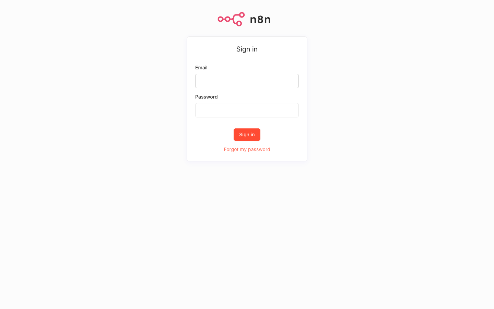

After creating the owner account, sign in. The first-time setup wizard may appear asking about usage preferences — you can skip it. You will land on the workflow dashboard.

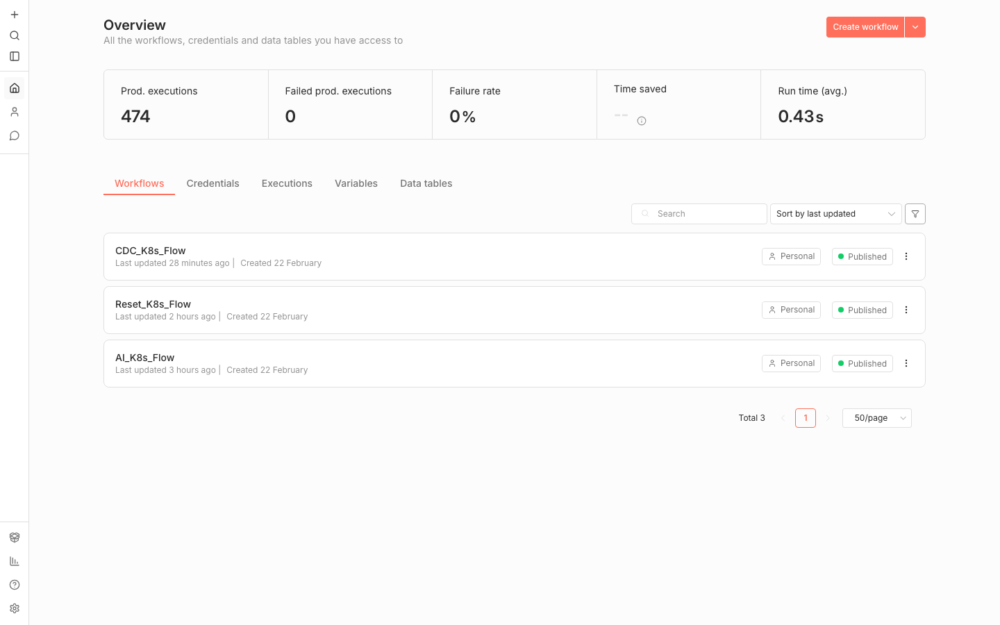

The dashboard is empty at this point. The next section walks through creating the Kafka credential and importing all four workflows.

---

## Part 2: The k8s-watcher Python Service

The watcher is the bridge between the Kubernetes API and Kafka. It runs ten watch loops in parallel daemon threads — one per resource type — and publishes every ADDED, MODIFIED, and DELETED event as a structured JSON message.

### The Ten Resource Types

```python
watchers = [
    (v1.list_namespace,                               "Namespace"),
    (v1.list_pod_for_all_namespaces,                  "Pod"),
    (v1.list_service_for_all_namespaces,              "Service"),
    (v1.list_config_map_for_all_namespaces,           "ConfigMap"),
    (v1.list_persistent_volume_claim_for_all_namespaces, "PVC"),
    (v1.list_secret_for_all_namespaces,               "Secret"),
    (apps.list_deployment_for_all_namespaces,         "Deployment"),
    (apps.list_replica_set_for_all_namespaces,        "ReplicaSet"),
    (apps.list_stateful_set_for_all_namespaces,       "StatefulSet"),
    (apps.list_daemon_set_for_all_namespaces,         "DaemonSet"),
]
```

Each uses `watch.stream(list_fn, timeout_seconds=0)` — an infinite stream that reconnects automatically on error. When the watcher starts, it also performs a full initial list of all resources and publishes ADDED events for everything in the cluster. This populates Qdrant on first run without needing a manual reset.

**Secret handling — safe spec only.** When the resource type is `Secret`, the watcher replaces the full spec with a minimal safe representation: `{"type": "Opaque", "dataKeys": ["my-key", "another-key"]}`. The base64-encoded values in `raw["data"]` are discarded before publishing to Kafka. This means Qdrant and the LLM can answer "What secrets exist in kube-system?" but never expose actual secret values — by design, not by accident.

### The `embed_text` Construction — The Most Critical Detail

The watcher constructs an `embed_text` field for each resource before publishing it to Kafka:

```python
scope     = f"in namespace {namespace}" if namespace else "cluster-scoped"
label_str = ", ".join(f"{k}={v}" for k, v in list(labels.items())[:5]) or "none"

embed_text = (
    f"Kubernetes {kind} named {name} {scope}. "
    f"Labels: {label_str}. "
    f"Spec: {spec_json[:600]}"
)
```

A real example:
```
Kubernetes Deployment named coredns in namespace kube-system.
Labels: k8s-app=kube-dns. Spec: {"replicas":2,"selector":{...}}
```

Why full sentences instead of `kind:Deployment name:coredns ns:kube-system`? Because `nomic-embed-text` was trained on natural-language text. Feeding it structured key=value pairs produces poor embeddings and low similarity scores. Natural-language sentences lift cosine similarity scores from the 0.15–0.28 range into the 0.38–0.70 range. This single change had the largest impact on system quality.

### In-Cluster Kubernetes Auth

When k8s-watcher runs as a pod, Kubernetes automatically mounts a ServiceAccount token at `/var/run/secrets/kubernetes.io/serviceaccount/`. The watcher detects this via the `KUBERNETES_SERVICE_HOST` environment variable (automatically set in every pod) and uses it:

```python
def load_k8s():
    if os.getenv("KUBERNETES_SERVICE_HOST"):
        # Running inside a pod — use the mounted ServiceAccount token
        config.load_incluster_config()
        log.info("K8s client configured — in-cluster (ServiceAccount token)")
    else:
        # Local dev / Docker Compose fallback — use kubeconfig
        cfg = client.Configuration()
        config.load_kube_config(config_file=KUBECONFIG, client_configuration=cfg)
        if K8S_SERVER:
            cfg.host = K8S_SERVER      # https://host.docker.internal:PORT
            cfg.verify_ssl = False
        client.Configuration.set_default(cfg)
        log.info("K8s client configured — server: %s", cfg.host)
```

The ServiceAccount is granted a ClusterRole with `list` and `watch` permissions on the ten monitored resource types via RBAC manifests in `infra/k8s/k8s-watcher/k8s-watcher-rbac.yaml`. No kubeconfig file, no hardcoded API server URL, no port hunting after every cluster recreation.

### The HTTP Server — healthz and resync

The watcher also exposes a lightweight HTTP server on port 8080 (NodePort 30002 on the host):

```python
# GET /healthz → {"status":"ok"}
# POST /resync  → 202 Accepted, then lists all 10 resource types
#                 and republishes every item as ADDED to Kafka
```

The `/resync` endpoint is what the Reset flow calls to rebuild Qdrant. It returns 202 immediately and runs the re-publish in a background thread, keeping the HTTP response time short. The full resync of a minimal kind cluster (35 resources) completes in about 30 seconds.

---

## Part 3: Building the n8n Workflows

There are two ways to get the workflows into n8n:
1. **Import from JSON** (recommended — 2 minutes, no manual configuration)
2. **Build from scratch** in the n8n UI (educational — this is what the rest of this article covers)

Both paths produce identical results.

### Setting Up the Kafka Credential

Before building the CDC workflow, you need to create a Kafka credential in n8n. This credential stores the bootstrap server address and is referenced by the Kafka Trigger node.

Navigate to **Credentials** in the left sidebar:

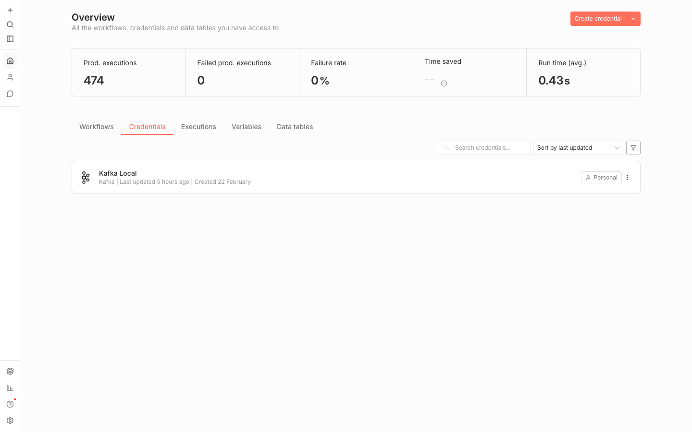

Click **Add credential**, search for **Kafka**, and select it. Fill in:

| Field | Value |
|---|---|
| Credential Name | `Kafka Local` |
| Bootstrap Servers | `kafka:9092` |

Use the internal Kubernetes service hostname `kafka` (not `localhost`) — n8n runs as a pod and resolves `kafka` to the Kafka ClusterIP Service directly via cluster DNS.

### Option A: Import from JSON (Recommended)

The fastest path is the setup script, which handles everything automatically — credential injection, deduplication, import, activation, and E2E test verification:

```bash
./scripts/setup.sh --keep-cluster   # cluster already running
# or
./scripts/setup.sh                  # full from-scratch setup
```

For a manual import when the cluster is already running:

```bash
# Get the n8n pod name
N8N_POD=$(kubectl --context kind-k8s-ai -n k8s-ai get pod -l app=n8n \
  -o jsonpath='{.items[0].metadata.name}')

# Copy workflow JSON files into the pod
kubectl --context kind-k8s-ai -n k8s-ai cp workflows/n8n_cdc_k8s_flow.json        ${N8N_POD}:/tmp/
kubectl --context kind-k8s-ai -n k8s-ai cp workflows/n8n_ai_k8s_flow.json         ${N8N_POD}:/tmp/
kubectl --context kind-k8s-ai -n k8s-ai cp workflows/n8n_reset_k8s_flow.json      ${N8N_POD}:/tmp/
kubectl --context kind-k8s-ai -n k8s-ai cp workflows/n8n_memory_clear_flow.json   ${N8N_POD}:/tmp/

# Import them (IDs are static — embedded in the JSON files)
kubectl --context kind-k8s-ai -n k8s-ai exec ${N8N_POD} -- n8n import:workflow --input=/tmp/n8n_cdc_k8s_flow.json
kubectl --context kind-k8s-ai -n k8s-ai exec ${N8N_POD} -- n8n import:workflow --input=/tmp/n8n_ai_k8s_flow.json
kubectl --context kind-k8s-ai -n k8s-ai exec ${N8N_POD} -- n8n import:workflow --input=/tmp/n8n_reset_k8s_flow.json
kubectl --context kind-k8s-ai -n k8s-ai exec ${N8N_POD} -- n8n import:workflow --input=/tmp/n8n_memory_clear_flow.json

# Activate all four (IDs are fixed — no discovery step needed)
kubectl --context kind-k8s-ai -n k8s-ai exec ${N8N_POD} -- n8n publish:workflow --id=k8sCDCflow00001
kubectl --context kind-k8s-ai -n k8s-ai exec ${N8N_POD} -- n8n publish:workflow --id=k8sAIflow000001
kubectl --context kind-k8s-ai -n k8s-ai exec ${N8N_POD} -- n8n publish:workflow --id=k8sRSTflow00001
kubectl --context kind-k8s-ai -n k8s-ai exec ${N8N_POD} -- n8n publish:workflow --id=k8sMEMclear001
kubectl --context kind-k8s-ai -n k8s-ai rollout restart deployment/n8n
kubectl --context kind-k8s-ai -n k8s-ai rollout status deployment/n8n --timeout=60s
```

> **Static workflow IDs:** The JSON files contain a hardcoded `id` field (`k8sCDCflow00001`, `k8sAIflow000001`, `k8sRSTflow00001`, `k8sMEMclear001`). Modern n8n (1.x+) uses this field on import — omitting it causes `SQLITE_CONSTRAINT: NOT NULL constraint failed: workflow_entity.id`.

> **Known n8n 2.6.4 bug:** `N8N_BASIC_AUTH_ACTIVE=true` causes the body-parser middleware to reject all `POST /rest/*` requests. The browser UI toggle and REST API both fail silently. The only reliable way to activate workflows is `n8n publish:workflow` via the CLI inside the container.

### Option B: Build from Scratch in the n8n UI

To create a workflow manually, click **Workflows** in the left sidebar, then click **Add Workflow** (or the `+` button). A blank canvas appears:

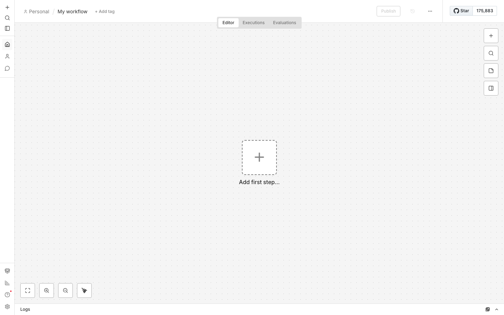

To add your first node, press **Tab** or click the `+` button in the center of the canvas. The node creator panel slides in from the right:

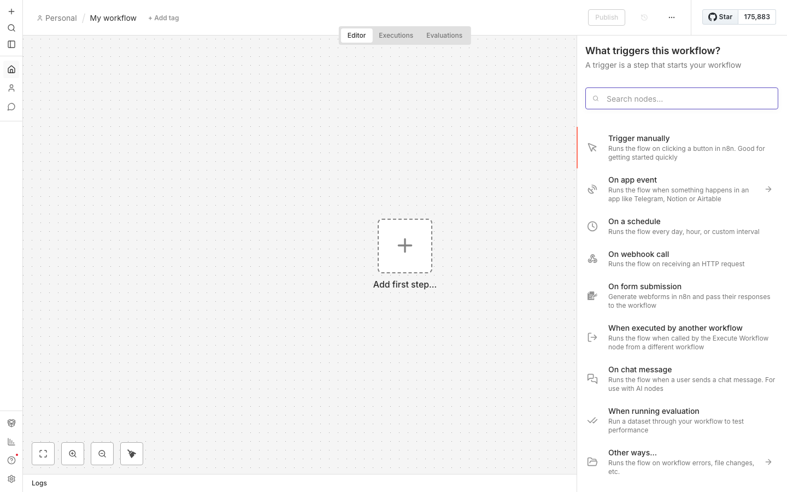

The node creator shows a search bar and categorised node list. Type the node name to filter. The following screenshots show searches for each node type used across the three flows:

**Searching "kafka trigger"** — the Kafka Trigger node (used in CDC_K8s_Flow):

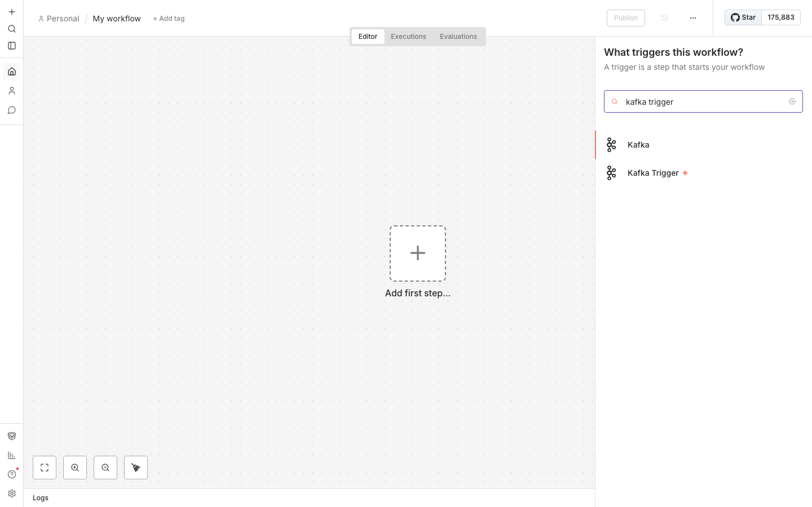

**Searching "http request"** — the HTTP Request node (used in all three flows for Qdrant and Ollama calls):

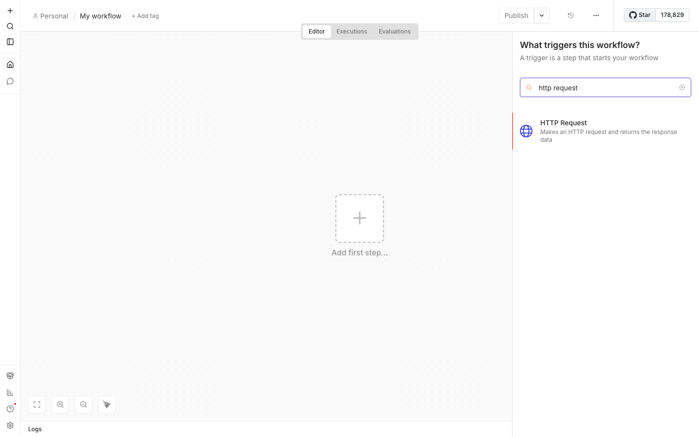

**Searching "code"** — the Code node (used for JavaScript logic in all three flows):

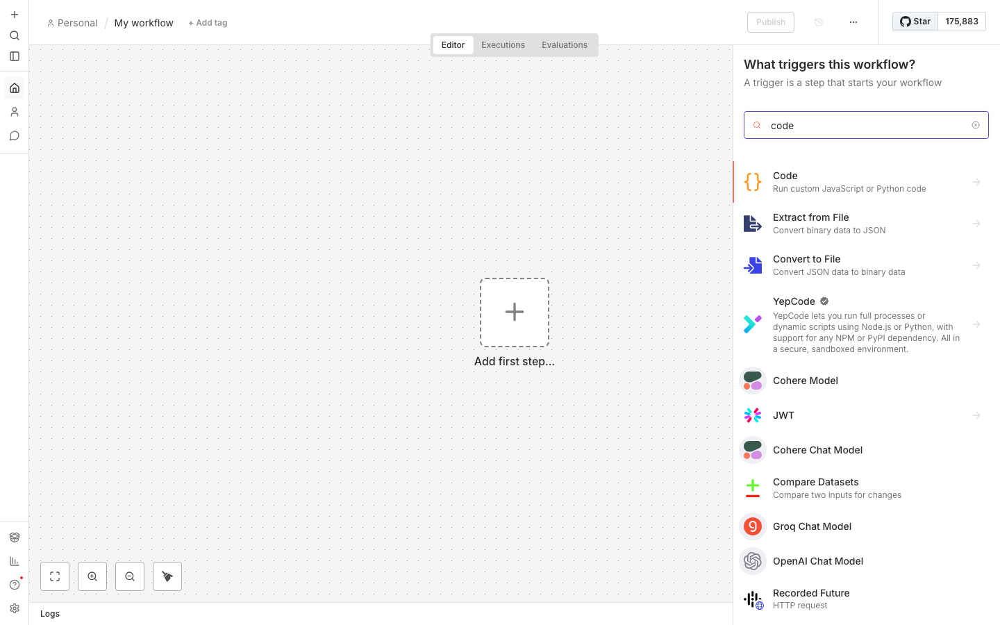

**Searching "if"** — the If node (used in CDC_K8s_Flow to branch on event type):

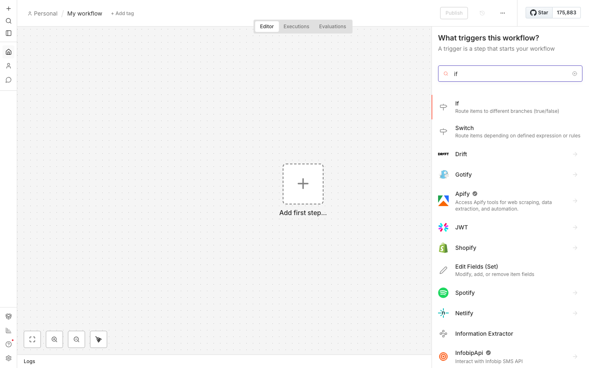

**Searching "webhook"** — the Webhook node (used in Reset_K8s_Flow as the entry point):

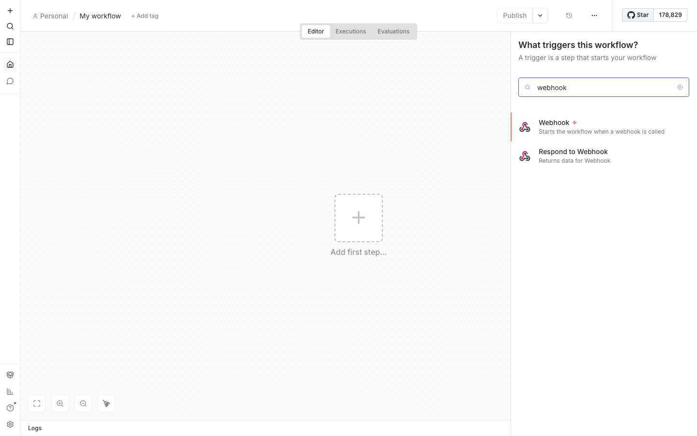

**Searching "chat trigger"** — the Chat Trigger node (used in AI_K8s_Flow as the entry point):

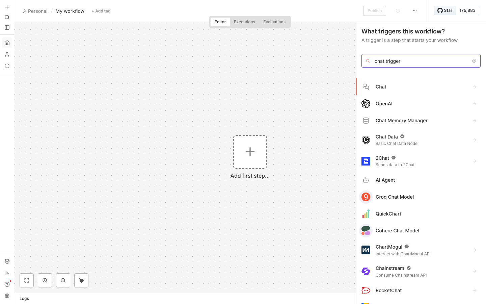

Click a result to place it on the canvas. Once placed, a single click on the node icon opens its configuration panel (the Node Details View, or NDV). The configuration panels shown in the sections below are what you will fill in for each node.

### After All Three Workflows Are Active

After importing or building all four workflows and activating them, the n8n dashboard shows:


All three workflows carry the green **Published** badge. The execution count and zero failures confirm the pipeline is running clean.

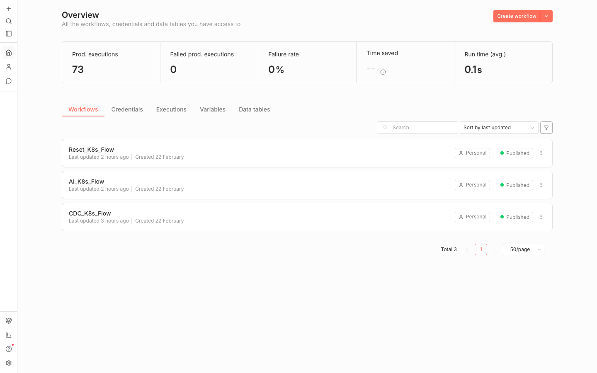

---

## Flow 1: CDC_K8s_Flow — Continuous Indexing

This is the backbone of the system. It runs permanently, consuming every Kubernetes change event from Kafka and keeping Qdrant in sync. Every resource change in the cluster is indexed within two seconds.

**To create this flow:** In the n8n dashboard click **Add Workflow**, name it `CDC_K8s_Flow`, then add the seven nodes described below in left-to-right order. Connect them with edges (drag from the output dot of one node to the input dot of the next).

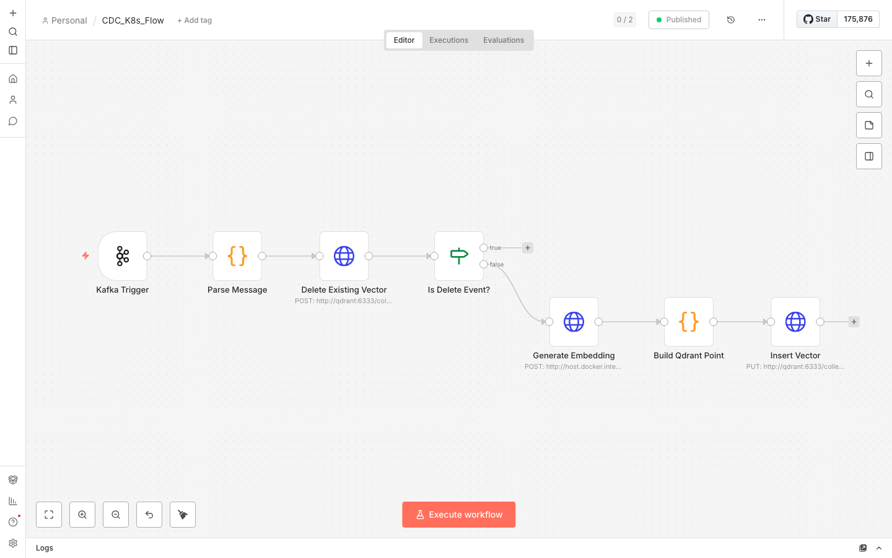

The canvas shows seven nodes left-to-right. At the "Is Delete Event?" branch, the true path terminates (nothing to index) while the false path continues through embedding and insertion.

---

### CDC Node 1 — Kafka Trigger

Press **Tab** → search **"kafka trigger"** → select **Kafka Trigger**. This is the entry point: it opens a persistent consumer connection to Kafka and fires the rest of the workflow for every message on the `k8s-resources` topic.


**Configuration:**

| Field | Value | Why |
|---|---|---|
| Credential to connect with | `Kafka Local` | The credential you created (bootstrap: `kafka:9092`) |
| Topic | `k8s-resources` | Must match `KAFKA_TOPIC` in the watcher's environment |
| Group ID | `n8n-cdc-consumer` | Kafka tracks this group's offset — survives n8n restarts |
| Allow Topic Creation | Off | Topic must already exist |

Under **Add option**, also add:

| Option | Value |
|---|---|
| Auto Offset Reset | `latest` |

Setting `Auto Offset Reset: latest` means the flow only processes messages published **after** the workflow starts — it does not replay historical Kafka messages on each n8n restart. This is intentional: the Reset flow (`POST /webhook/k8s-reset`) is the correct way to rebuild Qdrant from scratch. Using `earliest` would cause CDC to replay the entire topic history on every n8n restart, filling Qdrant with stale duplicate points and breaking the Reset E2E test (which expects Qdrant to be empty immediately after reset).

**Why Kafka and not a direct webhook?** Consumer group offset tracking means if n8n restarts, it resumes exactly where it left off. No events are lost. No polling loops. If the watcher publishes events faster than n8n processes them, Kafka absorbs the backpressure.

---

### CDC Node 2 — Parse Message

Press **Tab** → search **"code"** → select **Code**. Connect it to the Kafka Trigger output.

This node unwraps the Kafka message envelope and constructs the `embed_text` string that will be converted into a vector.

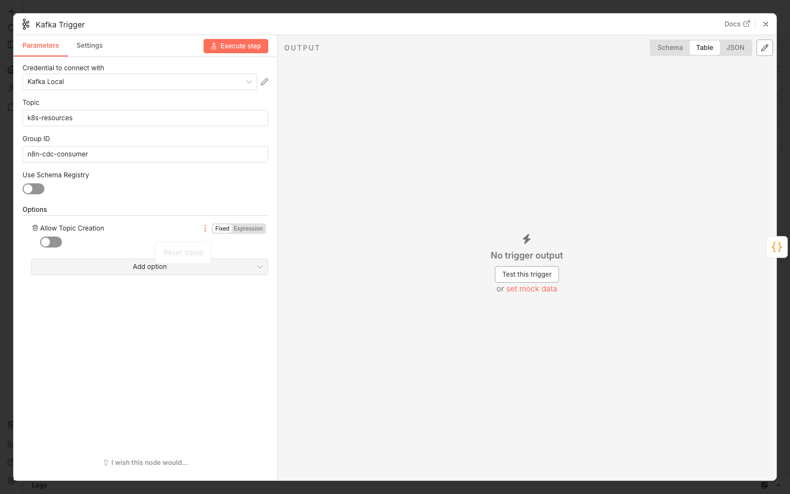

**Configuration:**

Set **Language** to `JavaScript`. Paste this code into the editor:

```javascript
// The Kafka trigger delivers the raw message string in .message
const raw = $input.first().json;
let data;
try {
  data = typeof raw.message === 'string' ? JSON.parse(raw.message) : raw;
} catch (_) {
  data = raw;
}

// Use embed_text from watcher if present; reconstruct it otherwise
let embed_text = data.embed_text;
if (!embed_text) {
  const scope = data.namespace
    ? `in namespace ${data.namespace}`
    : 'cluster-scoped';
  const labels = Object.entries(data.labels || {})
    .slice(0, 5)
    .map(([k, v]) => `${k}=${v}`)
    .join(', ') || 'none';
  embed_text = `Kubernetes ${data.kind} named ${data.name} ${scope}. `
             + `Labels: ${labels}. `
             + `Spec: ${(data.raw_spec_json || '{}').substring(0, 600)}`;
}

return [{ json: { ...data, embed_text } }];
```

The fallback `embed_text` builder is a defensive layer — if the watcher version changes or a message arrives through a different path, the CDC flow can still produce a consistent embedding. Both the watcher and this node use identical logic, so vectors are always constructed the same way.

---

### CDC Node 3 — Delete Existing Vector

Press **Tab** → search **"http request"** → select **HTTP Request**. Connect it to the Parse Message output.

This node removes any existing vector for this resource from Qdrant before inserting the updated one — the idempotency guarantee.

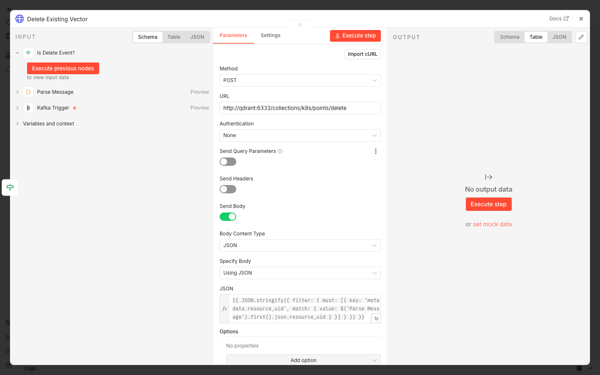

**Configuration:**

| Field | Value |
|---|---|
| Method | `POST` |
| URL | `http://qdrant:6333/collections/k8s/points/delete` |
| Body Content Type | `JSON` |
| JSON Body | `={{ JSON.stringify({ points: [$('Parse Message').first().json.resource_uid] }) }}` |

**Why delete instead of upsert?** Qdrant's upsert updates the payload but reuses the existing vector. For our use case this is wrong — if a Deployment's replica count changes from 2 to 5, the embedding must be recomputed from the new spec so queries about "5-replica deployments" find it. Delete + re-insert guarantees the vector always reflects the current state.

For brand-new resources (ADDED events), the delete call finds nothing and returns `{"result":{"status":"acknowledged"}}` — a harmless no-op.

---

### CDC Node 4 — Is Delete Event?

Press **Tab** → search **"if"** → select **If**. Connect it to the Delete Existing Vector output.

This node routes the workflow based on the Kubernetes event type.

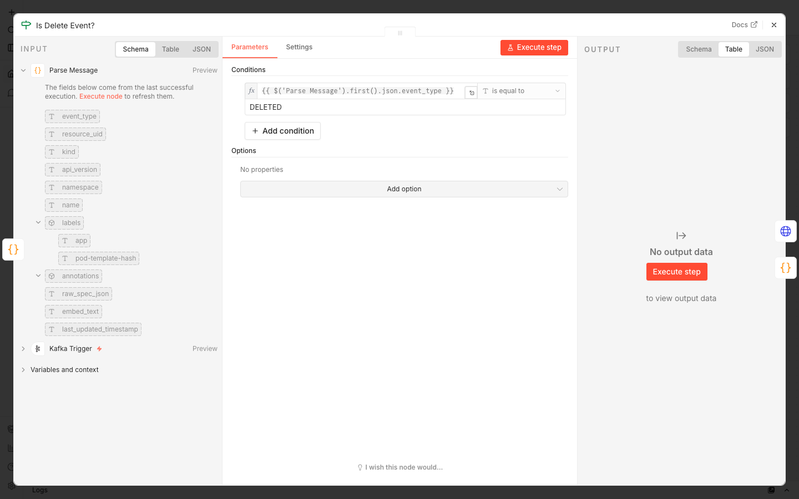

**Configuration:**

Add one condition:

| Condition | Value |
|---|---|
| Value 1 | `{{ $('Parse Message').first().json.event_type }}` |
| Operation | `is equal to` |
| Value 2 | `DELETED` |

**The two branches:**
- **True** (DELETED event) — The vector was already removed in Node 3. Stop here. Nothing to embed or insert.
- **False** (ADDED or MODIFIED) — The resource exists and needs indexing. Continue to Node 5.

Connect the **False** output to Node 5 below. The **True** output has no connection — the execution stops there.

---

### CDC Node 5 — Format Document

Press **Tab** → search **"code"** → select **Code**. Connect it to the **False** output of the If node.

This node reshapes the parsed resource data into the format n8n's native Qdrant Vector Store insert node expects: a `pageContent` field containing the text to embed, and a `metadata` object carrying all resource fields.

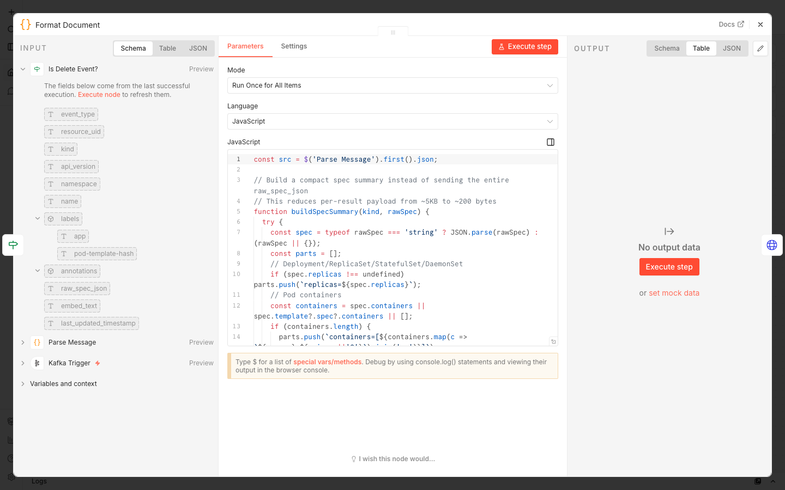

**Configuration:**

Set **Language** to `JavaScript`. Paste:

```javascript
const src = $('Parse Message').first().json;
return [{
  json: {
    pageContent: src.embed_text,
    metadata: {
      resource_uid:           src.resource_uid,
      kind:                   src.kind,
      api_version:            src.api_version,
      namespace:              src.namespace,
      name:                   src.name,
      labels:                 JSON.stringify(src.labels || {}),
      annotations:            JSON.stringify(src.annotations || {}),
      raw_spec_json:          src.raw_spec_json,
      last_updated_timestamp: src.last_updated_timestamp
    }
  }
}];
```

**Why `pageContent`?** n8n's LangChain Qdrant node uses `pageContent` as the text field for embedding. The native insert node reads this field, calls the configured embeddings model, and stores both the vector and the metadata — replacing the three-node HTTP-based approach with a single native operation.

**Why store `raw_spec_json` in the metadata?** It travels with every search hit, enabling the AI flow to answer questions like "What are the CPU limits on the coredns deployment?"

---

### CDC Node 6 — Insert to Qdrant

Press **Tab** → search **"qdrant"** → select **Qdrant Vector Store**. Connect it to the Format Document output. Set **mode** to **Insert Documents**.

This is n8n's native Qdrant integration. It reads `pageContent` from the incoming item, calls the Embeddings Ollama sub-node to generate the 768-dim vector, and upserts the point into Qdrant — all in a single node.


**Configuration:**

| Field | Value |
|---|---|
| Operation Mode | `Insert Documents` |
| Qdrant Collection | `k8s` (ID mode) |
| Credential | `Qdrant Local` (`qdrantApi` → `http://qdrant:6333`) |

Connect a **Qdrant Vector Store** sub-node slot: in the canvas, click the `ai_embedding` connector on the Insert to Qdrant node and attach the Embeddings Ollama (CDC) node.

The native node handles the embedding call and Qdrant upsert internally. End-to-end from `kubectl apply` to searchable vector: under 2 seconds, dominated by the ~400–600ms Ollama embedding call.

---

### CDC Sub-Node — Embeddings Ollama (CDC)

Press **Tab** → search **"embeddings ollama"** → select **Embeddings Ollama**. Wire it to the `ai_embedding` slot of Insert to Qdrant.

This sub-node provides the embedding model used by the Insert to Qdrant node.


**Configuration:**

| Field | Value |
|---|---|
| Model | `nomic-embed-text:latest` |
| Credential | `Ollama Local` (`ollamaApi` → `http://host.docker.internal:11434`) |

**This symmetry is the foundation of RAG.** The same `nomic-embed-text` model is used for both indexing (here) and querying (in the AI flow). Documents and queries exist in the same 768-dimensional semantic space — enabling accurate cosine similarity search.

### Activate the CDC Flow

Save the workflow (Ctrl/Cmd + S), then activate it from the CLI:

```bash
N8N_POD=$(kubectl --context kind-k8s-ai -n k8s-ai get pod -l app=n8n \
  -o jsonpath='{.items[0].metadata.name}')
kubectl --context kind-k8s-ai -n k8s-ai exec ${N8N_POD} -- n8n list:workflow
# note the CDC workflow ID
kubectl --context kind-k8s-ai -n k8s-ai exec ${N8N_POD} -- n8n publish:workflow --id=<CDC_ID>
kubectl --context kind-k8s-ai -n k8s-ai rollout restart deployment/n8n
```

### CDC Flow in Action


The Executions tab shows a burst of events processed during a resync. Fast DELETED-branch executions complete in 49–96ms. Full ADDED/MODIFIED executions (with embedding) take 450–466ms.

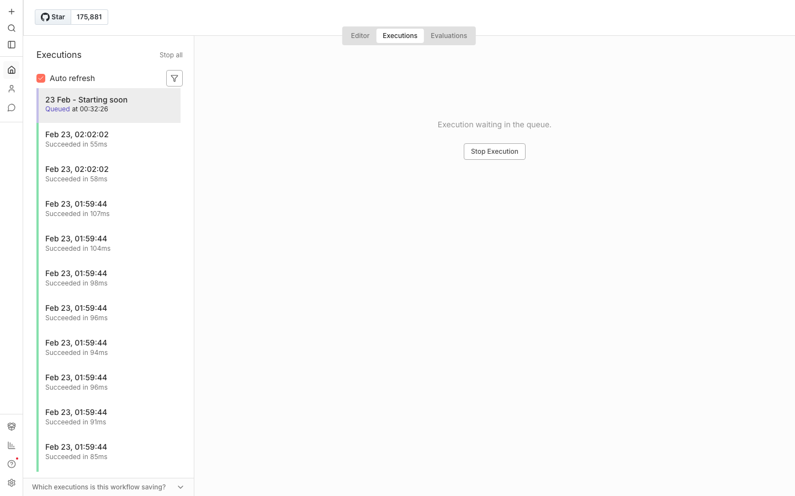

Execution #277: all nodes show green checkmarks, "1 item" flows between each, and the "Is Delete Event?" node shows `false` on the outgoing edge — confirming this was an ADDED or MODIFIED event that went through the full embedding path. Completed in 466ms.

---

## Flow 2: AI_K8s_Flow — The Query Pipeline

This flow answers user questions using n8n's native LangChain AI Agent node. The agent autonomously decides when and how to search the knowledge base, then generates a grounded response.

**To create this flow:** In the n8n dashboard click **Add Workflow**, name it `AI_K8s_Flow`, then add the six nodes described below.

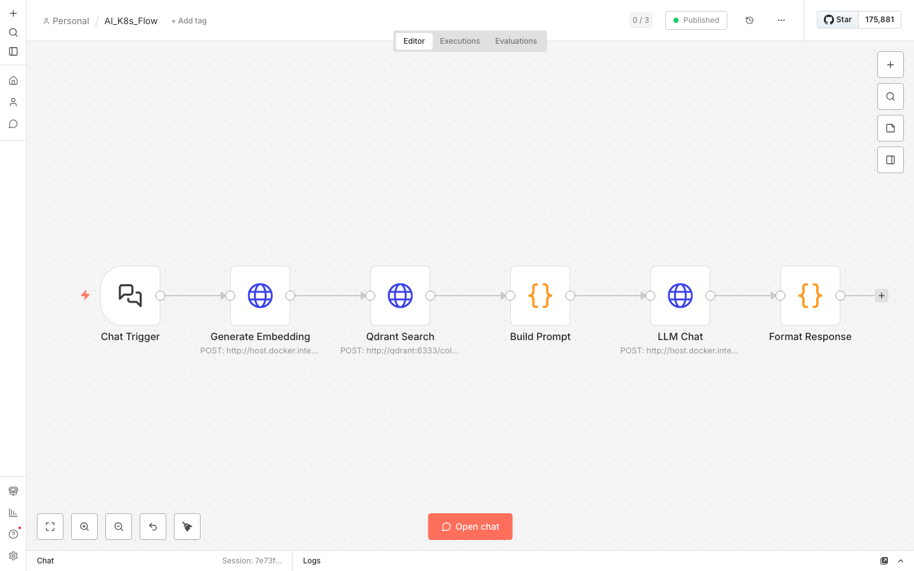

Two main nodes (Chat Trigger + AI Agent) plus four sub-nodes wired into the agent's LangChain slots: a chat model, a vector store tool, an embeddings model, and a Postgres Chat Memory node. The "Open chat" button at the bottom launches n8n's built-in chat UI connected to this flow's public webhook.

---

### AI Node 1 — Chat Trigger

Press **Tab** → search **"chat trigger"** → select **Chat Trigger**. This is the entry point that exposes the public webhook.

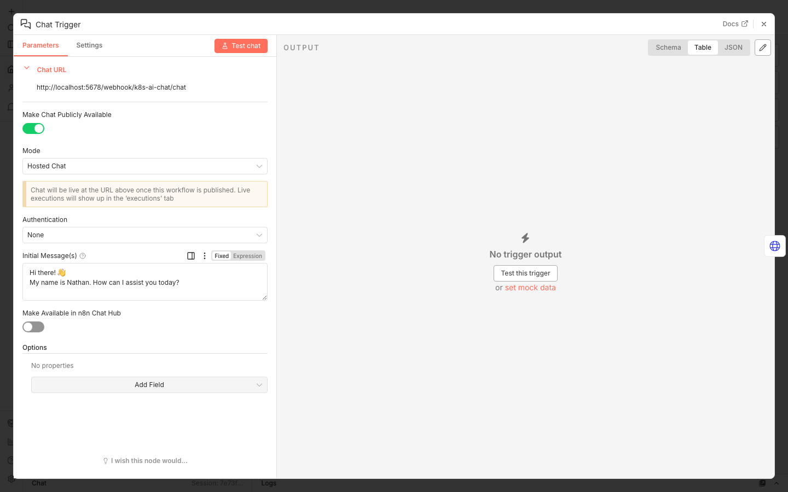

**Configuration:**

| Field | Value |
|---|---|
| Make Chat Publicly Available | Toggle **ON** |
| Webhook ID | `k8s-ai-chat` |

This creates the public endpoint: `http://localhost:30000/webhook/k8s-ai-chat/chat`

No authentication is required on this endpoint — intentional for a local development environment. The Chat Trigger:
- Holds the HTTP connection open while the workflow runs
- Passes `{ "chatInput": "..." }` to the AI Agent
- Automatically sends the agent's final reply back as the response

You can reach it from a browser (n8n renders a chat UI) or from curl:

```bash
curl -X POST http://localhost:30000/webhook/k8s-ai-chat/chat \
  -H 'Content-Type: application/json' \
  -d '{"chatInput": "Show me all deployments and their replica counts"}'
```

---

### AI Node 2 — AI Agent

Press **Tab** → search **"agent"** → select **AI Agent**. Connect it to the Chat Trigger output.

The AI Agent is the orchestrator. It receives the user question, decides to call the `kubernetes_knowledge_base` tool (the Qdrant Vector Store), retrieves relevant resources, then generates a grounded response using the Ollama Chat Model.

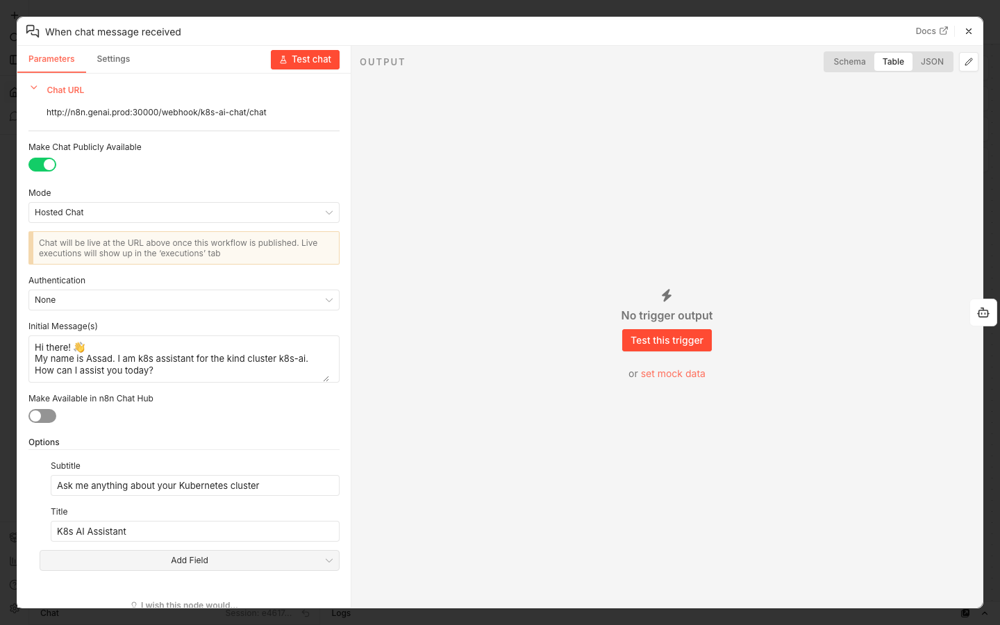

**Configuration:**

| Field | Value |
|---|---|
| Agent Type | `Tools Agent` |
| System Message | (see below) |

**System Message:**

```
You are an expert Kubernetes AI assistant with access to a live cluster knowledge base.

ALWAYS use the kubernetes_knowledge_base tool to search for relevant cluster state before answering. Never answer from memory alone.

Rules:
- Search for EVERY user question — never skip the tool
- ONLY answer based on retrieved context; never hallucinate cluster state
- If the tool returns no results: "No indexed Kubernetes resources found in vector database."
- Use markdown tables for structured/aggregated data (namespace lists, resource counts, deployment specs)
- Be concise and technical
- Do not expose internal resource_uid values
- For secret resources: list names and types only, never expose secret data values
```

**"ALWAYS use the tool" is non-negotiable.** Without this instruction, the agent may answer deployment questions from its training data rather than from your actual cluster. The tool call guarantees every answer is grounded in live indexed state.

After placing the AI Agent node, wire the three sub-nodes described below into its connection slots.

---

### AI Sub-Node A — Ollama Chat Model

Press **Tab** → search **"ollama"** → select **Ollama Chat Model**. Wire it to the `ai_languageModel` slot of the AI Agent.

Provides the language model the agent uses for reasoning and response generation.

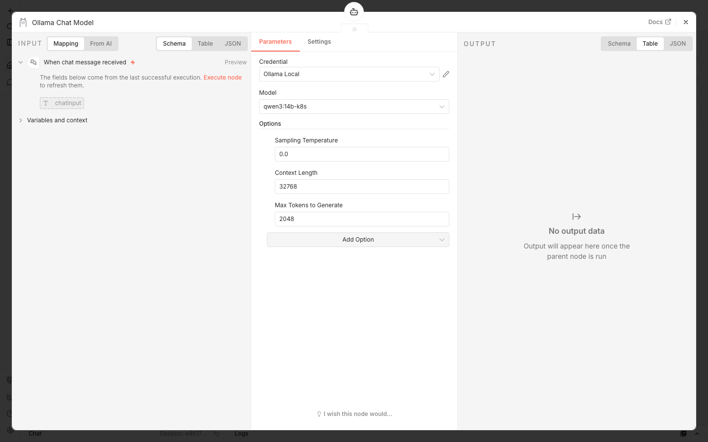

**Configuration:**

| Field | Value |
|---|---|
| Model | `qwen3:8b` |
| Temperature | `0.1` |
| Credential | `Ollama Local` (`ollamaApi` → `http://host.docker.internal:11434`) |

**`temperature: 0.1`** — Near-deterministic output. This is a factual lookup and formatting task, not creative writing. Low temperature produces consistent, accurate answers without randomness.

**`qwen3:8b` and tool-calling.** The Tools Agent mode requires a model that supports Ollama function calling. `qwen3:8b` implements this natively — it can decide to call `kubernetes_knowledge_base`, receive the results, and incorporate them into its answer in a single agentic loop.

---

### AI Sub-Node B — Qdrant Vector Store

Press **Tab** → search **"qdrant"** → select **Qdrant Vector Store**. Wire it to the `ai_tool` slot of the AI Agent.

Exposes the `k8s` Qdrant collection as a named tool the agent can call. The agent invokes it with a natural-language query; the node embeds the query, searches Qdrant, and returns matching documents.

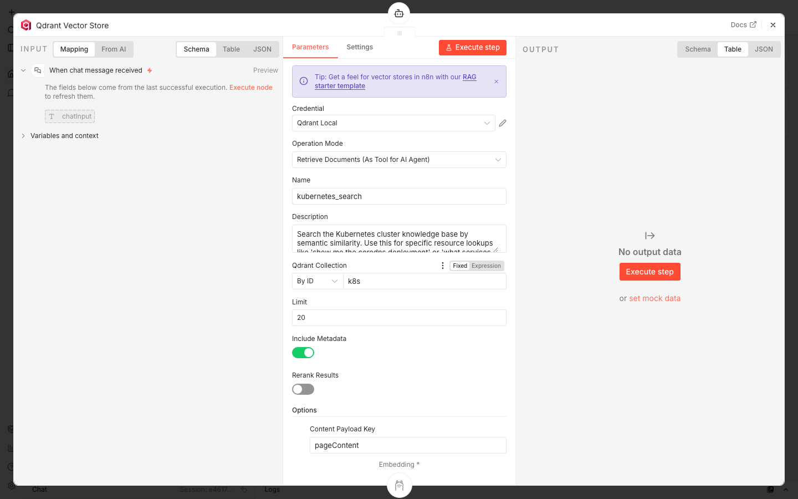

**Configuration:**

| Field | Value |
|---|---|
| Operation Mode | `Retrieve Documents (As Tool for AI Agent)` |
| Qdrant Collection | `k8s` (ID mode) |
| Tool Name | `kubernetes_knowledge_base` |
| Tool Description | `Search the Kubernetes cluster knowledge base. Use this for any question about pods, deployments, services, namespaces, secrets, configmaps, or other cluster resources.` |
| Limit | `30` |
| Credential | `Qdrant Local` (`qdrantApi` → `http://qdrant:6333`) |

**`limit: 30`** — a minimal kind cluster has ~35 resources. Retrieving up to 30 ensures broad questions like "list everything" can be answered comprehensively.

Wire an Embeddings Ollama sub-node to the `ai_embedding` slot of this Qdrant node (described next).

---

### AI Sub-Node C — Embeddings Ollama

Press **Tab** → search **"embeddings ollama"** → select **Embeddings Ollama**. Wire it to the `ai_embedding` slot of the Qdrant Vector Store node.

Provides the embedding model used to convert the user's query into a vector before searching Qdrant.

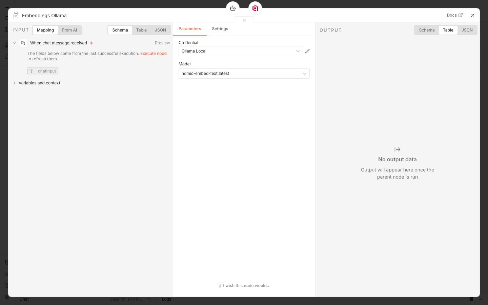

**Configuration:**

| Field | Value |
|---|---|
| Model | `nomic-embed-text:latest` |
| Credential | `Ollama Local` (`ollamaApi` → `http://host.docker.internal:11434`) |

**This symmetry is the foundation of RAG.** The same `nomic-embed-text` model is used for both indexing (in the CDC flow) and querying (here). Documents and queries exist in the same 768-dimensional semantic space — enabling accurate cosine similarity search.

The scoring range for `nomic-embed-text` on Kubernetes metadata is 0.38–0.70. The Qdrant node's default threshold is set to retrieve all relevant results; the agent's system message provides the guardrail against hallucinating from low-relevance hits.

---

### AI Sub-Node D — Postgres Chat Memory

Press **Tab** → search **"postgres chat memory"** → select **Postgres Chat Memory**. Wire it to the `ai_memory` slot of the AI Agent.

This sub-node gives the agent conversation memory. Each message pair (user question + agent answer) is stored in the `n8n_chat_histories` table in PostgreSQL. On the next query, the agent receives the last 5 exchanges as context — enabling follow-up questions like "What did I just ask you?" to be answered correctly.

**Configuration:**

| Field | Value |
|---|---|
| Session ID Type | `Custom Key` |
| Session Key | `k8s-ai-global` |
| Table Name | `n8n_chat_histories` |
| Context Window Length | `5` |
| Credential | `Postgres Local` (`postgres` → host: `postgres`, db: `n8n_memory`, user: `n8n`) |

**Why a fixed session key?** This is a single-user local assistant. All webhook calls share one persistent session (`k8s-ai-global`), so conversation context accumulates across curl calls and browser chat sessions without any session management complexity. For a multi-user deployment, replace with `{{ $('When chat message received').item.json.sessionId }}` to derive a per-user key from the request.

**Why `contextWindowLength: 5`?** Five message pairs (10 messages total) provides enough context for meaningful follow-up questions without inflating the LLM's prompt size. Each additional message pair adds ~100–500 tokens depending on answer length.

**The `n8n_chat_histories` table** is auto-created by n8n on the first successful memory write. Its schema: `session_id TEXT`, `message JSONB`, `id SERIAL PRIMARY KEY`. You can inspect it via pgAdmin at `http://localhost:30003` or directly via psql:

```bash
psql -h localhost -p 30004 -U n8n -d n8n_memory   -c "SELECT session_id, message->>'type' AS type FROM n8n_chat_histories;"
```

### Activate the AI Flow

```bash
N8N_POD=$(kubectl --context kind-k8s-ai -n k8s-ai get pod -l app=n8n \
  -o jsonpath='{.items[0].metadata.name}')
kubectl --context kind-k8s-ai -n k8s-ai exec ${N8N_POD} -- n8n publish:workflow --id=<AI_ID>
kubectl --context kind-k8s-ai -n k8s-ai rollout restart deployment/n8n
```

### The AI Flow in Action

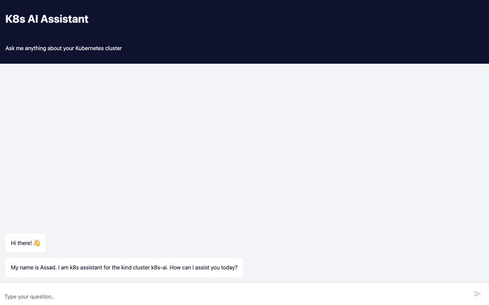

Opening `http://localhost:30000/webhook/k8s-ai-chat/chat` presents n8n's built-in chat widget. No login, no setup — type and ask.

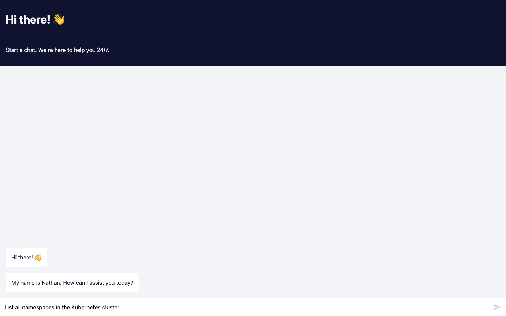

The user types a plain-English question.

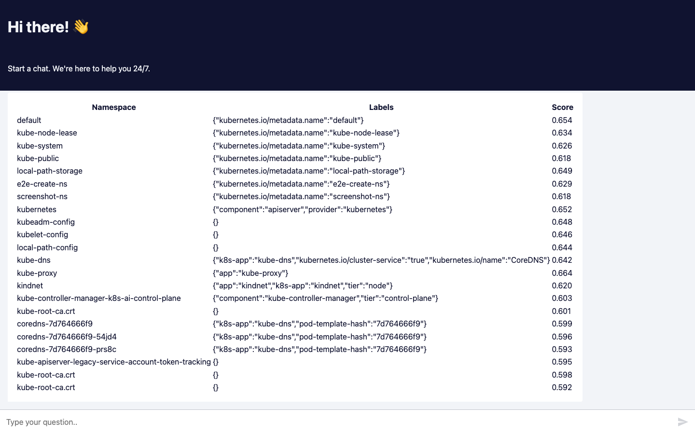

The response arrives as a structured markdown table containing real namespace data from the cluster — default, kube-system, kube-public, kube-node-lease, local-path-storage, and others — exactly as they exist in the kind cluster. No invented entries. No hallucinated namespaces.

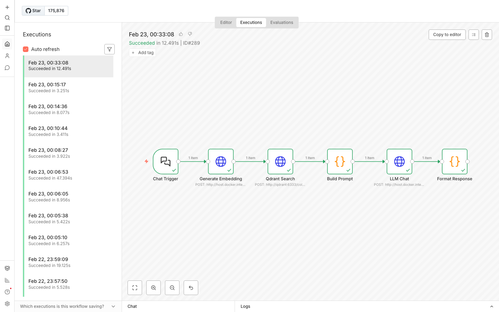

---

## Flow 3: Reset_K8s_Flow — On-Demand Re-indexing

This utility flow solves a practical problem: sometimes you need to start completely fresh. New embedding model (incompatible vectors), cluster recreated, schema changed, or simply verifying the full pipeline from scratch. One HTTP call wipes Qdrant and triggers a complete re-index.

**To create this flow:** In the n8n dashboard click **Add Workflow**, name it `Reset_K8s_Flow`, then add the five nodes described below.

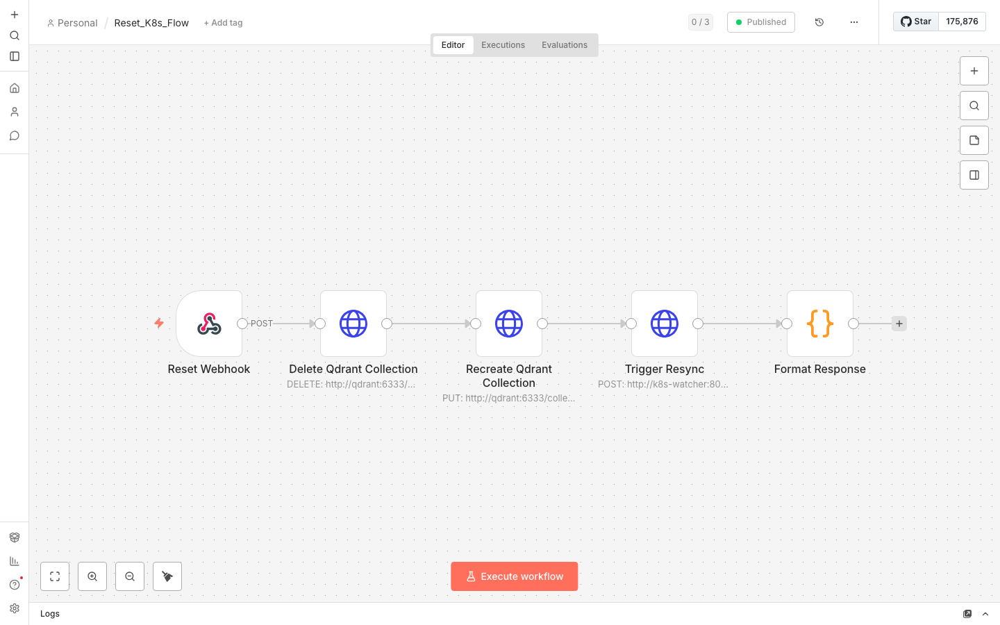

Five nodes, no branching, response mode set to `Last Node` so the caller waits for confirmation that all steps completed before receiving the response.

---

### Reset Node 1 — Reset Webhook

Press **Tab** → search **"webhook"** → select **Webhook**. This is the entry point.

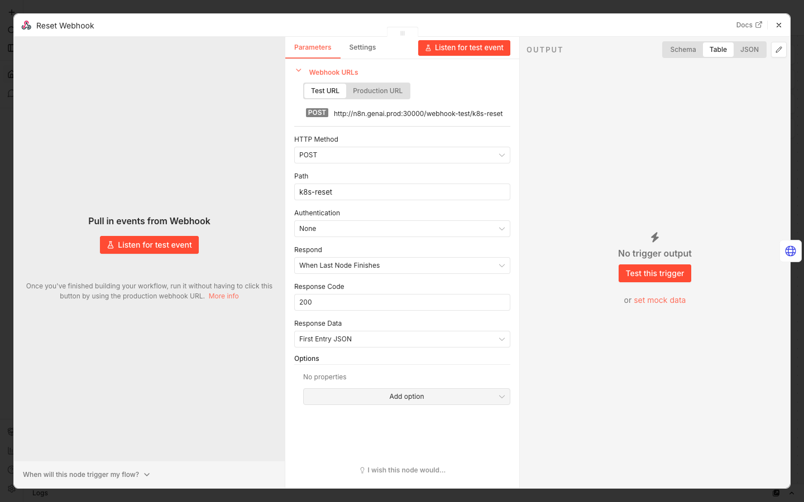

**Configuration:**

| Field | Value |
|---|---|
| HTTP Method | `POST` |
| Path | `k8s-reset` |
| Response Mode | `Last Node` |

`Response Mode: Last Node` is key. The webhook holds the TCP connection open while Nodes 2–5 execute. The caller receives the JSON output from the Format Response node as the HTTP response body — so you know exactly when the reset completed.

**How to trigger:**
```bash
curl -s -X POST http://localhost:30000/webhook/k8s-reset \
  -H 'Content-Type: application/json' -d '{}'
```

---

### Reset Node 2 — Delete Qdrant Collection

Press **Tab** → search **"http request"** → select **HTTP Request**. Connect it to the Webhook output.

Drops the entire `k8s` collection — every vector, every payload, every index.

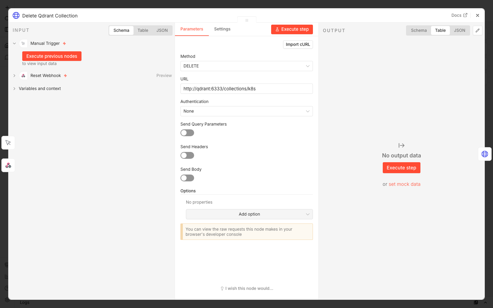

**Configuration:**

| Field | Value |
|---|---|
| Method | `DELETE` |
| URL | `http://qdrant:6333/collections/k8s` |

**Response from Qdrant:** `{"result":true,"status":"ok","time":0.043}`

After this node executes, the collection does not exist. Any Qdrant queries between this node and the collection recreation in Node 3 will return 404. This is acceptable — the reset is intentionally disruptive, and it completes in under 100ms.

---

### Reset Node 3 — Recreate Qdrant Collection

Press **Tab** → search **"http request"** → select **HTTP Request**. Connect it to the Delete output.

Creates a fresh 768-dimensional Cosine similarity collection.

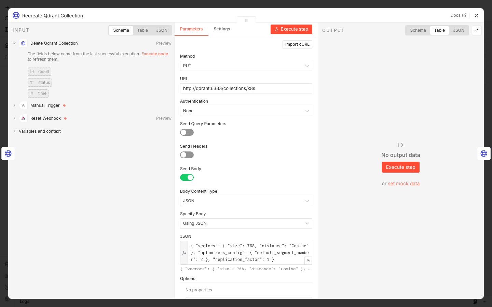

**Configuration:**

| Field | Value |
|---|---|
| Method | `PUT` |
| URL | `http://qdrant:6333/collections/k8s` |
| Body Content Type | `JSON` |
| JSON Body | `={ "vectors": { "size": 768, "distance": "Cosine" }, "optimizers_config": { "default_segment_number": 2 }, "replication_factor": 1 }` |

**`size: 768`** must match `nomic-embed-text`'s output dimensionality exactly. Change the embedding model → change this number.

**`distance: Cosine`** — Cosine similarity measures vector angle, not magnitude. For semantic embeddings, this is the correct choice: semantically similar texts produce vectors pointing in similar directions regardless of text length.

---

### Reset Node 4 — Trigger Resync

Press **Tab** → search **"http request"** → select **HTTP Request**. Connect it to the Recreate output.

Calls the k8s-watcher's `/resync` endpoint, which lists all nine tracked resource types and republishes every object as an ADDED event to Kafka.

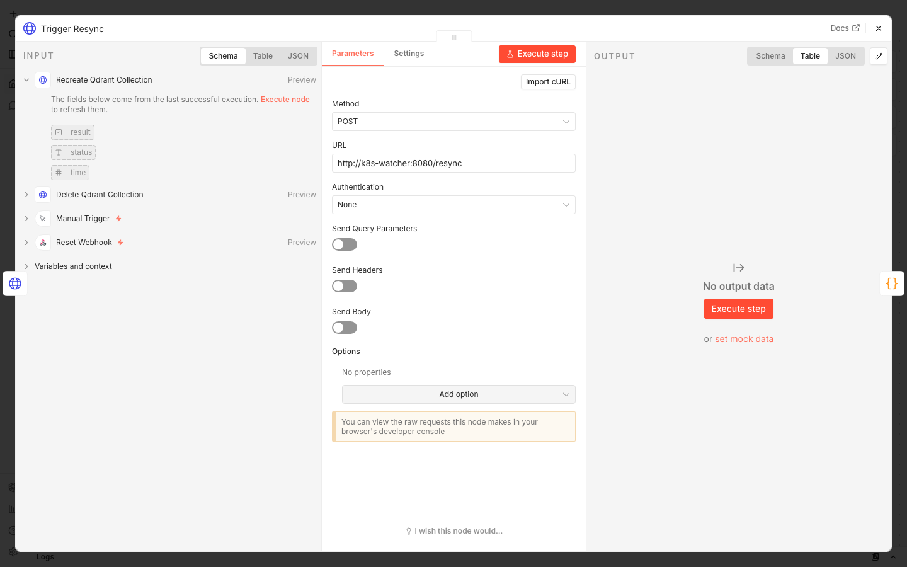

**Configuration:**

| Field | Value |
|---|---|
| Method | `POST` |
| URL | `http://k8s-watcher:8080/resync` |

Note the internal Kubernetes Service port `8080` (exposed as NodePort `30002` on the host — but pod-to-pod traffic uses the ClusterIP Service port directly).

**The watcher's response:** `{"status":"accepted","message":"Resync started in background"}` — 202 Accepted immediately, resync runs in a daemon thread. The CDC flow then processes each event asynchronously. On a minimal kind cluster, Qdrant is fully repopulated within 30–45 seconds.

---

### Reset Node 5 — Format Response

Press **Tab** → search **"code"** → select **Code**. Connect it to the Trigger Resync output.

Constructs the confirmation JSON returned to the curl caller.

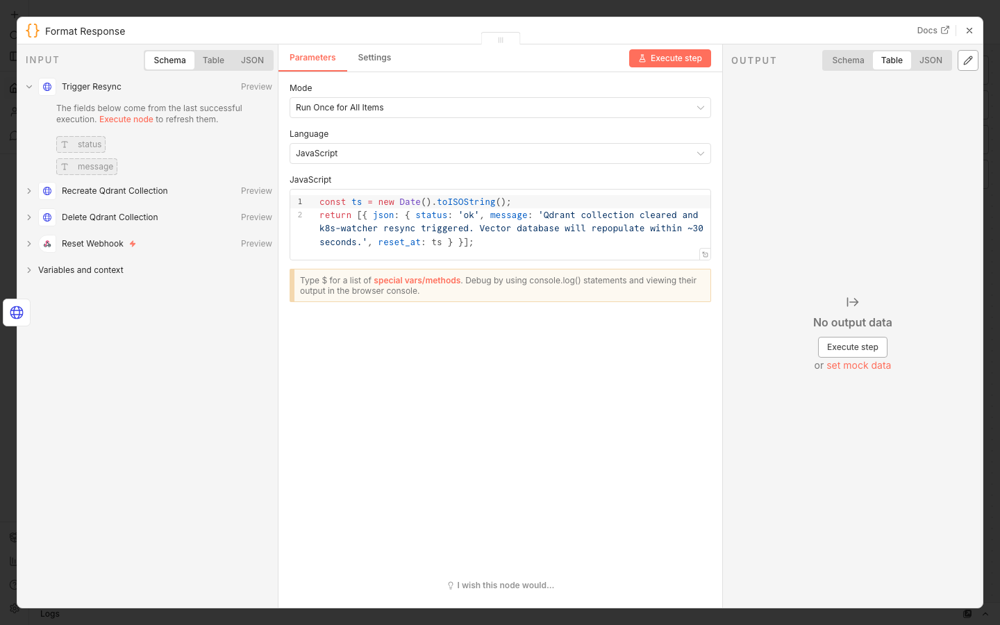

**Configuration:**

Set **Language** to `JavaScript`. Paste:

```javascript
const ts = new Date().toISOString();
return [{
  json: {
    status: 'ok',
    message: 'Qdrant collection cleared and k8s-watcher resync triggered. '
           + 'Vector database will repopulate within ~30 seconds.',
    reset_at: ts
  }
}];
```

**What the caller receives:**
```json
{
  "status": "ok",
  "message": "Qdrant collection cleared and k8s-watcher resync triggered. Vector database will repopulate within ~30 seconds.",
  "reset_at": "2026-02-23T06:19:43.442Z"
}
```

### Activate the Reset Flow

```bash
N8N_POD=$(kubectl --context kind-k8s-ai -n k8s-ai get pod -l app=n8n \
  -o jsonpath='{.items[0].metadata.name}')
kubectl --context kind-k8s-ai -n k8s-ai exec ${N8N_POD} -- n8n publish:workflow --id=<RESET_ID>
kubectl --context kind-k8s-ai -n k8s-ai rollout restart deployment/n8n
```

### Reset Flow Execution History

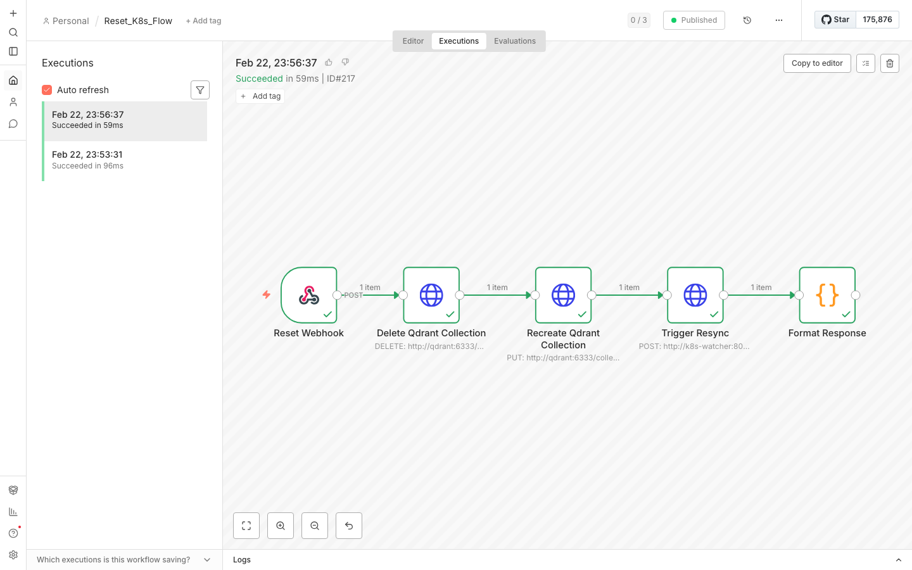

Both executions in the history completed in under 100ms — the fast completion is because the actual re-indexing work (embedding 35 resources) runs asynchronously in the k8s-watcher background thread after the workflow has already returned. The flow itself just clears the collection, recreates it, and fires the resync trigger.

---

## Flow 4: Memory_Clear_Flow — Resetting Conversation History

This utility flow deletes all rows from `n8n_chat_histories`, giving the AI agent a fresh memory. It can be triggered manually from the n8n UI (useful during testing) or automatically runs every hour via a Schedule Trigger.

**To create this flow:** In the n8n dashboard click **Add Workflow**, name it `Memory_Clear_Flow`, then add the three nodes described below.

Three nodes — two triggers that both connect to a single Postgres node. No branching, no loops. Simple by design: history accumulates until explicitly cleared.

---

### Memory Node 1 — Manual Trigger

Press **Tab** → search **"manual trigger"** → select **Manual Trigger**. This is the first entry point.

**Configuration:** None required. Clicking **Execute** in the n8n UI fires the workflow immediately — useful during development to verify the delete works, or to clear history before a demo.

---

### Memory Node 2 — Schedule Trigger

Press **Tab** → search **"schedule trigger"** → select **Schedule Trigger**. This is the second entry point.

**Configuration:**

| Field | Value |
|---|---|
| Trigger Interval | Every |
| Hours | `1` |

This fires the workflow every hour, capping the growth of the `n8n_chat_histories` table without manual intervention. One hour is enough context for typical usage; adjust to taste.

**Why two triggers on one flow?** n8n allows multiple trigger nodes in a single workflow. Both the Manual Trigger and the Schedule Trigger connect their `main[0]` output to the Clear Memory node. This is more maintainable than two separate workflows doing the same thing.

---

### Memory Node 3 — Clear Memory (Postgres)

Press **Tab** → search **"postgres"** → select **Postgres**. Connect both trigger outputs to this node.

Executes a raw SQL DELETE against `n8n_chat_histories`.

**Configuration:**

| Field | Value |
|---|---|
| Operation | `Execute Query` |
| Query | `DELETE FROM n8n_chat_histories;` |
| Credential | `Postgres Local` (`postgres` → host: `postgres`, db: `n8n_memory`, user: `n8n`) |

**Why not use the n8n Memory node's built-in clear?** The `MemoryPostgresChat` node does not expose a "clear all sessions" operation — it only clears a specific session key. The raw SQL DELETE clears all sessions in one atomic operation, which is what you want for a scheduled housekeeping task.

### Activate the Memory_Clear_Flow

```bash
N8N_POD=$(kubectl --context kind-k8s-ai -n k8s-ai get pod -l app=n8n   -o jsonpath='{.items[0].metadata.name}')
kubectl --context kind-k8s-ai -n k8s-ai exec ${N8N_POD} -- n8n publish:workflow --id=k8sMEMclear001
kubectl --context kind-k8s-ai -n k8s-ai rollout restart deployment/n8n
```

---

## End-to-End Test Suite

Twelve Playwright tests (API mode — no browser required) verify the complete pipeline:

```bash
npm install
npx playwright install chromium
npm test
```

```
  ✓  CDC: create namespace → Kafka event + Qdrant insertion              (2.4s)
  ✓  CDC: update deployment → old vector replaced (dedup by resource_uid)(1.9s)
  ✓  CDC: delete resource → point removed from Qdrant                    (33ms)
  ✓  AI: namespace count query → structured markdown table response      (2.2s)
  ✓  AI: full agent webhook → 200, mentions kube-system, no hallucination(3.1s)
  ✓  AI: deployment query → agent returns markdown table with replicas   (2.8s)
  ✓  CDC: Secret watch → Qdrant stores kind=Secret, no raw values        (1.7s)
  ✓  AI: secrets query → LLM mentions secret/kube-system, no raw values  (3.5s)
  ✓  AI: Secret-safe spec in context → only type+dataKeys exposed        (2.1s)
  ✓  AI: high-limit namespace query → cluster-scoped resources returned  (2.6s)
  ✓  Memory: consecutive queries share session context (postgres-backed) (5.2s)
  ✓  Memory: clear removes all chat history from n8n_chat_histories      (1.1s)
  ✓  Reset: POST /webhook/k8s-reset clears Qdrant and resync repopulates (3.1s)

  12 passed (31.9s)
```

**Tests 1–3** verify the CDC pipeline: namespace creation, deployment update deduplication, and resource deletion from Qdrant.

**Test 4** embeds a natural-language question, searches Qdrant, builds a prompt, calls Ollama directly, and asserts the response contains a markdown table and mentions known namespaces.

**Tests 5–6** exercise the live AI_K8s_Flow webhook end-to-end — the full Chat Trigger → AI Agent → Qdrant tool → Ollama chain — verifying response quality and no hallucination.

**Tests 7–10** verify Secret watching: the watcher publishes safe metadata (type + dataKeys only, never base64 values), Qdrant stores `kind=Secret`, and the AI flow surfaces secrets without exposing sensitive data.

**Test 11** verifies postgres-backed memory. It clears the `k8s-ai-global` session, asks "How many pods are running in kube-system?", then asks "Based on my previous question, which namespace did I ask about?" — the answer must contain "kube-system", proving the agent recalled it from the `n8n_chat_histories` table.

**Test 12** verifies the memory clear. It populates the table (if needed), runs `DELETE FROM n8n_chat_histories;` via `kubectl exec` on the postgres pod, and asserts `COUNT(*) = 0`. This simulates what Memory_Clear_Flow's Postgres node does.

**Test ordering note:** Test 13 (Reset) is declared last in the spec file even though it's numbered 5 in the original sequence — because Reset wipes Qdrant, all other tests must complete before it runs. Playwright executes tests in declaration order.

---

## Key Design Decisions That Took Time to Get Right

### 1. Natural-Language Embed Text Is Not Optional

Indexing resources as `kind:Deployment name:coredns ns:kube-system` produced cosine similarity scores in the 0.15–0.28 range — too low to surface anything useful. Switching to full natural-language sentences lifted scores into 0.38–0.70 and made the entire system work. The sentence format matches `nomic-embed-text`'s training distribution, which is the single most important requirement for good embedding quality.

### 2. The Score Threshold Requires Real Calibration

There is no universal correct threshold. For this model on this text type, Deployment resources score ~0.43 for deployment queries — close enough to be useful but below the "safe" 0.45 we started with. The silent failure mode (Qdrant returns zero results, LLM says "no resources found") is particularly hard to debug. Always test your actual queries against your actual indexed data before setting the threshold.

### 3. Delete-Before-Insert for Correct Vector Updates

Qdrant upsert keeps old vectors and only updates payloads. For a system where content changes (spec updates), this produces stale embeddings. Always delete and re-insert to guarantee the vector reflects the current state.

### 4. k8s-watcher Over Debezium

The original design used Debezium's MongoDB connector to watch etcd — Kubernetes's backing store. This is architecturally wrong: etcd is not MongoDB. Watching the Kubernetes Watch API directly (what k8s-watcher does) is the correct approach: proper event semantics, correct object deserialization, automatic reconnection.

### 5. Kafka for Pipeline Durability

Wiring the watcher directly to n8n's webhook endpoint is simpler but loses events during n8n restarts. Kafka's consumer group offset tracking means the CDC pipeline resumes exactly where it left off after any restart. This is not over-engineering — it is the difference between a reliable system and one that silently falls behind.

### 6. `enableServiceLinks: false` on the Kafka StatefulSet

Kubernetes automatically injects environment variables for every ClusterIP Service in the namespace. With a Service named `kafka`, every pod receives `KAFKA_PORT=tcp://10.x.x.x:9092`. The Confluent Platform Kafka startup script iterates every `KAFKA_*` environment variable and fails when it encounters a URL-format value. The fix is one line: `enableServiceLinks: false` on the StatefulSet pod spec. Without it, the Kafka pod enters CrashLoopBackOff with logs truncated to four lines — a particularly difficult failure to diagnose because the startup script exits before printing anything useful.

### 7. PostgreSQL-Backed Memory Over In-Memory Alternatives

n8n offers several memory options: in-memory buffer, Redis, and PostgreSQL. In-memory buffer is lost on every n8n pod restart — which happens whenever you deploy or update the cluster. Redis adds another service with its own port mapping. PostgreSQL is already present for chat memory, and its `n8n_chat_histories` table persists across restarts, rescheduling, and even cluster recreations (hostPath PV at `/data/postgres`). The table is also inspectable via pgAdmin without any additional tooling.

### 8. pgAdmin Email Validation — `.local` TLD Is Rejected

Newer versions of `dpage/pgadmin4:latest` validate email deliverability during container startup. The `.local` TLD (e.g., `admin@k8s-ai.local`) is classified as a special-use reserved domain and is rejected. Fix: use a valid-looking email (`admin@example.com`) and add `PGADMIN_CONFIG_CHECK_EMAIL_DELIVERABILITY: "False"` to the pgAdmin deployment env block. Without the second setting, even `example.com` may fail depending on the version.

### 9. Kind Port Mappings Require Cluster Recreation

kind's `extraPortMappings` (the host-to-container port forwarding configuration) cannot be hot-patched — they are baked into the cluster node at creation time. Adding new NodePorts (30003 for pgAdmin, 30004 for postgres) requires deleting and recreating the cluster. `setup.sh` handles this automatically. The host `./data/` directory is preserved across cluster recreation because it lives on the host filesystem, not inside the cluster node. Data is never lost.

---

## Troubleshooting

| Symptom | Likely Cause | Fix |
|---|---|---|
| CDC flow not triggering | Pod not running | `kubectl -n k8s-ai get pods` — if not Running, `kubectl apply -f infra/k8s/` |
| LLM returns "No indexed resources" | Qdrant has 0 points | `curl -X POST http://localhost:30000/webhook/k8s-reset` then wait 45s |
| Workflow webhooks return 404 | Workflows not active | `kubectl exec ${N8N_POD} -- n8n publish:workflow --id=...` then rollout restart |
| Embedding scores all below 0.3 | embed_text format wrong | Verify natural-language sentence format in Parse Message node |
| k8s-watcher CrashLoopBackOff | RBAC not applied | `kubectl apply -f infra/k8s/k8s-watcher/k8s-watcher-rbac.yaml` |
| Kafka CrashLoopBackOff (port deprecated) | `enableServiceLinks` injecting `KAFKA_PORT` | Ensure `enableServiceLinks: false` is set in kafka-statefulset.yaml |
| n8n activation fails via UI | n8n 2.6.4 basic-auth bug | Use `n8n publish:workflow` CLI only |
| Ollama unreachable from n8n pod | hostAliases not set | Verify `hostAliases` in n8n-deployment.yaml maps `host.docker.internal` → your host IP |
| Postgres pod CrashLoopBackOff | Permission issue on PV | Check initContainer log: `kubectl -n k8s-ai logs <postgres-pod> -c fix-permissions` |
| pgAdmin pod CrashLoopBackOff | Invalid email format | Ensure `PGADMIN_DEFAULT_EMAIL` uses `example.com` TLD and `PGADMIN_CONFIG_CHECK_EMAIL_DELIVERABILITY: "False"` is set |
| AI Agent does not recall previous questions | Postgres credential missing | Verify `Postgres Local` credential exists; re-run `./scripts/setup.sh --keep-cluster` |
| `n8n_chat_histories` table not found | First query hasn't run yet | Send at least one chat message; n8n creates the table on first memory write |

---

## What This System Does Not Do (Yet)

- **Custom Resource Definitions** — The watcher only monitors ten core resource types. CRDs require dynamic API group discovery.
- **Historical queries** — Only current cluster state is indexed (session memory tracks conversation turns, not cluster state history). "What did coredns look like yesterday?" requires retaining versioned vectors.
- **Multi-cluster** — Adding a `cluster_name` tag to each payload and Qdrant filter would enable indexing multiple clusters into one collection.
- **Per-user session memory** — All queries share the `k8s-ai-global` session key. A multi-user deployment would derive session keys from a user identifier in the request.
- **Streaming responses** — The LLM currently waits for the full response before returning. WebSocket streaming would make the interface feel faster for complex queries.

---

## Getting the Code

Everything in this article — Kubernetes manifests (`infra/k8s/`), the kind cluster config (`infra/kind-config.yaml`), the k8s-watcher Python service, all four n8n workflow JSON files, the Qdrant collection schema, Playwright E2E tests, and the screenshot capture script — is available at:

**[github.com/a2z-ice/k8s-ai-knowledge-system](https://github.com/a2z-ice/k8s-ai-knowledge-system)**

Clone it, install prerequisites, and run `./scripts/setup.sh` — it creates the kind cluster, deploys all six pods (n8n, Qdrant, Kafka, k8s-watcher, PostgreSQL, pgAdmin), imports all four workflows, creates all credentials, and runs the full E2E test suite automatically.

---

*If you found this useful or have questions about the implementation, leave a comment. If you extend the system to support CRDs, multi-cluster, or streaming, I would genuinely like to hear how you did it.*
