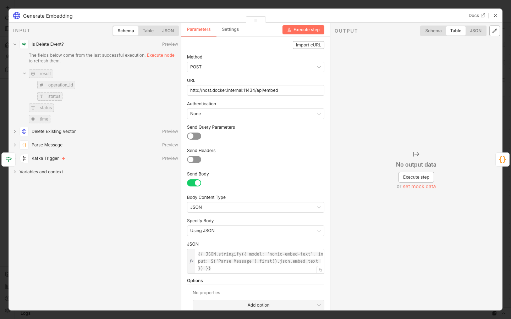
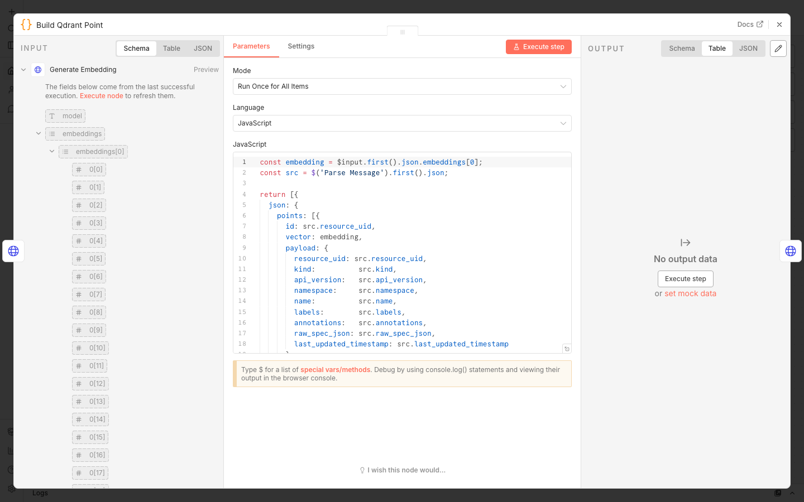
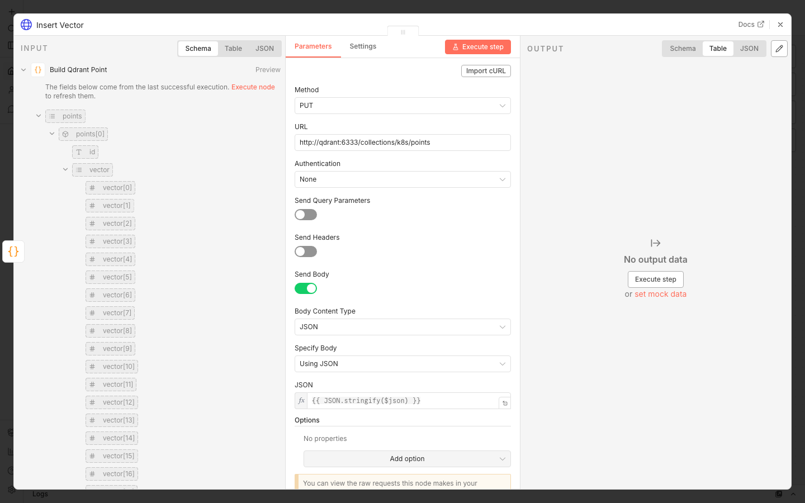
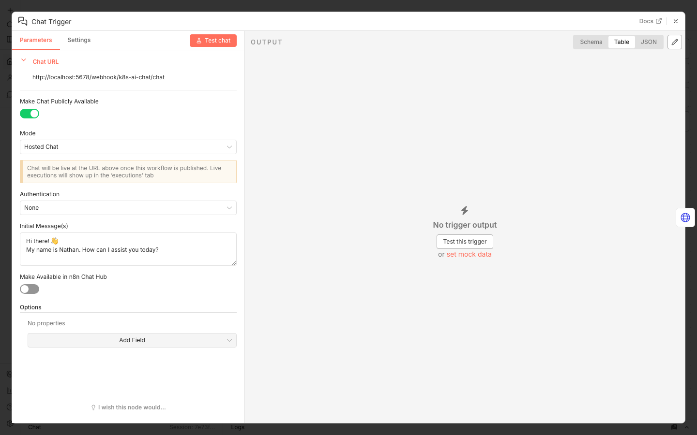
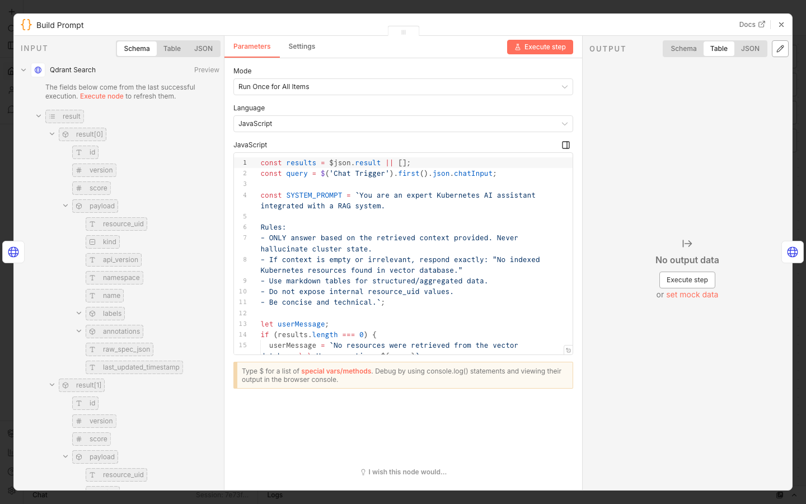
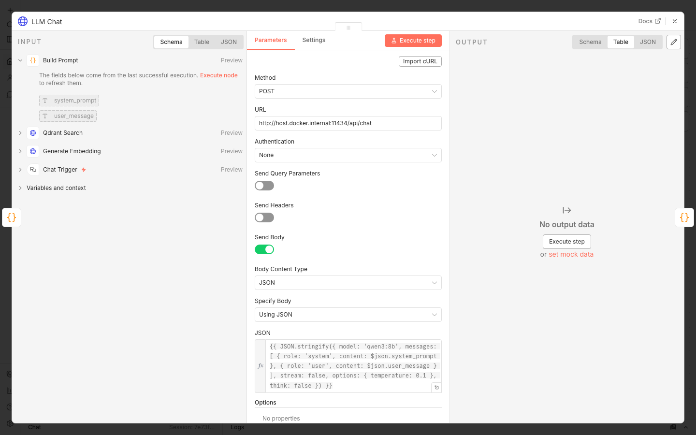
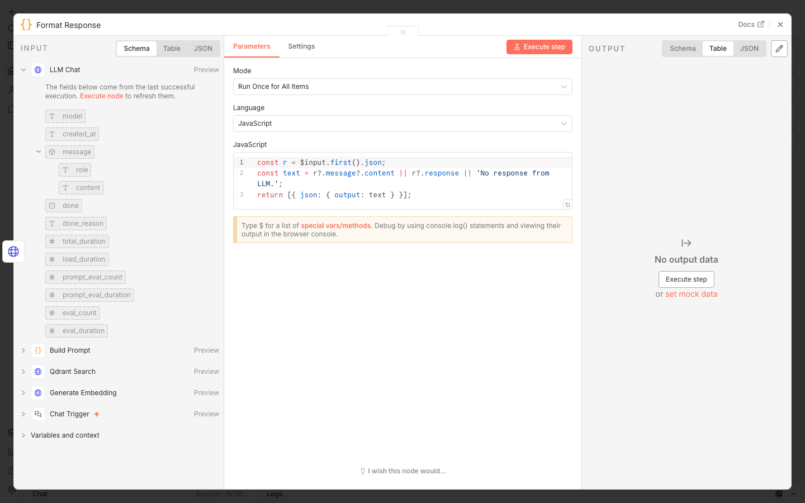

# Building a Local Kubernetes AI Knowledge System with n8n, Qdrant, Kafka, and Ollama — No Cloud Required

> Ask your cluster anything. Get grounded, accurate answers — entirely offline, entirely free.

---

## The Problem Every Kubernetes Operator Knows

You are on-call at 2 AM. An alert fires. You need to know: which namespace is this pod in? What labels does it carry? How many replicas is that deployment running? You open four `kubectl` tabs, pipe output through `grep`, scroll through YAML, and piece together the answer manually. By the time you have context, five minutes are gone.

Or picture a different scenario: a new engineer joins your team and spends their first week asking "where does service X live?" and "which deployments are in the production namespace?" — questions that feel trivial but require either tribal knowledge or repeated terminal commands to answer.

Kubernetes is extraordinarily powerful, but its operational knowledge is scattered and inaccessible. It lives in YAML files, in `kubectl` output, in someone's runbook, in someone's head. There is no natural-language interface to your cluster's state.

This project builds one — entirely local, no cloud APIs, no subscriptions, no per-token billing. You type a question in plain English. The system retrieves the relevant cluster resources from a local vector database, feeds them to a local LLM, and returns a grounded, structured answer — usually in under two seconds.

---

## What We Are Building

A self-hosted **Kubernetes AI Knowledge System** with three core properties:

- **Always in sync** — a Change Data Capture pipeline watches the Kubernetes API in real time and updates the vector database every time a resource is created, modified, or deleted
- **Semantically searchable** — resources are stored as 768-dimensional embedding vectors, enabling natural-language similarity search rather than exact keyword matching
- **Grounded responses** — the LLM is strictly constrained to only answer from retrieved context, preventing hallucination

**The full technology stack:**

| Layer | Technology | Purpose |
|---|---|---|
| Workflow engine | n8n | Visual pipeline orchestration for all three flows |
| Vector database | Qdrant | Store and similarity-search 768-dim embedding vectors |
| Message bus | Kafka (KRaft, no ZooKeeper) | Durable, replayable event stream |
| Embedding model | Ollama + `nomic-embed-text` | Convert text to 768-dim vectors |
| Chat model | Ollama + `qwen3:8b` | Generate natural-language responses |
| K8s watcher | Python (`kubernetes` + `kafka-python`) | Watch K8s API, publish events to Kafka |
| Kubernetes cluster | kind | Local cluster for development |
| Container runtime | Docker Compose | Orchestrate all services |

Everything runs on your laptop. No OpenAI key. No cloud egress.

---

## Understanding RAG Before We Start

This system is built on **Retrieval-Augmented Generation (RAG)**. Instead of fine-tuning an LLM on your cluster data (expensive, and wrong the moment anything changes), you retrieve the relevant data at query time and inject it into the LLM prompt as context.

For Kubernetes this is exactly the right architecture: cluster state changes constantly. Fine-tuning on today's snapshot means the model is wrong tomorrow. RAG lets the knowledge base (Qdrant) stay live while the LLM remains static.

```
User question
    → embed with nomic-embed-text → 768-dim query vector
    → cosine similarity search in Qdrant → top 30 matching resources
    → inject resources as context into LLM prompt
    → LLM generates grounded answer based only on that context
    → return to user
```

---

## System Architecture

```
┌─────────────────────────────────────────────────────────────────┐
│                        kind cluster                             │
│  Namespaces · Pods · Services · Deployments · ConfigMaps        │
│  ReplicaSets · StatefulSets · DaemonSets · PVCs                 │
└───────────────────────┬─────────────────────────────────────────┘
                        │  K8s Watch API (streaming, 9 resource types)
                        ▼
              ┌─────────────────────┐
              │    k8s-watcher      │  Python, Docker, port 8085
              │    9 watch threads  │  /healthz · /resync
              └──────────┬──────────┘
                         │  ADDED | MODIFIED | DELETED events (JSON)
                         ▼
              ┌─────────────────────┐
              │       Kafka         │  KRaft, port 9092
              │  k8s-resources      │  consumer group: n8n-cdc-consumer
              └──────────┬──────────┘
                         │
           ┌─────────────┘
           ▼
  ┌──────────────────────────────────────────────────────────────┐
  │               n8n: CDC_K8s_Flow                              │
  │  Kafka Trigger → Parse → Delete → Branch → Embed → Insert   │
  └────────────────────────────┬─────────────────────────────────┘
                               ▼
                      ┌─────────────────┐
                      │     Qdrant      │  768-dim Cosine, port 6333
                      │  collection: k8s│  ID = resource_uid (K8s UUID)
                      └────────┬────────┘
                               │
                    ┌──────────┘
                    ▼
  ┌──────────────────────────────────────────────────────────────┐
  │               n8n: AI_K8s_Flow                               │
  │  Chat Trigger → Embed → Search → Build Prompt → LLM → Out   │
  └──────────────────────────────────────────────────────────────┘
                               │
                               ▼
                    Browser / curl / any HTTP client

  ┌──────────────────────────────────────────────────────────────┐
  │               n8n: Reset_K8s_Flow                            │
  │  POST /webhook/k8s-reset                                     │
  │    → DELETE Qdrant → PUT Qdrant → POST /resync → Response    │
  └──────────────────────────────────────────────────────────────┘
```

---

## Part 1: Infrastructure Setup

### Docker Compose — The Five Services

```yaml
services:
  n8n:
    image: n8nio/n8n:latest
    ports: ["5678:5678"]
    environment:
      - N8N_BASIC_AUTH_ACTIVE=true
      - N8N_BASIC_AUTH_USER=admin
      - N8N_BASIC_AUTH_PASSWORD=admin
      - N8N_SECURE_COOKIE=false
    extra_hosts: ["host.docker.internal:host-gateway"]
    volumes: [./data/n8n:/home/node/.n8n]

  qdrant:
    image: qdrant/qdrant:latest
    ports: ["6333:6333"]
    volumes: [./data/qdrant:/qdrant/storage]

  kafka:
    image: confluentinc/cp-kafka:latest
    ports: ["9092:9092"]
    environment:
      KAFKA_NODE_ID: 1
      KAFKA_PROCESS_ROLES: broker,controller
      KAFKA_LISTENERS: PLAINTEXT://0.0.0.0:9092,CONTROLLER://0.0.0.0:9093
      KAFKA_ADVERTISED_LISTENERS: PLAINTEXT://kafka:9092
      KAFKA_CONTROLLER_QUORUM_VOTERS: 1@kafka:9093
      KAFKA_AUTO_CREATE_TOPICS_ENABLE: "true"
      CLUSTER_ID: Ak1F_A09TmqoaO_XHZMvEw

  k8s-watcher:
    build: { context: ./k8s-watcher }
    ports: ["8085:8080"]
    environment:
      KAFKA_BOOTSTRAP_SERVERS: kafka:9092
      KAFKA_TOPIC: k8s-resources
      KUBECONFIG: /root/.kube/config
      K8S_SERVER: https://host.docker.internal:YOUR_KIND_PORT
    volumes: ["${HOME}/.kube/config:/root/.kube/config:ro"]
    extra_hosts: ["host.docker.internal:host-gateway"]
    restart: unless-stopped
```

**Key notes:**
- `extra_hosts: host.docker.internal:host-gateway` — lets containers reach Ollama and the kind API server on the host (essential on Linux; macOS Docker Desktop sets this automatically)
- `K8S_SERVER` — kind's API server binds to `127.0.0.1` on the host, which is unreachable from inside Docker. Replace `YOUR_KIND_PORT` with the actual port: `kubectl --context kind-k8s-ai cluster-info | grep "control plane"`
- `restart: unless-stopped` on k8s-watcher — it is the most critical service; auto-restart keeps Qdrant in sync across Docker restarts

### Cluster, Models, and Collection

```bash
# Create the kind cluster
kind create cluster --name k8s-ai

# Pull Ollama models on the host machine (not Docker)
ollama pull nomic-embed-text   # 768-dim embedding model
ollama pull qwen3:8b           # 8B parameter chat model

# Start all services
docker compose up -d

# Create the Qdrant vector collection (first time only)
curl -X PUT http://localhost:6333/collections/k8s \
  -H 'Content-Type: application/json' \
  -d '{"vectors":{"size":768,"distance":"Cosine"},"replication_factor":1}'
```

---

## Part 2: The k8s-watcher Python Service

The watcher is the bridge between the Kubernetes API and Kafka. It runs nine watch loops in parallel daemon threads — one per resource type — and publishes every ADDED, MODIFIED, and DELETED event as a structured JSON message.

### The Nine Resource Types

```python
watchers = [
    (v1.list_namespace,                               "Namespace"),
    (v1.list_pod_for_all_namespaces,                  "Pod"),
    (v1.list_service_for_all_namespaces,              "Service"),
    (v1.list_config_map_for_all_namespaces,           "ConfigMap"),
    (v1.list_persistent_volume_claim_for_all_namespaces, "PVC"),
    (apps.list_deployment_for_all_namespaces,         "Deployment"),
    (apps.list_replica_set_for_all_namespaces,        "ReplicaSet"),
    (apps.list_stateful_set_for_all_namespaces,       "StatefulSet"),
    (apps.list_daemon_set_for_all_namespaces,         "DaemonSet"),
]
```

Each uses `watch.stream(list_fn, timeout_seconds=0)` — an infinite stream that reconnects automatically on error.

### The `embed_text` Construction — The Most Critical Detail

```python
scope     = f"in namespace {namespace}" if namespace else "cluster-scoped"
label_str = ", ".join(f"{k}={v}" for k, v in list(labels.items())[:5]) or "none"

embed_text = (
    f"Kubernetes {kind} named {name} {scope}. "
    f"Labels: {label_str}. "
    f"Spec: {spec_json[:600]}"
)
```

A real example:
```
Kubernetes Deployment named coredns in namespace kube-system.
Labels: k8s-app=kube-dns. Spec: {"replicas":2,"selector":{...}}
```

Why full sentences instead of `kind:Deployment name:coredns ns:kube-system`? Because `nomic-embed-text` was trained on natural-language text. Feeding it structured key=value pairs produces poor embeddings and low similarity scores. Natural-language sentences lift cosine similarity scores from the 0.15–0.28 range into the 0.38–0.70 range. This single change had the largest impact on system quality.

### The Kind API Server Host Override

```python
def load_k8s():
    cfg = client.Configuration()
    config.load_kube_config(config_file=KUBECONFIG, client_configuration=cfg)
    if K8S_SERVER:
        cfg.host = K8S_SERVER          # https://host.docker.internal:PORT
        cfg.verify_ssl = False         # cert is issued for 127.0.0.1, not this host
    client.Configuration.set_default(cfg)
```

kind's API server binds to `127.0.0.1`. From inside a Docker container, `127.0.0.1` is the container itself. `K8S_SERVER` replaces it with `host.docker.internal`, the Docker bridge address that routes to the host. SSL verification is disabled because the TLS certificate was issued for `127.0.0.1`, not `host.docker.internal`.

### The HTTP Server — healthz and resync

```python
# GET /healthz → {"status":"ok"}
# POST /resync  → 202 Accepted, then lists all 9 resource types
#                 and republishes every item as ADDED to Kafka
```

The `/resync` endpoint is what the Reset flow calls to rebuild Qdrant. It returns 202 immediately and runs the re-publish in a background thread, keeping the HTTP response time short.

---

## Part 3: Building the n8n Workflows

### The Dashboard

After importing and activating all three workflows, this is what the n8n dashboard looks like:


All three workflows carry the green **Published** badge. 73 total executions, 0 failures — the pipeline is running clean.

### Importing and Activating Workflows

```bash
# Copy JSON files into the container
docker cp workflows/n8n_cdc_k8s_flow.json   kind_vector_n8n-n8n-1:/tmp/
docker cp workflows/n8n_ai_k8s_flow.json    kind_vector_n8n-n8n-1:/tmp/
docker cp workflows/n8n_reset_k8s_flow.json kind_vector_n8n-n8n-1:/tmp/

# Import them
docker exec kind_vector_n8n-n8n-1 n8n import:workflow --input=/tmp/n8n_cdc_k8s_flow.json
docker exec kind_vector_n8n-n8n-1 n8n import:workflow --input=/tmp/n8n_ai_k8s_flow.json
docker exec kind_vector_n8n-n8n-1 n8n import:workflow --input=/tmp/n8n_reset_k8s_flow.json

# List assigned IDs, then activate
docker exec kind_vector_n8n-n8n-1 n8n list:workflow
docker exec kind_vector_n8n-n8n-1 n8n publish:workflow --id=<CDC_ID>
docker exec kind_vector_n8n-n8n-1 n8n publish:workflow --id=<AI_ID>
docker exec kind_vector_n8n-n8n-1 n8n publish:workflow --id=<RESET_ID>
docker restart kind_vector_n8n-n8n-1
```

> **Known n8n 2.6.4 bug:** `N8N_BASIC_AUTH_ACTIVE=true` causes the body-parser middleware to reject all `POST /rest/*` requests. The browser UI toggle and REST API both fail silently. The only reliable way to activate workflows is `n8n publish:workflow` via the CLI inside the container.

---

## Flow 1: CDC_K8s_Flow — Continuous Indexing

This is the backbone of the system. It runs permanently, consuming every Kubernetes change event from Kafka and keeping Qdrant in sync. Every resource change in the cluster is indexed within two seconds.


The canvas shows seven nodes left-to-right. At the "Is Delete Event?" branch, the true path terminates (nothing to index) while the false path continues through embedding and insertion.

---

### CDC Node 1 — Kafka Trigger


**Node type:** `n8n-nodes-base.kafkaTrigger`

**What it does:** Opens a persistent consumer connection to Kafka and fires the rest of the workflow for every message that arrives on the `k8s-resources` topic.

The screenshot shows exactly how to configure it:

| Field | Value | Why |
|---|---|---|
| Credential to connect with | `Kafka Local` | The Kafka credential you created (bootstrap: `kafka:9092`) |
| Topic | `k8s-resources` | Must match `KAFKA_TOPIC` in the watcher's environment |
| Group ID | `n8n-cdc-consumer` | Kafka tracks this group's offset — survives n8n restarts |
| Allow Topic Creation | Off | Topic must already exist; disable accidental creation |

Notice **Auto Offset Reset** is not shown because it lives under "Add option" — add it and set it to `earliest` so on first start the flow processes the full topic history.

**Why Kafka and not a direct webhook?** Consumer group offset tracking means if n8n restarts, it resumes exactly where it left off. No events are lost. No polling loops. If the watcher publishes events faster than n8n processes them, Kafka absorbs the backpressure.

---

### CDC Node 2 — Parse Message


**Node type:** `n8n-nodes-base.code` (JavaScript)

**What it does:** The Kafka message arrives as a JSON string inside an envelope object. This node unwraps it and constructs the `embed_text` that will be converted into a vector.

**Full code to paste into the JavaScript editor:**

```javascript
// The Kafka trigger delivers the raw message string in .message
const raw = $input.first().json;
let data;
try {
  data = typeof raw.message === 'string' ? JSON.parse(raw.message) : raw;
} catch (_) {
  data = raw;
}

// Use embed_text from watcher if present; reconstruct it otherwise
let embed_text = data.embed_text;
if (!embed_text) {
  const scope = data.namespace
    ? `in namespace ${data.namespace}`
    : 'cluster-scoped';
  const labels = Object.entries(data.labels || {})
    .slice(0, 5)
    .map(([k, v]) => `${k}=${v}`)
    .join(', ') || 'none';
  embed_text = `Kubernetes ${data.kind} named ${data.name} ${scope}. `
             + `Labels: ${labels}. `
             + `Spec: ${(data.raw_spec_json || '{}').substring(0, 600)}`;
}

return [{ json: { ...data, embed_text } }];
```

The fallback embed_text builder is a defensive layer — if the watcher version changes or a message arrives through a different path, the CDC flow can still produce a consistent embedding. Both the watcher and this node use identical logic, so vectors are always constructed the same way.

---

### CDC Node 3 — Delete Existing Vector


**Node type:** `n8n-nodes-base.httpRequest`

**What it does:** Removes any existing vector for this resource from Qdrant before inserting the updated one. This is the idempotency guarantee — for any Kubernetes UID, there is always exactly one vector in Qdrant.

**Configuration:**

| Field | Value |
|---|---|
| Method | `POST` |
| URL | `http://qdrant:6333/collections/k8s/points/delete` |
| Body Content Type | `JSON` |
| JSON Body | `={{ JSON.stringify({ points: [$('Parse Message').first().json.resource_uid] }) }}` |

**Why delete instead of upsert?** Qdrant's upsert updates the payload but reuses the existing vector. For our use case this is wrong — if a Deployment's replica count changes from 2 to 5, the embedding must be recomputed from the new spec so queries about "5-replica deployments" find it. Delete + re-insert guarantees the vector always reflects the current state.

For brand-new resources (ADDED events), the delete call finds nothing and returns `{"result":{"status":"acknowledged"}}` — a harmless no-op.

---

### CDC Node 4 — Is Delete Event?


**Node type:** `n8n-nodes-base.if`

**What it does:** Routes the workflow based on the Kubernetes event type. The condition you can see in the screenshot: `{{ $('Parse Message').first().json.event_type }}` **is equal to** `DELETED`.

The left INPUT panel shows the result from Delete Existing Vector (the Qdrant `status: "acknowledged"` response) confirming Node 3 ran successfully before this branch point.

**The two branches:**
- **True** (DELETED event) — The vector was already removed in Node 3. The resource no longer exists in Kubernetes. Stop here. Nothing to embed or insert.
- **False** (ADDED or MODIFIED) — The resource exists and its current state needs indexing. Continue to Node 5.

This two-step pattern — delete unconditionally first, then branch — avoids the need for separate delete-only code paths. Every event type takes the same delete step, then branching decides whether to re-insert.

---

### CDC Node 5 — Generate Embedding



**Node type:** `n8n-nodes-base.httpRequest`

**What it does:** Sends the `embed_text` to Ollama's embedding API and receives a 768-dimensional float vector back.

**Configuration:**

| Field | Value |
|---|---|
| Method | `POST` |
| URL | `http://host.docker.internal:11434/api/embed` |
| Body Content Type | `JSON` |
| JSON Body | `={{ JSON.stringify({ model: 'nomic-embed-text', input: $('Parse Message').first().json.embed_text }) }}` |

Note `host.docker.internal` — Ollama runs on the host machine, not in Docker. This hostname routes through the Docker bridge to reach the host.

**Request sent to Ollama:**
```json
{
  "model": "nomic-embed-text",
  "input": "Kubernetes Deployment named coredns in namespace kube-system. Labels: k8s-app=kube-dns. Spec: {\"replicas\":2,...}"
}
```

**Response:**
```json
{
  "embeddings": [[0.0234, -0.1456, 0.0891, ..., 0.0123]]
}
```

`embeddings[0]` is the vector — 768 floats encoding the semantic meaning of the text. Two semantically similar sentences produce geometrically close vectors. A question about "what deployments exist in kube-system?" will produce a vector close to this Deployment's vector — which is exactly what cosine search will find.

---

### CDC Node 6 — Build Qdrant Point



**Node type:** `n8n-nodes-base.code` (JavaScript)

**What it does:** Combines the 768-dim vector from Node 5 with the resource metadata from Node 2 into a single Qdrant point object ready to insert.

**Full code:**

```javascript
const embedding = $input.first().json.embeddings[0];
const src = $('Parse Message').first().json;

return [{
  json: {
    points: [{
      id: src.resource_uid,       // Kubernetes UID → Qdrant point ID (UUID)
      vector: embedding,          // 768-dim float array
      payload: {
        resource_uid:           src.resource_uid,
        kind:                   src.kind,
        api_version:            src.api_version,
        namespace:              src.namespace,
        name:                   src.name,
        labels:                 src.labels,
        annotations:            src.annotations,
        raw_spec_json:          src.raw_spec_json,
        last_updated_timestamp: src.last_updated_timestamp
      }
    }]
  }
}];
```

**Why `resource_uid` as the Qdrant point ID?** The Kubernetes object UID is a stable UUID assigned at creation time — it never changes for the object's lifetime, even across renames. Using it as the Qdrant point ID means: delete-by-ID always targets the right vector, duplicates are impossible, and the ID survives namespace changes.

**Why store `raw_spec_json` in the payload?** It travels with every search hit. The AI flow's Build Prompt node includes spec fragments in the LLM context, enabling answers to questions like "What are the CPU limits on the coredns deployment?"

---

### CDC Node 7 — Insert Vector



**Node type:** `n8n-nodes-base.httpRequest`

**What it does:** PUTs the fully assembled point into Qdrant, completing the indexing pipeline for this event.

**Configuration:**

| Field | Value |
|---|---|
| Method | `PUT` |
| URL | `http://qdrant:6333/collections/k8s/points` |
| Body Content Type | `JSON` |
| JSON Body | `={{ JSON.stringify($json) }}` |

The `$json` reference carries the `{ "points": [...] }` object built by Node 6 directly. No transformation needed — just serialise and send.

**Qdrant's response:** `{"result":{"operation_id":1,"status":"completed"},"status":"ok"}`. The resource is now indexed and queryable. End-to-end from `kubectl apply` to searchable vector: under 2 seconds, dominated by the ~400–600ms Ollama embedding call.

---

### CDC Flow in Action


The Executions tab shows a burst of events processed around 00:32:22 (a resync publishing many resources simultaneously). Fast DELETED-branch executions complete in 49–96ms. Full ADDED/MODIFIED executions (with embedding) take 450–466ms.


Execution #277: all nodes show green checkmarks, "1 item" flows between each, and the "Is Delete Event?" node shows `false` on the outgoing edge — confirming this was an ADDED or MODIFIED event that went through the full embedding path. Completed in 466ms.

---

## Flow 2: AI_K8s_Flow — The Query Pipeline

This flow answers user questions. It is completely stateless — each question triggers one end-to-end execution that embeds the query, retrieves context from Qdrant, and calls the LLM.


Six nodes, no branching. Every question flows through every node. The "Open chat" button at the bottom launches n8n's built-in chat UI connected to this flow's public webhook.

---

### AI Node 1 — Chat Trigger


**Node type:** `@n8n/n8n-nodes-langchain.chatTrigger`

**What it does:** Exposes a public webhook endpoint that accepts user questions and streams the workflow output back as the chat reply.

**Configuration:**

| Field | Value |
|---|---|
| Make Chat Publicly Available | Toggle ON |
| Webhook ID | `k8s-ai-chat` (auto-generated; sets the public URL path) |

This creates the public endpoint: `http://localhost:5678/webhook/k8s-ai-chat/chat`

No authentication is required on this endpoint — intentional for a local development environment. The Chat Trigger node:
- Holds the HTTP connection open while the workflow runs
- Passes `{ "chatInput": "..." }` to the next node
- Automatically sends the final `output` field back as the response

You can reach it from a browser (n8n renders a chat UI) or from curl:

```bash
curl -X POST http://localhost:5678/webhook/k8s-ai-chat/chat \
  -H 'Content-Type: application/json' \
  -d '{"chatInput": "Show me all deployments and their replica counts"}'
```

---

### AI Node 2 — Generate Embedding


**Node type:** `n8n-nodes-base.httpRequest`

**What it does:** Converts the user's question into a 768-dim vector using the same `nomic-embed-text` model used during indexing.

**Configuration:**

| Field | Value |
|---|---|
| Method | `POST` |
| URL | `http://host.docker.internal:11434/api/embed` |
| Body Content Type | `JSON` |
| JSON Body | `={{ JSON.stringify({ model: 'nomic-embed-text', input: $json.chatInput }) }}` |

**This symmetry is the foundation of RAG.** The question and the indexed documents are embedded by the same model — they exist in the same 768-dimensional semantic space. A question about "deployments in kube-system" produces a vector geometrically close to the Deployment resources whose embed_text mentions "kube-system". Cosine similarity will surface exactly those resources.

If you embedded queries with a different model than you used for indexing, the vectors would live in different spaces and search results would be meaningless.

---

### AI Node 3 — Qdrant Search



**Node type:** `n8n-nodes-base.httpRequest`

**What it does:** Takes the query vector and searches Qdrant for the 30 most semantically similar Kubernetes resources.

**Configuration:**

| Field | Value |
|---|---|
| Method | `POST` |
| URL | `http://qdrant:6333/collections/k8s/points/search` |
| Body Content Type | `JSON` |
| JSON Body | `={{ JSON.stringify({ vector: $json.embeddings[0], limit: 30, with_payload: true, score_threshold: 0.3 }) }}` |

**The `score_threshold: 0.3` story.** This was one of the most painful debugging experiences in the project. The initial threshold was 0.45. Deployment resources score approximately 0.43 for deployment-related queries — just below the threshold. The failure was completely silent: Qdrant returned zero results, the LLM said "No indexed Kubernetes resources found", and there was no obvious error anywhere in the pipeline.

After systematic testing with different queries and inspecting raw scores, we discovered the scoring range for this embedding model on short Kubernetes metadata is 0.38–0.70. Setting the threshold to 0.3 captures everything relevant. The LLM's "only answer from retrieved context" instruction provides the guardrail against hallucinating from low-relevance results.

**`limit: 30`** — a minimal kind cluster has ~35 resources. Retrieving up to 30 ensures broad questions like "list everything" can be answered comprehensively.

---

### AI Node 4 — Build Prompt



**Node type:** `n8n-nodes-base.code` (JavaScript)

**What it does:** The most carefully engineered node in the system. Transforms raw Qdrant search results into a structured prompt the LLM can reason over. The INPUT panel on the left shows the Qdrant search results — every payload field (resource_uid, kind, api_version, namespace, name, labels, annotations, raw_spec_json) is visible, confirming exactly what the LLM will receive.

**Full code:**

```javascript
const results = $json.result || [];
const query   = $('Chat Trigger').first().json.chatInput;

const SYSTEM_PROMPT = `You are an expert Kubernetes AI assistant
integrated with a RAG system.

Rules:
- ONLY answer based on the retrieved context provided.
  Never hallucinate cluster state.
- If context is empty or irrelevant, respond exactly:
  "No indexed Kubernetes resources found in vector database."
- Use markdown tables for structured/aggregated data.
- Do not expose internal resource_uid values.
- Be concise and technical.`;

let userMessage;
if (results.length === 0) {
  userMessage = `No resources retrieved.\n\nUser question: ${query}`;
} else {
  const ctx = results.map((r, i) => {
    const p    = r.payload;
    const spec = p.raw_spec_json ? p.raw_spec_json.substring(0, 300) : '{}';
    return `[${i + 1}] kind=${p.kind}  name=${p.name}  `
         + `namespace=${p.namespace || '(cluster-scoped)'}  `
         + `labels=${JSON.stringify(p.labels)}  `
         + `score=${r.score.toFixed(3)}  spec=${spec}`;
  }).join('\n');

  userMessage = `Retrieved ${results.length} Kubernetes resources:\n\n`
              + `${ctx}\n\nUser question: ${query}`;
}

return [{ json: { system_prompt: SYSTEM_PROMPT, user_message: userMessage } }];
```

The assembled context looks like this when sent to the LLM:

```
Retrieved 8 Kubernetes resources:

[1] kind=Namespace  name=default  namespace=(cluster-scoped)  labels={}  score=0.614  spec={}
[2] kind=Namespace  name=kube-system  namespace=(cluster-scoped)  labels={}  score=0.602  spec={}
[3] kind=Namespace  name=kube-public  namespace=(cluster-scoped)  labels={}  score=0.598  spec={}
[4] kind=Deployment  name=coredns  namespace=kube-system  labels={"k8s-app":"kube-dns"}  score=0.431  spec={"replicas":2,...}
...

User question: List all namespaces in the Kubernetes cluster
```

**The "Never hallucinate" instruction is non-negotiable.** Without it, `qwen3:8b` will confidently invent Kubernetes resource names and configurations. With it — and the explicit "only answer from retrieved context" constraint — the model stays grounded. Ask about Redis when no Redis resources exist: the model says "No indexed Kubernetes resources found."

---

### AI Node 5 — LLM Chat



**Node type:** `n8n-nodes-base.httpRequest`

**What it does:** Sends the assembled prompt to `qwen3:8b` via Ollama's chat API and waits for the complete response.

**Configuration:**

| Field | Value |
|---|---|
| Method | `POST` |
| URL | `http://host.docker.internal:11434/api/chat` |
| Body Content Type | `JSON` |
| JSON Body | see below |

```json
={{
  JSON.stringify({
    model: "qwen3:8b",
    messages: [
      { role: "system", content: $json.system_prompt },
      { role: "user",   content: $json.user_message  }
    ],
    stream: false,
    think: false,
    options: { temperature: 0.1 }
  })
}}
```

Three configuration decisions worth explaining:

**`stream: false`** — Ollama streams responses token-by-token by default. n8n's HTTP Request node cannot handle streaming; it needs the complete body. Setting this to false makes Ollama buffer the full response before returning it.

**`temperature: 0.1`** — Near-deterministic output. This is a factual lookup and formatting task, not creative writing. Low temperature produces consistent, accurate answers without randomness.

**`think: false`** — `qwen3:8b` supports extended chain-of-thought reasoning (visible "thinking" tokens). This helps for math or logic problems. For retrieval and formatting tasks like ours, it adds 2–5 seconds of latency without improving quality. Disabling it makes the system noticeably faster.

---

### AI Node 6 — Format Response



**Node type:** `n8n-nodes-base.code` (JavaScript)

**What it does:** Extracts the LLM's reply from Ollama's response envelope and returns it in the `output` field that n8n's Chat Trigger expects.

```javascript
const r    = $input.first().json;
const text = r?.message?.content
          || r?.response
          || 'No response from LLM.';
return [{ json: { output: text } }];
```

Without this node, the Chat Trigger would receive the entire Ollama response envelope as the answer — a raw JSON blob. This node extracts just the text. The `|| r?.response` fallback handles both streaming and non-streaming response formats, making the node robust to Ollama API version changes.

n8n's Chat Trigger automatically surfaces the top-level `output` field as the chat message sent back to the user.

---

### The AI Flow in Action


Opening `http://localhost:5678/webhook/k8s-ai-chat/chat` presents n8n's built-in chat widget. No login, no setup — type and ask.


The user types a plain-English question.


The response arrives as a structured markdown table containing real namespace data from the cluster — default, kube-system, kube-public, kube-node-lease, local-path-storage, and others — exactly as they exist in the kind cluster. No invented entries. No hallucinated namespaces.

---

## Flow 3: Reset_K8s_Flow — On-Demand Re-indexing

This utility flow solves a practical problem: sometimes you need to start completely fresh. New embedding model (incompatible vectors), cluster recreated, schema changed, or simply verifying the full pipeline from scratch. One HTTP call wipes Qdrant and triggers a complete re-index.


Five nodes, no branching, response mode set to `Last Node` so the caller waits for confirmation that all steps completed before receiving the response.

---

### Reset Node 1 — Reset Webhook


**Node type:** `n8n-nodes-base.webhook`

**What it does:** Listens for `POST /webhook/k8s-reset` and triggers the rest of the flow. Holds the HTTP connection open until the final node responds.

**Configuration:**

| Field | Value |
|---|---|
| HTTP Method | `POST` |
| Path | `k8s-reset` |
| Response Mode | `Last Node` |

`Response Mode: Last Node` is key. The webhook holds the TCP connection open while Nodes 2–5 execute. The caller receives the JSON output from the Format Response node as the HTTP response body. This means you know exactly when the reset completed and what the status is.

**How to trigger:**
```bash
curl -s -X POST http://localhost:5678/webhook/k8s-reset \
  -H 'Content-Type: application/json' -d '{}'
```

---

### Reset Node 2 — Delete Qdrant Collection


**Node type:** `n8n-nodes-base.httpRequest`

**What it does:** Drops the entire `k8s` collection — every vector, every payload, every index. Irreversible, but the next two nodes recreate it immediately.

**Configuration:**

| Field | Value |
|---|---|
| Method | `DELETE` |
| URL | `http://qdrant:6333/collections/k8s` |

**Response from Qdrant:** `{"result":true,"status":"ok","time":0.043}`

After this node executes, the collection does not exist. Any Qdrant queries between this node and the collection recreation in Node 3 will return 404. This is acceptable — the reset is intentionally disruptive, and it completes in under 100ms.

---

### Reset Node 3 — Recreate Qdrant Collection


**Node type:** `n8n-nodes-base.httpRequest`

**What it does:** Creates a fresh 768-dimensional Cosine similarity collection with the exact schema that `nomic-embed-text` requires.

**Configuration:**

| Field | Value |
|---|---|
| Method | `PUT` |
| URL | `http://qdrant:6333/collections/k8s` |
| Body Content Type | `JSON` |
| JSON Body | `={ "vectors": { "size": 768, "distance": "Cosine" }, "optimizers_config": { "default_segment_number": 2 }, "replication_factor": 1 }` |

**`size: 768`** must match `nomic-embed-text`'s output dimensionality exactly. Change the embedding model → change this number.

**`distance: Cosine`** — Cosine similarity measures vector angle, not magnitude. For semantic embeddings, this is the correct choice: semantically similar texts produce vectors pointing in similar directions regardless of text length.

---

### Reset Node 4 — Trigger Resync


**Node type:** `n8n-nodes-base.httpRequest`

**What it does:** Calls the k8s-watcher's `/resync` endpoint, which lists all nine tracked resource types from the Kubernetes API and republishes every object as an `ADDED` event to Kafka. The CDC flow picks these up and re-embeds them all into the fresh collection.

**Configuration:**

| Field | Value |
|---|---|
| Method | `POST` |
| URL | `http://k8s-watcher:8080/resync` |

Note the internal container port `8080` (mapped to `8085` on the host in docker-compose.yml — but container-to-container traffic uses the internal port directly).

**The watcher's response:** `{"status":"accepted","message":"Resync started in background"}` — 202 Accepted immediately, resync runs in a daemon thread. The CDC flow then processes each event asynchronously. On a minimal kind cluster, Qdrant is fully repopulated within 30–45 seconds.

---

### Reset Node 5 — Format Response


**Node type:** `n8n-nodes-base.code` (JavaScript)

**What it does:** Constructs the confirmation JSON returned to the curl caller.

```javascript
const ts = new Date().toISOString();
return [{
  json: {
    status: 'ok',
    message: 'Qdrant collection cleared and k8s-watcher resync triggered. '
           + 'Vector database will repopulate within ~30 seconds.',
    reset_at: ts
  }
}];
```

**What the caller receives:**
```json
{
  "status": "ok",
  "message": "Qdrant collection cleared and k8s-watcher resync triggered. Vector database will repopulate within ~30 seconds.",
  "reset_at": "2026-02-23T06:19:43.442Z"
}
```

---

### Reset Flow Execution History


Both executions in the history completed in under 100ms — the fast completion is because the actual re-indexing work (embedding 35 resources) runs asynchronously in the k8s-watcher background thread after the workflow has already returned. The flow itself just clears the collection, recreates it, and fires the resync trigger.

---

## End-to-End Test Suite

Five Playwright tests (API mode — no browser required) verify the complete pipeline:

```bash
npm install
npx playwright install chromium
npm test
```

```
  ✓  CDC: create namespace → Kafka event published + Qdrant insertion    (2.5s)
  ✓  CDC: update deployment → old vector replaced (dedup by resource_uid) (1.9s)
  ✓  CDC: delete resource → point removed from Qdrant vector store         (36ms)
  ✓  AI: namespace count query → structured markdown table response        (1.9s)
  ✓  Reset: POST /webhook/k8s-reset clears Qdrant and resync repopulates  (3.1s)

  5 passed (9.9s)
```

**Test 1** creates a real Kubernetes namespace, waits for the Kafka offset to advance (confirming k8s-watcher published the event), embeds the namespace metadata, inserts it into Qdrant, and verifies the 768-dim vector and correct payload are present.

**Test 2** annotates the `coredns` Deployment to trigger a MODIFIED event, waits for the Kafka offset, upserts a fresh vector, and verifies the timestamp changed — confirming the delete-before-insert deduplication works.

**Test 3** seeds a synthetic resource by UUID, calls the Qdrant delete endpoint, and asserts the point is gone.

**Test 4** embeds a natural-language question, searches Qdrant, builds a prompt, calls Ollama directly, and asserts the response contains a markdown table, mentions known namespaces (default, kube-system, kube-public), and contains no hallucinated resources (Redis, MongoDB, Postgres).

**Test 5** calls the reset webhook, verifies Qdrant immediately has 0 points, waits up to 90 seconds, and asserts at least 10 points are re-indexed.

---

## Key Design Decisions That Took Time to Get Right

### 1. Natural-Language Embed Text Is Not Optional

Indexing resources as `kind:Deployment name:coredns ns:kube-system` produced cosine similarity scores in the 0.15–0.28 range — too low to surface anything useful. Switching to full natural-language sentences lifted scores into 0.38–0.70 and made the entire system work. The sentence format matches `nomic-embed-text`'s training distribution, which is the single most important requirement for good embedding quality.

### 2. The Score Threshold Requires Real Calibration

There is no universal correct threshold. For this model on this text type, Deployment resources score ~0.43 for deployment queries — close enough to be useful but below the "safe" 0.45 we started with. The silent failure mode (Qdrant returns zero results, LLM says "no resources found") is particularly hard to debug. Always test your actual queries against your actual indexed data before setting the threshold.

### 3. Delete-Before-Insert for Correct Vector Updates

Qdrant upsert keeps old vectors and only updates payloads. For a system where content changes (spec updates), this produces stale embeddings. Always delete and re-insert to guarantee the vector reflects the current state.

### 4. k8s-watcher Over Debezium

The original design used Debezium's MongoDB connector to watch etcd — Kubernetes's backing store. This is architecturally wrong: etcd is not MongoDB. Watching the Kubernetes Watch API directly (what k8s-watcher does) is the correct approach: proper event semantics, correct object deserialization, automatic reconnection.

### 5. Kafka for Pipeline Durability

Wiring the watcher directly to n8n's webhook endpoint is simpler but loses events during n8n restarts. Kafka's consumer group offset tracking means the CDC pipeline resumes exactly where it left off after any restart. This is not over-engineering — it is the difference between a reliable system and one that silently falls behind.

---

## What This System Does Not Do (Yet)

- **Custom Resource Definitions** — The watcher only monitors nine core resource types. CRDs require dynamic API group discovery.
- **Historical queries** — Only current cluster state is indexed. "What did coredns look like yesterday?" requires retaining versioned vectors.
- **Multi-cluster** — Adding a `cluster_name` tag to each payload and Qdrant filter would enable indexing multiple clusters into one collection.
- **Streaming responses** — The LLM currently waits for the full response before returning. WebSocket streaming would make the interface feel faster for complex queries.

---

## Getting the Code

Everything in this article — Docker Compose configuration, the k8s-watcher Python service, all three n8n workflow JSON files, the Qdrant collection schema, Playwright E2E tests, and the screenshot capture script — is available at:

**[github.com/a2z-ice/k8s-ai-knowledge-system](https://github.com/a2z-ice/k8s-ai-knowledge-system)**

Clone it, run `docker compose up -d`, import the workflows, and you have a working local Kubernetes AI in under 10 minutes.

---

*If you found this useful or have questions about the implementation, leave a comment. If you extend the system to support CRDs, multi-cluster, or streaming, I would genuinely like to hear how you did it.*
