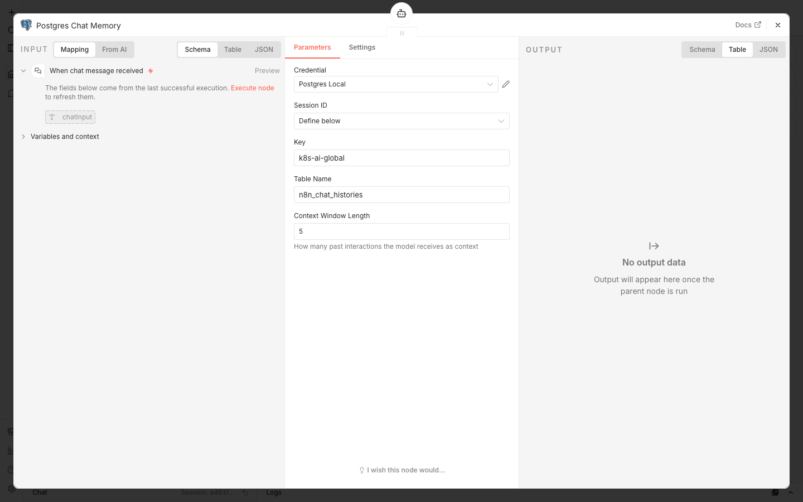
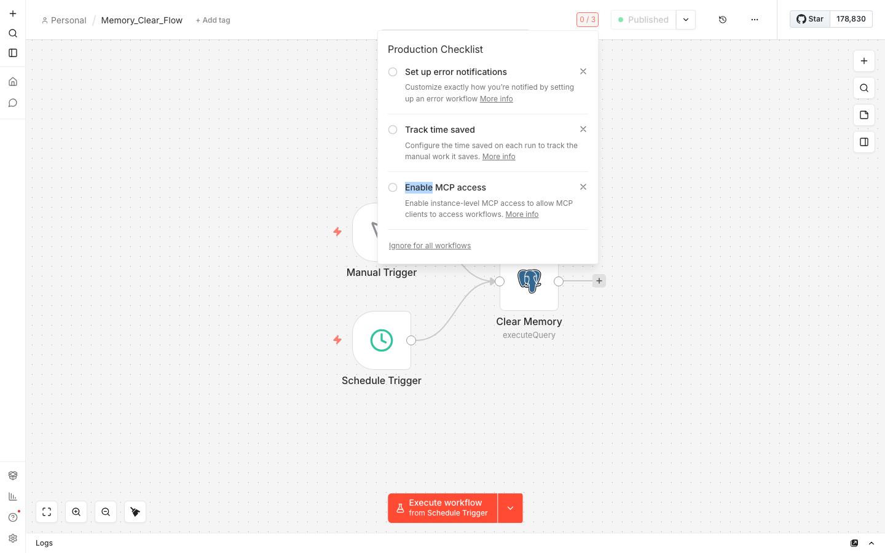
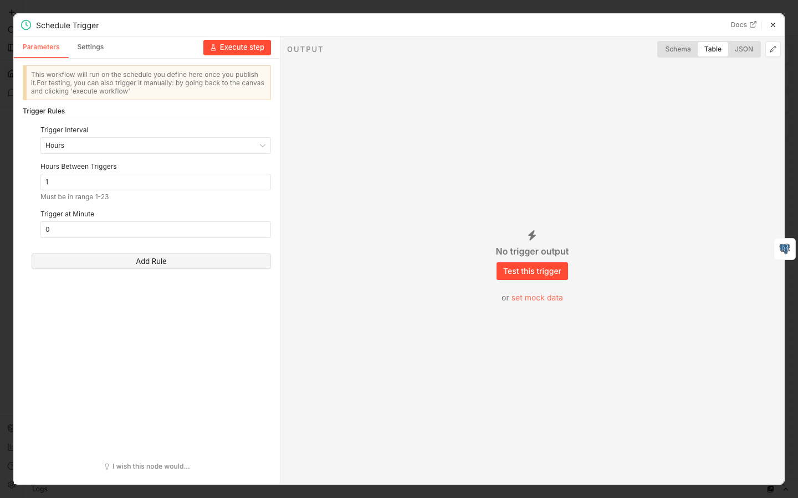
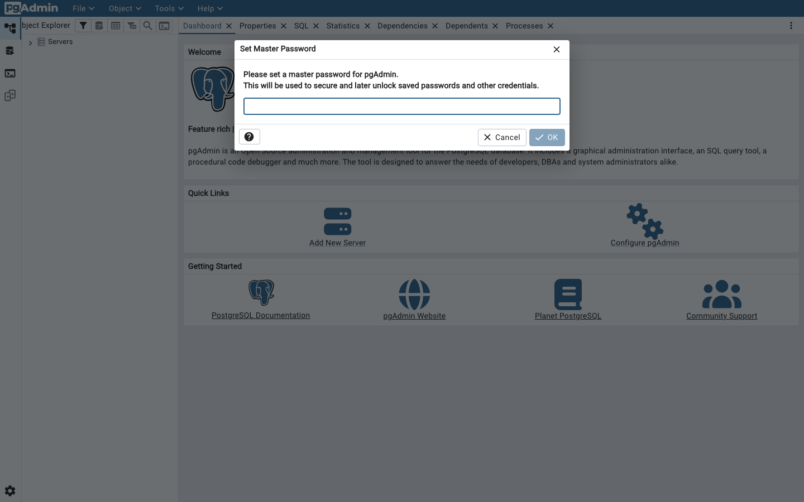

# User Manual — Kubernetes AI Knowledge System

**Version:** 2.0
**Date:** 2026-03-12
**Branch:** n8n-agent (multi-tool AI Agent pipeline)

A complete visual guide to setting up, operating, testing, and utilizing the Kubernetes AI Knowledge System — a self-hosted AI assistant that indexes your live Kubernetes cluster into a vector database and answers natural-language queries.

> Every step includes screenshots from the actual running system. To regenerate screenshots: `N8N_EMAIL=assaduzzaman.ict@gmail.com N8N_PASS='********' npm run screenshots`

---

## Table of Contents

1. [Quick Reference: URLs & Credentials](#1-quick-reference-urls--credentials)
2. [System Architecture Overview](#2-system-architecture-overview)
3. [Setup & Installation](#3-setup--installation)
4. [Verifying System Health](#4-verifying-system-health)
5. [n8n Dashboard: Sign-In & Navigation](#5-n8n-dashboard-sign-in--navigation)
6. [Workflow 1: CDC Pipeline (Real-Time Sync)](#6-workflow-1-cdc-pipeline-real-time-sync)
7. [Workflow 2: AI Agent Query Pipeline](#7-workflow-2-ai-agent-query-pipeline)
8. [Workflow 3: Reset & Resync](#8-workflow-3-reset--resync)
9. [Workflow 4: Memory Clear](#9-workflow-4-memory-clear)
10. [Using the AI Chat Interface](#10-using-the-ai-chat-interface)
11. [Chat Memory & Session Context](#11-chat-memory--session-context)
12. [Qdrant Vector Database](#12-qdrant-vector-database)
13. [pgAdmin: Database Browser](#13-pgadmin-database-browser)
14. [Running E2E Tests](#14-running-e2e-tests)
15. [API Reference: curl Commands](#15-api-reference-curl-commands)
16. [Ollama Model Management](#16-ollama-model-management)
17. [Common Operations & Maintenance](#17-common-operations--maintenance)
18. [Troubleshooting](#18-troubleshooting)
19. [Claude Code Skills (Slash Commands)](#19-claude-code-skills-slash-commands)

---

## 1. Quick Reference: URLs & Credentials

### Service URLs

| Service | URL | Auth Required |
|---------|-----|---------------|
| **n8n Dashboard** | http://localhost:30000 | Yes — see below |
| **AI Chat** (public) | http://localhost:30000/webhook/k8s-ai-chat/chat | No |
| **Qdrant Dashboard** | http://localhost:30001/dashboard | No |
| **Qdrant REST API** | http://localhost:30001 | No |
| **k8s-watcher Health** | http://localhost:30002/healthz | No |
| **pgAdmin** | http://localhost:30003 | Yes — see below |
| **Postgres** (direct) | `psql -h localhost -p 30004 -U n8n -d n8n_memory` | Yes — see below |
| **Ollama** (host) | http://localhost:11434 | No |
| **Reset Webhook** | POST http://localhost:30000/webhook/k8s-reset | No |

### Credentials

| Service | Username/Email | Password |
|---------|---------------|----------|
| **n8n Dashboard** | `assaduzzaman.ict@gmail.com` | `********` |
| **n8n HTTP Basic Auth** | `admin` | `admin` |
| **pgAdmin** | `admin@example.com` | `admin` |
| **Postgres** | `n8n` | `n8n_memory` |

### Domain-Based Access (Optional)

Add to `/etc/hosts`:
```
192.168.1.154 n8n.genai.prod
```
Then access n8n at: http://n8n.genai.prod:30000

### NodePort Assignments

| Port | Service |
|------|---------|
| 30000 | n8n |
| 30001 | Qdrant |
| 30002 | k8s-watcher |
| 30003 | pgAdmin |
| 30004 | PostgreSQL |

### Workflow IDs (Static)

| Workflow | ID |
|----------|----|
| CDC_K8s_Flow | `k8sCDCflow00001` |
| AI_K8s_Flow | `k8sAIflow000001` |
| Reset_K8s_Flow | `k8sRSTflow00001` |
| Memory_Clear_Flow | `k8sMEMclear001` |

### Kubernetes Context

| Item | Value |
|------|-------|
| Cluster name | `k8s-ai` |
| kubectl context | `kind-k8s-ai` |
| Namespace | `k8s-ai` |
| Kafka topic | `k8s-resources` |
| Qdrant collection | `k8s` |

---

## 2. System Architecture Overview

```
┌─────────────────────────────────────────────────────────────────┐
│                    kind cluster (k8s-ai)                         │
│                                                                  │
│  ┌──────────────┐    ┌──────────┐    ┌──────────────────────┐   │
│  │ k8s-watcher  │───▶│  Kafka   │───▶│  n8n CDC Flow        │   │
│  │ (Python pod) │    │ (KRaft)  │    │  embed → Qdrant      │   │
│  │ watches 10   │    │          │    │  upsert              │   │
│  │ resource     │    │          │    └──────────────────────┘   │
│  │ types        │    └──────────┘                               │
│  └──────────────┘                    ┌──────────────────────┐   │
│                                      │  Qdrant Vector DB    │   │
│  ┌──────────────┐                    │  768-dim Cosine      │   │
│  │  PostgreSQL  │◀───────────────────│  k8s collection      │   │
│  │  (chat       │    ┌──────────┐    └──────────────────────┘   │
│  │   memory)    │◀───│  n8n AI  │───▶                           │
│  └──────────────┘    │  Agent   │    ┌──────────────────────┐   │
│                      │  Flow    │───▶│  Ollama (host)       │   │
│  ┌──────────────┐    └──────────┘    │  qwen3:14b-k8s       │   │
│  │   pgAdmin    │                    │  nomic-embed-text     │   │
│  └──────────────┘                    └──────────────────────┘   │
│                                                                  │
└─────────────────────────────────────────────────────────────────┘
```

**Two parallel data flows:**

1. **CDC Pipeline** — k8s-watcher monitors the Kubernetes API → publishes events to Kafka → n8n embeds and stores in Qdrant
2. **AI Query Pipeline** — User query → n8n AI Agent → tool calls (Qdrant search + inventory) → Ollama LLM → markdown table response

**Resources watched by k8s-watcher (10 types):**
Namespace, Pod, Service, ConfigMap, PVC, Secret, Deployment, ReplicaSet, StatefulSet, DaemonSet

---

## 3. Setup & Installation

### Prerequisites

| Tool | Version | Check Command |
|------|---------|---------------|
| Docker Desktop | 4.x+ | `docker info --format '{{.ServerVersion}}'` |
| kind | 0.24+ | `kind version` |
| kubectl | any | `kubectl version --client` |
| Ollama | any | `ollama --version` |
| Node.js | 18+ | `node --version` |
| python3 | 3.8+ | `python3 --version` |

### Step 1: Pull Ollama Models (Host Machine)

```bash
ollama pull nomic-embed-text      # 768-dim embedding model (~274 MB)
ollama pull qwen3:14b             # base chat model (~9.3 GB)
```

### Step 2: Build the Custom Chat Model

```bash
ollama create qwen3:14b-k8s -f models/Modelfile.k8s
```

Verify:
```bash
ollama list | grep qwen3
# qwen3:14b-k8s    ...    9.3 GB
# qwen3:14b        ...    9.3 GB
```

### Step 3: Run the Full Setup

```bash
./scripts/setup.sh
```

This single command handles everything: cluster creation, pod deployment, workflow import, Qdrant collection creation, and E2E test execution.

**Options:**
```bash
./scripts/setup.sh                     # full from-scratch setup
./scripts/setup.sh --keep-cluster      # reuse existing cluster
./scripts/setup.sh --no-test           # skip E2E tests
```

### Step 4: Verify Setup Complete

After setup completes (~4 minutes), you should see:

```
  n8n dashboard      : http://localhost:30000
  AI chat            : http://localhost:30000/webhook/k8s-ai-chat/chat
  Qdrant             : http://localhost:30001
  k8s-watcher health : http://localhost:30002/healthz
  pgAdmin            : http://localhost:30003
  Postgres (direct)  : psql -h localhost -p 30004 -U n8n -d n8n_memory
```

---

## 4. Verifying System Health

### Check All Pods

```bash
kubectl --context kind-k8s-ai -n k8s-ai get pods
```

Expected — all 6 pods Running (1/1 Ready):
```
NAME                           READY   STATUS    RESTARTS
k8s-watcher-xxxxx              1/1     Running   0
kafka-0                        1/1     Running   0
n8n-xxxxx                      1/1     Running   0
qdrant-xxxxx                   1/1     Running   0
postgres-xxxxx                 1/1     Running   0
pgadmin-xxxxx                  1/1     Running   0
```

### Check k8s-watcher Health

```bash
curl http://localhost:30002/healthz
# {"status":"ok"}
```

### Check Qdrant Points

```bash
curl -s http://localhost:30001/collections/k8s | python3 -c \
  "import sys,json; r=json.load(sys.stdin)['result']; print(f'Points: {r[\"points_count\"]}, Status: {r[\"status\"]}')"
# Points: 73, Status: green
```

### Check n8n Webhooks

```bash
# AI Chat — should return 200 (not 404)
curl -s -o /dev/null -w "%{http_code}" -X POST \
  http://localhost:30000/webhook/k8s-ai-chat/chat \
  -H 'Content-Type: application/json' \
  -d '{"chatInput":"hello"}'

# Reset — should return 200
curl -s -o /dev/null -w "%{http_code}" -X POST \
  http://localhost:30000/webhook/k8s-reset \
  -H 'Content-Type: application/json' -d '{}'
```

> **If webhooks return 404:** Workflows are inactive. Run `./scripts/setup.sh --keep-cluster --no-test` to reimport and activate.

### Check Ollama Models

```bash
ollama list
```

Required models:
| Model | Purpose |
|-------|---------|
| `nomic-embed-text:latest` | 768-dim text embeddings |
| `qwen3:14b-k8s` | Custom Kubernetes chat model |
| `qwen3:14b` | Base model (weights shared with custom) |

---

## 5. n8n Dashboard: Sign-In & Navigation

### Step 1: Open the Sign-In Page

Navigate to: **http://localhost:30000**


### Step 2: Enter Credentials

| Field | Value |
|-------|-------|
| Email | `assaduzzaman.ict@gmail.com` |
| Password | `********` |


### Step 3: Landing Page After Sign-In

After successful sign-in, you'll see the n8n editor interface:


### Step 4: Workflow Dashboard

The dashboard shows all 4 workflows. Click the hamburger menu or navigate to the workflows list:


### Step 5: Verify Active Badges

All 4 workflows should have green **Active** badges:


| Workflow | Expected Status |
|----------|----------------|
| CDC_K8s_Flow | Active (green) |
| AI_K8s_Flow | Active (green) |
| Reset_K8s_Flow | Active (green) |
| Memory_Clear_Flow | Active (green) |

### Credentials List

Navigate to **Settings → Credentials** to see the configured Ollama and Kafka connections:


---

## 6. Workflow 1: CDC Pipeline (Real-Time Sync)

**Purpose:** Continuously synchronizes Kubernetes cluster state into the Qdrant vector database via Kafka Change Data Capture (CDC).

**Workflow ID:** `k8sCDCflow00001`

### How It Works

```
k8s-watcher (K8s API watch)
  → Kafka topic: k8s-resources
  → n8n Kafka Trigger
  → Parse Message (construct embed_text)
  → Delete existing Qdrant point by resource_uid
  → [if DELETED event: stop]
  → Generate Embedding (nomic-embed-text, 768-dim)
  → Build Qdrant Point
  → Insert Vector (Qdrant PUT /points)
```

### Canvas View

Open the CDC_K8s_Flow workflow to see the full pipeline:


### Node Details

#### Node 1: Kafka Trigger

Listens on the `k8s-resources` Kafka topic. When k8s-watcher publishes an event (create/update/delete), this node fires.


**Key settings:**
- Topic: `k8s-resources`
- Group ID: `n8n-cdc-consumer`
- Auto Offset Reset: `latest` (never replays old events)

#### Node 2: Parse Message

JavaScript Code node that extracts event data and constructs the natural-language `embed_text`:


**Embed text format:**
```
"Kubernetes Deployment named coredns in namespace kube-system. Labels: k8s-app=kube-dns..."
```

This natural-language format produces significantly better cosine similarity scores than terse `kind:X name:Y` formats.

#### Node 3: Delete Existing Vector

HTTP POST to Qdrant filter-delete API — removes any existing point with the same `resource_uid` before inserting the updated version:


**Endpoint:** `POST http://qdrant:6333/collections/k8s/points/delete`

#### Node 4: Is Delete Event?

If/Else condition — if the event type is `DELETED`, stop here (no need to re-insert):


#### Node 5: Format Document

Structures the payload with `pageContent` (embed text) and `metadata` (kind, name, namespace, labels, etc.):


### Execution History

Each CDC event appears as an execution in the list:


Click any execution to see the data flowing through each node:


### Triggering a CDC Event

Create a Kubernetes resource and watch it flow through the pipeline:

```bash
# Create a test namespace
kubectl --context kind-k8s-ai create namespace test-manual

# Wait 5-10 seconds, then check Qdrant
curl -s http://localhost:30001/collections/k8s/points/scroll \
  -H 'Content-Type: application/json' \
  -d '{"filter":{"must":[{"key":"metadata.name","match":{"value":"test-manual"}}]},"limit":1}' \
  | python3 -m json.tool

# Clean up
kubectl --context kind-k8s-ai delete namespace test-manual
```

---

## 7. Workflow 2: AI Agent Query Pipeline

**Purpose:** Receives natural-language queries via chat interface, uses AI Agent with two tools to fetch data from Qdrant, and returns structured markdown table responses.

**Workflow ID:** `k8sAIflow000001`

### How It Works

```
User query (Chat Trigger)
  → AI Agent (toolsAgent, maxIterations=5)
      ├── Tool: kubernetes_inventory (Code Tool → HTTP Qdrant scroll → group by kind/ns)
      ├── Tool: kubernetes_search   (Qdrant Vector Store → topK=20, score threshold 0.3)
      ├── LLM: Ollama Chat Model    (qwen3:14b-k8s, temperature 0)
      └── Memory: Postgres Chat     (session: k8s-ai-global, contextWindow: 5)
  → Response (markdown table)
```

### Canvas View


### Node Details

#### Node 1: Chat Trigger

Public webhook that accepts chat messages. No authentication required.


**Key settings:**
- Webhook ID: `k8s-ai-chat`
- Public: Yes (accessible without n8n login)
- URL: `http://localhost:30000/webhook/k8s-ai-chat/chat`

#### Node 2: AI Agent

The orchestrator — decides which tool to call based on the query:


**Tool selection logic:**
| Query Type | Tool Called | Example |
|------------|-----------|---------|
| Counting / listing all | `kubernetes_inventory` | "How many pods?" |
| Aggregation by namespace | `kubernetes_inventory` | "Deployments per namespace?" |
| Specific resource details | `kubernetes_search` | "Show me the coredns deployment" |
| Search by name/label | `kubernetes_search` | "Find services with app=nginx" |

#### Node 3: Ollama Chat Model

The custom `qwen3:14b-k8s` model — configured for deterministic, table-formatted output:


**Key settings:**
- Model: `qwen3:14b-k8s` (custom, built from `Modelfile.k8s`)
- Temperature: 0 (deterministic)
- Base URL: `http://host.docker.internal:11434` (Ollama on host machine)

#### Node 4: Qdrant Vector Store (kubernetes_search tool)

Semantic search over the vector database. Embeds the query using `nomic-embed-text`, then finds the top-20 most similar Kubernetes resources:


**Key settings:**
- Collection: `k8s`
- Top K: 20
- Mode: `retrieve-as-tool` (the AI Agent decides when to call it)
- Tool name: `kubernetes_search`

#### Node 5: Embeddings Ollama

Generates 768-dimensional embeddings for both CDC ingestion and AI queries:


**Key settings:**
- Model: `nomic-embed-text:latest`
- Dimensions: 768

#### Node 6: Postgres Chat Memory

Stores conversation history in PostgreSQL for multi-turn context:



**Key settings:**
- Database: `n8n_memory`
- Table: `n8n_chat_histories`
- Session ID: `k8s-ai-global` (shared across all users)
- Context Window: 5 (last 5 message pairs)

### Execution History


---

## 8. Workflow 3: Reset & Resync

**Purpose:** Wipes the Qdrant vector database and triggers a full re-index from the live Kubernetes cluster.

**Workflow ID:** `k8sRSTflow00001`

### How It Works

```
POST /webhook/k8s-reset
  → DELETE http://qdrant:6333/collections/k8s    (wipe all vectors)
  → PUT http://qdrant:6333/collections/k8s       (recreate 768-dim Cosine collection)
  → POST http://k8s-watcher:8080/resync           (trigger full CDC resync)
  → Format Response {status, message, reset_at}
```

### Canvas View


### Node Details

#### Node 1: Reset Webhook

Accepts POST requests to trigger the reset:


**Endpoint:** `POST http://localhost:30000/webhook/k8s-reset`

#### Node 2: Delete Collection

Removes the entire Qdrant `k8s` collection:


#### Node 3: Recreate Collection

Creates a fresh `k8s` collection with the correct schema:


**Schema:** 768-dim vectors, Cosine distance metric

#### Node 4: Trigger Resync

Tells k8s-watcher to re-enumerate all Kubernetes resources and publish them to Kafka:


**Endpoint:** `POST http://k8s-watcher:8080/resync`

#### Node 5: Format Response

Returns a JSON status object:


### Execution History


### Using the Reset Endpoint

```bash
# Trigger reset
curl -X POST http://localhost:30000/webhook/k8s-reset \
  -H 'Content-Type: application/json' -d '{}'

# Expected response:
# {"status":"success","message":"Qdrant reset and resync triggered","reset_at":"2026-03-12T..."}

# Wait 30-45 seconds for Qdrant to repopulate, then verify:
curl -s http://localhost:30001/collections/k8s | python3 -c \
  "import sys,json; print('Points:', json.load(sys.stdin)['result']['points_count'])"
# Points: 73  (or similar — depends on cluster size)
```

> **Important:** After reset, Qdrant is empty for ~30-45 seconds while k8s-watcher republishes all resources. Do not run queries or tests during this window.

---

## 9. Workflow 4: Memory Clear

**Purpose:** Clears chat conversation history from the PostgreSQL database. Runs automatically every hour and can be triggered manually.

**Workflow ID:** `k8sMEMclear001`

### Canvas View


### Node Details

#### Node 1: Manual Trigger

Click to run the memory clear on demand:



#### Node 2: Schedule Trigger

Fires automatically every hour:


#### Node 3: Clear Memory

Executes `DELETE FROM n8n_chat_histories` on the PostgreSQL database:



### Manual Memory Clear via SQL

```bash
psql -h localhost -p 30004 -U n8n -d n8n_memory \
  -c "DELETE FROM n8n_chat_histories;"
# Password: n8n_memory
```

---

## 10. Using the AI Chat Interface

### Public Chat (No Login Required)

Open: **http://localhost:30000/webhook/k8s-ai-chat/chat**


### Sending a Query

Type a question about your Kubernetes cluster:


**Example queries:**
| Query | Expected Tool | Response Format |
|-------|--------------|-----------------|
| "How many pods are running?" | kubernetes_inventory | Count table |
| "List all namespaces" | kubernetes_inventory | List table |
| "Show deployments per namespace" | kubernetes_inventory | Grouped table |
| "Tell me about the coredns deployment" | kubernetes_search | Detail table |
| "Find services with kube-dns label" | kubernetes_search | Search results table |
| "Are there any secrets?" | kubernetes_search | Names only (values never exposed) |

### Receiving a Response

The AI responds with clean markdown tables — no verbose explanations, no code blocks:


### curl-Based Queries

```bash
# Simple query
curl -X POST http://localhost:30000/webhook/k8s-ai-chat/chat \
  -H 'Content-Type: application/json' \
  -d '{"chatInput": "How many pods are in the cluster?"}'

# Deployment listing
curl -X POST http://localhost:30000/webhook/k8s-ai-chat/chat \
  -H 'Content-Type: application/json' \
  -d '{"chatInput": "Show me all deployments and their replica counts"}'

# Namespace query
curl -X POST http://localhost:30000/webhook/k8s-ai-chat/chat \
  -H 'Content-Type: application/json' \
  -d '{"chatInput": "List all namespaces in the cluster"}'

# Secret query (values are NEVER exposed)
curl -X POST http://localhost:30000/webhook/k8s-ai-chat/chat \
  -H 'Content-Type: application/json' \
  -d '{"chatInput": "What secrets exist in the cluster?"}'
```

### Security: Secret Handling

The system indexes Secret **metadata only** — names, types, and key names. Base64-encoded values are **never** published to Kafka or stored in Qdrant. When you ask about secrets, the AI returns:

| Kind | Name | Namespace | Details |
|------|------|-----------|---------|
| Secret | my-secret | default | Type: Opaque, Keys: username, password |

The actual values of `username` and `password` are never retrievable.

---

## 11. Chat Memory & Session Context

The AI Agent maintains conversation context using PostgreSQL-backed memory. The last 5 message pairs are stored per session.

### How It Works

- **Session ID:** `k8s-ai-global` (shared across all users — single-user assistant)
- **Context Window:** 5 (last 5 exchanges)
- **Storage:** `n8n_memory` database → `n8n_chat_histories` table
- **Auto-clear:** Every hour via Memory_Clear_Flow

### Testing Memory Persistence

```bash
# Query 1
curl -s -X POST http://localhost:30000/webhook/k8s-ai-chat/chat \
  -H 'Content-Type: application/json' \
  -d '{"chatInput": "How many namespaces are in the cluster?"}'

# Query 2 — references "them" from previous context
curl -s -X POST http://localhost:30000/webhook/k8s-ai-chat/chat \
  -H 'Content-Type: application/json' \
  -d '{"chatInput": "List them"}'
```

The second query should return the namespace list, even though "them" was not explicitly defined — the AI remembers the previous question.

### Inspecting Chat History

```bash
psql -h localhost -p 30004 -U n8n -d n8n_memory \
  -c "SELECT session_id, message->>'type' AS type, left(message->>'data', 80) AS preview FROM n8n_chat_histories ORDER BY id DESC LIMIT 10;"
# Password: n8n_memory
```

---

## 12. Qdrant Vector Database

### Dashboard

Open: **http://localhost:30001/dashboard**

### Key Facts

| Property | Value |
|----------|-------|
| Collection name | `k8s` |
| Vector dimensions | 768 |
| Distance metric | Cosine |
| Embedding model | `nomic-embed-text:latest` |
| Score threshold | 0.3 |
| Typical point count | 60-80 (depends on cluster size) |

### Checking Point Count

```bash
curl -s http://localhost:30001/collections/k8s | python3 -c \
  "import sys,json; r=json.load(sys.stdin)['result']; print(f'Points: {r[\"points_count\"]}, Status: {r[\"status\"]}')"
```

### Browsing Points

```bash
# Scroll first 5 points
curl -s http://localhost:30001/collections/k8s/points/scroll \
  -H 'Content-Type: application/json' \
  -d '{"limit": 5, "with_payload": true, "with_vector": false}' \
  | python3 -m json.tool
```

### Searching by Metadata

```bash
# Find all Deployment resources
curl -s http://localhost:30001/collections/k8s/points/scroll \
  -H 'Content-Type: application/json' \
  -d '{"filter":{"must":[{"key":"metadata.kind","match":{"value":"Deployment"}}]},"limit":20,"with_payload":true,"with_vector":false}' \
  | python3 -m json.tool
```

### Qdrant Payload Structure

Each point in Qdrant has this structure:

```json
{
  "id": "<auto-generated UUID>",
  "vector": [0.123, -0.456, ...],   // 768 floats
  "payload": {
    "pageContent": "Kubernetes Deployment named coredns in namespace kube-system. Labels: k8s-app=kube-dns...",
    "metadata": {
      "resource_uid": "abc-123-def",
      "kind": "Deployment",
      "namespace": "kube-system",
      "name": "coredns",
      "labels": "{\"k8s-app\":\"kube-dns\"}",
      "annotations": "{}",
      "raw_spec_json": "{...}",
      "last_updated_timestamp": "2026-03-12T..."
    }
  }
}
```

---

## 13. pgAdmin: Database Browser

### Login

Open: **http://localhost:30003**

| Field | Value |
|-------|-------|
| Email | `admin@example.com` |
| Password | `admin` |



### Navigating to Chat History

1. Expand **Servers → k8s-ai Postgres** (auto-configured)
2. Navigate to **Databases → n8n_memory → Schemas → public → Tables → n8n_chat_histories**
3. Right-click → **View/Edit Data → All Rows**

### Direct SQL Access

```bash
psql -h localhost -p 30004 -U n8n -d n8n_memory
# Password: n8n_memory

# List all tables
\dt

# View chat history
SELECT id, session_id, message->>'type' AS type,
       left(message->>'data', 100) AS preview
FROM n8n_chat_histories
ORDER BY id DESC;

# Count messages
SELECT COUNT(*) FROM n8n_chat_histories;
```

---

## 14. Running E2E Tests

### Full Test Suite (15 Tests)

```bash
npm test
```

Expected output:
```
  ✓  1  CDC: create namespace → Kafka event published + Qdrant insertion       (2.9s)
  ✓  2  CDC: update deployment → old vector replaced (dedup by resource_uid)   (2.0s)
  ✓  3  CDC: delete resource → point removed from Qdrant vector store          (32ms)
  ✓  4  AI: namespace count query → structured markdown table response          (3.4s)
  ✓  6  CDC: create secret → Kafka event + Qdrant (safe metadata only)         (2.9s)
  ✓  7  AI: secrets query → metadata returned, values never exposed            (1.1s)
  ✓  8  AI Agent webhook: deployment query → grounded response via Qdrant tool (26.5s)
  ✓  9  AI Agent webhook: namespace query → markdown table via Qdrant tool      (4.7s)
  ✓ 10  AI Agent webhook: secrets query → names returned, values never exposed (16.4s)
  ✓ 11  Memory: consecutive queries share session context (postgres-backed)    (31.4s)
  ✓ 12  Memory: clear removes all chat history from n8n_chat_histories         (451ms)
  ✓ 13  Accuracy: AI pod counts match kubectl pod counts per namespace         (...)
  ✓ 14  Accuracy: AI deployment list matches kubectl deployments               (...)
  ✓ 15  Accuracy: AI namespace list matches kubectl namespaces                 (...)
  ✓  5  Reset: POST /webhook/k8s-reset clears Qdrant and CDC resync repopulates (3.4s)

  15 passed
```

### Run a Single Test

```bash
npm run test:single "create namespace"       # Test 1: CDC create
npm run test:single "update deployment"       # Test 2: CDC update
npm run test:single "delete resource"         # Test 3: CDC delete
npm run test:single "namespace count"         # Test 4: AI query
npm run test:single "create secret"           # Test 6: CDC secret
npm run test:single "secrets query"           # Test 7: AI secrets
npm run test:single "deployment query"        # Test 8: AI Agent
npm run test:single "namespace query"         # Test 9: AI Agent
npm run test:single "AI Agent webhook: secrets" # Test 10: AI Agent secrets
npm run test:single "consecutive queries"     # Test 11: Memory
npm run test:single "clear removes"           # Test 12: Memory clear
npm run test:single "pod counts"              # Test 13: Accuracy
npm run test:single "deployment list"         # Test 14: Accuracy
npm run test:single "namespace list"          # Test 15: Accuracy
npm run test:single "Reset"                   # Test 5: Reset (runs LAST)
```

### Test Groups Explained

| Group | Tests | What They Validate |
|-------|-------|-------------------|
| **CDC Data Ingestion** | 1-3, 6 | Create/update/delete resources → Kafka events → Qdrant vectors |
| **Direct AI Query** | 4, 7 | Ollama + Qdrant without n8n Agent (simulated inline) |
| **AI Agent Webhook** | 8-10 | Full end-to-end via live n8n `/webhook/k8s-ai-chat/chat` |
| **Memory** | 11-12 | Session context persistence + clearing |
| **Accuracy** | 13-15 | AI output compared against real `kubectl` results |
| **Reset** | 5 | Qdrant wipe + CDC resync repopulation |

### Test Ordering

Test 5 (Reset) is declared **last** in the spec file despite being numbered 5. This is intentional — Reset wipes Qdrant, so it must execute after all other tests that depend on existing data.

### If Tests Fail

| Symptom | Likely Cause | Fix |
|---------|-------------|-----|
| Tests 8-10 return 404 | Workflows inactive | `./scripts/setup.sh --keep-cluster --no-test` |
| Tests 13-15 accuracy mismatch | Stale Qdrant data | `curl -X POST http://localhost:30000/webhook/k8s-reset -H 'Content-Type: application/json' -d '{}'` then wait 45s |
| Tests 1-3 timeout | Kafka not running | `kubectl -n k8s-ai get pods` — check kafka-0 |
| All tests timeout | Ollama not running | `ollama list` — verify models present |

---

## 15. API Reference: curl Commands

### AI Chat

```bash
# General query
curl -X POST http://localhost:30000/webhook/k8s-ai-chat/chat \
  -H 'Content-Type: application/json' \
  -d '{"chatInput": "Show me all deployments and their replica counts"}'
```

### Reset & Resync

```bash
curl -X POST http://localhost:30000/webhook/k8s-reset \
  -H 'Content-Type: application/json' -d '{}'
```

### k8s-watcher Health

```bash
curl http://localhost:30002/healthz
```

### Qdrant Collection Info

```bash
curl http://localhost:30001/collections/k8s | python3 -m json.tool
```

### Qdrant Scroll Points

```bash
curl -s http://localhost:30001/collections/k8s/points/scroll \
  -H 'Content-Type: application/json' \
  -d '{"limit":10,"with_payload":true,"with_vector":false}' | python3 -m json.tool
```

### Qdrant Semantic Search

```bash
# First embed the query
VECTOR=$(curl -s http://localhost:11434/api/embed -d '{
  "model": "nomic-embed-text",
  "input": "kubernetes deployments"
}' | python3 -c "import sys,json; print(json.load(sys.stdin)['embeddings'][0])")

# Then search
curl -s http://localhost:30001/collections/k8s/points/search \
  -H 'Content-Type: application/json' \
  -d "{\"vector\":$VECTOR,\"limit\":5,\"with_payload\":true}" | python3 -m json.tool
```

### Ollama Direct Chat

```bash
curl http://localhost:11434/api/chat -d '{
  "model": "qwen3:14b-k8s",
  "messages": [{"role":"user","content":"List namespaces in a default k8s cluster"}],
  "stream": false,
  "think": false
}' | python3 -c "import sys,json; print(json.load(sys.stdin)['message']['content'])"
```

### Ollama Embedding

```bash
curl http://localhost:11434/api/embed -d '{
  "model": "nomic-embed-text",
  "input": "Kubernetes Deployment named coredns in namespace kube-system"
}' | python3 -c "import sys,json; e=json.load(sys.stdin)['embeddings'][0]; print(f'Dimensions: {len(e)}, First 5: {e[:5]}')"
```

### Kafka: List Topics

```bash
kubectl --context kind-k8s-ai -n k8s-ai exec kafka-0 -- \
  /opt/kafka/bin/kafka-topics.sh --bootstrap-server localhost:9092 --list
```

### Kafka: Read Latest Messages

```bash
kubectl --context kind-k8s-ai -n k8s-ai exec kafka-0 -- \
  /opt/kafka/bin/kafka-console-consumer.sh \
  --bootstrap-server localhost:9092 \
  --topic k8s-resources \
  --from-beginning --max-messages 3
```

### PostgreSQL: Chat History

```bash
psql -h localhost -p 30004 -U n8n -d n8n_memory \
  -c "SELECT session_id, message->>'type' AS type, left(message->>'data', 80) AS preview FROM n8n_chat_histories ORDER BY id DESC LIMIT 10;"
```

---

## 16. Ollama Model Management

### List Installed Models

```bash
ollama list
```

### Inspect Custom Model

```bash
# View the complete Modelfile
ollama show qwen3:14b-k8s --modelfile

# View just the system prompt
ollama show qwen3:14b-k8s --system

# View parameters
ollama show qwen3:14b-k8s --parameters
```

### Rebuild After Editing Modelfile

```bash
# Edit the Modelfile
vim models/Modelfile.k8s

# Rebuild (takes ~40ms)
ollama create qwen3:14b-k8s -f models/Modelfile.k8s

# Verify
ollama show qwen3:14b-k8s --system
```

### Interactive Chat

```bash
ollama run qwen3:14b-k8s
# Type queries directly, Ctrl+D to exit
```

### Test Tool-Calling

```bash
curl -s http://localhost:11434/api/chat -d '{
  "model": "qwen3:14b-k8s",
  "messages": [{"role":"user","content":"How many pods are in the cluster?"}],
  "tools": [{
    "type": "function",
    "function": {
      "name": "kubernetes_inventory",
      "description": "Get all K8s resources grouped by kind and namespace",
      "parameters": {"type":"object","properties":{}}
    }
  },{
    "type": "function",
    "function": {
      "name": "kubernetes_search",
      "description": "Search K8s resources by semantic similarity",
      "parameters": {"type":"object","properties":{"query":{"type":"string"}}}
    }
  }],
  "stream": false,
  "think": false
}' | python3 -c "
import sys, json
r = json.load(sys.stdin)
msg = r['message']
if msg.get('tool_calls'):
    for tc in msg['tool_calls']:
        print(f'Tool: {tc[\"function\"][\"name\"]}()')
        print(f'Args: {json.dumps(tc[\"function\"].get(\"arguments\", {}))}')
else:
    print(f'Response: {msg[\"content\"][:200]}')
"
```

> For the full model customization guide, see [Ollama Model Customization Guide](ollama-model-customization-guide.md) and [HTML version](html/index.html).

---

## 17. Common Operations & Maintenance

### Restart After Docker Desktop Reboot

Pods auto-restart with `restartPolicy: Always`. Wait ~30 seconds after Docker starts, then verify:

```bash
kubectl --context kind-k8s-ai -n k8s-ai get pods
```

If pods are missing entirely (cluster gone):
```bash
./scripts/setup.sh   # full rebuild from scratch
```

### Re-Import Workflows

After editing workflow JSON files:

```bash
./scripts/setup.sh --keep-cluster --no-test
```

### Rebuild k8s-watcher Image

After editing `k8s-watcher/watcher.py`:

```bash
docker build -t k8s-watcher:latest ./k8s-watcher/
kind load docker-image k8s-watcher:latest --name k8s-ai
kubectl --context kind-k8s-ai -n k8s-ai rollout restart deployment/k8s-watcher
```

### View Pod Logs

```bash
# k8s-watcher logs
kubectl --context kind-k8s-ai -n k8s-ai logs -f deployment/k8s-watcher

# n8n logs
kubectl --context kind-k8s-ai -n k8s-ai logs -f deployment/n8n

# Kafka logs
kubectl --context kind-k8s-ai -n k8s-ai logs -f kafka-0
```

### Full Teardown

```bash
./scripts/cleanup.sh                    # delete cluster (keep data/)
./scripts/cleanup.sh --wipe-data --yes  # delete cluster + all data
```

### Capture Screenshots

```bash
N8N_EMAIL=assaduzzaman.ict@gmail.com N8N_PASS='********' npm run screenshots
# Saved to docs/screenshots/
```

---

## 18. Troubleshooting

### Webhook Returns 404

**Symptom:** `curl -X POST http://localhost:30000/webhook/k8s-ai-chat/chat` returns 404.

**Cause:** Workflows are inactive.

**Fix:**
```bash
./scripts/setup.sh --keep-cluster --no-test
```

### Qdrant Has 0 Points

**Symptom:** `Points: 0` from Qdrant collection info.

**Cause:** Either reset was just triggered, or k8s-watcher/CDC flow is not running.

**Fix:**
```bash
# Trigger a resync
curl -X POST http://localhost:30000/webhook/k8s-reset \
  -H 'Content-Type: application/json' -d '{}'

# Wait 30-45 seconds, then check:
curl -s http://localhost:30001/collections/k8s | python3 -c \
  "import sys,json; print('Points:', json.load(sys.stdin)['result']['points_count'])"
```

### AI Returns "No Results" or Empty Table

**Symptom:** AI chat returns a response but says "No results found" or shows an empty table.

**Possible causes:**
1. Qdrant is empty (check point count)
2. Ollama is not running (check `ollama list`)
3. Embedding model not installed (`ollama pull nomic-embed-text`)

### Pods Not Starting

```bash
# Check pod status
kubectl --context kind-k8s-ai -n k8s-ai get pods

# Check events for a specific pod
kubectl --context kind-k8s-ai -n k8s-ai describe pod <pod-name>

# Common fix: re-apply manifests
kubectl --context kind-k8s-ai apply -f infra/k8s/00-namespace.yaml
kubectl --context kind-k8s-ai apply -f infra/k8s/01-pvs.yaml
kubectl --context kind-k8s-ai apply -f infra/k8s/kafka/
kubectl --context kind-k8s-ai apply -f infra/k8s/qdrant/
kubectl --context kind-k8s-ai apply -f infra/k8s/k8s-watcher/
kubectl --context kind-k8s-ai apply -f infra/k8s/n8n/
kubectl --context kind-k8s-ai apply -f infra/k8s/postgres/
kubectl --context kind-k8s-ai apply -f infra/k8s/pgadmin/
```

### Port Conflicts

**Symptom:** `setup.sh` fails with "port 30000 already in use".

**Fix:** Stop any other kind clusters or containers using those ports:
```bash
docker ps | grep 30000          # find the conflicting container
docker stop <container-name>    # stop it
```

### Ollama Connection Error from Pods

**Symptom:** n8n workflows fail with "ECONNREFUSED" to Ollama.

**Cause:** Ollama only runs on the host machine. Pods reach it via `host.docker.internal:11434`.

**Fix:** Ensure Ollama is running on the host:
```bash
ollama list   # should show models
# If Ollama is not running:
ollama serve &
```

### Database Corruption

**Symptom:** n8n logs show `SQLITE_CORRUPT`.

**Cause:** Direct sqlite3 writes while n8n was running.

**Fix:** Rebuild from scratch:
```bash
./scripts/cleanup.sh --wipe-data --yes
./scripts/setup.sh
```

---

## 19. Claude Code Skills (Slash Commands)

This project includes 7 custom slash commands (skills) for Claude Code that automate common operations. Skills are stored in `.claude/commands/` and invoked by typing `/<skill-name>` in the Claude Code CLI.

### Overview

| Command | Purpose | When to Use |
|---------|---------|-------------|
| `/resume` | Session-start brief with system state and next steps | Beginning of every new Claude Code session |
| `/status` | Full health check of all 11 components | After Docker restart, suspected issues, or periodic monitoring |
| `/start-services` | Apply k8s manifests and verify all pods are healthy | After cluster creation or pod failures |
| `/reimport-workflows` | Reimport + reactivate all 4 n8n workflows from JSON | After editing workflow JSON files or fresh n8n pod |
| `/reset-db` | Wipe Qdrant and trigger CDC resync via k8s-watcher | When Qdrant data is stale or tests need clean state |
| `/test` | Run all 15 E2E tests with prerequisite checks | After code changes, workflow edits, or deployment |
| `/screenshots` | Capture all UI screenshots to docs/screenshots/ | After UI changes or for documentation updates |

### Skill Details

#### `/resume` — Session Start Brief

Reads project context and reports:
- What phases are complete (from `docs/plans/`)
- Current system state: pods (6), Qdrant points, workflow webhooks, Ollama models
- Static workflow IDs for quick reference
- Quick commands for common operations
- Suggested next steps from the plans

**Best practice:** Run this at the start of every Claude Code session to orient yourself.

#### `/status` — Full Health Check

Checks all 11 components in parallel:

| Check | Method | Expected |
|-------|--------|----------|
| k8s pods (6) | `kubectl get pods` | All Running |
| Qdrant | `curl localhost:30001/collections/k8s` | points_count > 0, status green |
| Kafka | `kafka-get-offsets` via kubectl exec | Topic offset present |
| k8s-watcher | `curl localhost:30002/healthz` | `{"status":"ok"}` |
| Ollama | `curl localhost:11434/api/tags` | nomic-embed-text + qwen3:14b-k8s |
| kind cluster | `kubectl get nodes` | Ready |
| n8n AI webhook | `curl localhost:30000/webhook/k8s-ai-chat/chat` | HTTP 200 |
| n8n Reset webhook | `POST localhost:30000/webhook/k8s-reset` | HTTP 200 |
| Postgres | `psql -h localhost -p 30004` | Connection OK |
| pgAdmin | `curl localhost:30003` | HTTP 200 |

Includes auto-remediation hints for each failure mode.

#### `/start-services` — Deploy & Verify

Applies manifests in dependency order:
1. Namespace → PVs → Kafka → Qdrant → k8s-watcher → n8n
2. Waits 30s for initialization
3. Verifies each service endpoint
4. Creates Qdrant collection if missing
5. Checks Ollama models (pulls if missing, builds qwen3:14b-k8s if needed)
6. Verifies workflow webhooks
7. Triggers initial Qdrant sync if empty

#### `/reimport-workflows` — Workflow Import

Handles the full workflow reimport lifecycle:
1. Scales n8n to 0 replicas (sqlite safety)
2. Deletes existing workflow rows by static ID
3. Scales n8n back to 1
4. Copies 4 JSON files into the n8n pod
5. Imports via `n8n import:workflow`
6. Publishes (activates) via `n8n publish:workflow`
7. Restarts n8n for webhook registration
8. Verifies webhooks return HTTP 200

**Static workflow IDs:**
- CDC: `k8sCDCflow00001`
- AI Agent: `k8sAIflow000001`
- Reset: `k8sRSTflow00001`
- Memory Clear: `k8sMEMclear001`

> **Tip:** For most cases, `./scripts/setup.sh --keep-cluster --no-test` is simpler — it handles everything automatically.

#### `/reset-db` — Qdrant Reset

1. Records current point count (before)
2. Calls `POST /webhook/k8s-reset` which:
   - Deletes the `k8s` collection
   - Recreates it (768-dim Cosine)
   - Triggers k8s-watcher `/resync` (async)
3. Polls Qdrant every 5s until ≥ 25 points
4. Reports before/after counts

**Important:** After reset, Qdrant is empty for ~30–45 seconds while k8s-watcher republishes all resources. Do not run tests until repopulation is complete.

#### `/test` — E2E Test Suite

Runs all 15 Playwright API-mode tests with prerequisite verification:

**Prerequisites checked:**
- All 6 pods Running
- Qdrant has ≥ 10 points
- Ollama has nomic-embed-text + qwen3:14b-k8s
- kind cluster reachable

**Test categories:**
| Tests | Category | Dependencies |
|-------|----------|-------------|
| 1–4 | CDC simulation (direct Qdrant upsert) | Qdrant only |
| 6–7 | Additional CDC tests | Qdrant only |
| 8–10 | Multi-tool AI Agent pipeline | n8n AI webhook + Ollama + Qdrant |
| 13–15 | Accuracy (AI vs kubectl comparison) | n8n AI webhook + Ollama + kubectl |
| 5 | Reset (declared last in spec) | n8n Reset webhook |

**Single test:** `npm run test:single "test name"`

#### `/screenshots` — UI Capture

Captures all UI screenshots using Playwright:
1. Verifies n8n health and all 6 pods
2. Runs `npm run screenshots`
3. Saves to `docs/screenshots/`
4. Lists captured files and flags missing ones

Expected output: 15 PNG files covering sign-in, dashboard, workflow canvases, executions, chat interface, and settings.

### Adding New Skills

Create a new `.md` file in `.claude/commands/`:
```bash
# Example: .claude/commands/my-skill.md
echo "Description of what the skill does and step-by-step instructions..." > .claude/commands/my-skill.md
```

The skill becomes available as `/my-skill` in Claude Code immediately. Skills are markdown files containing instructions that Claude Code follows when the command is invoked.

---

*Generated 2026-03-12. For the technical model customization guide, see [docs/ollama-model-customization-guide.md](ollama-model-customization-guide.md) and [docs/html/index.html](html/index.html).*
